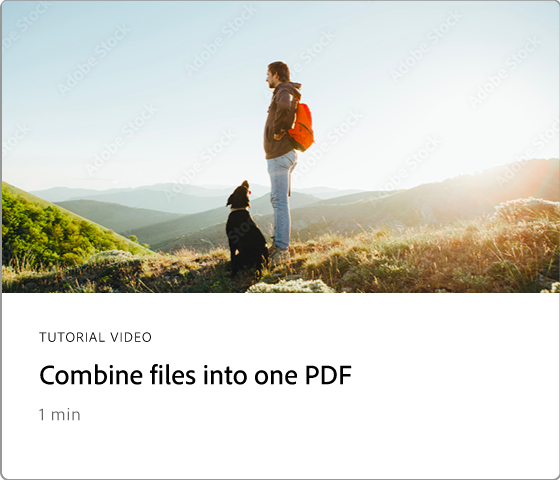
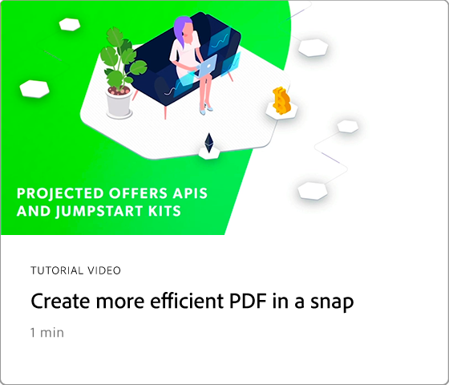

# 60-Sekunden-Acrobat - Übersicht

Mit der 60-Sekunden-Testversion von Acrobat kannst du in kleinen Tutorials einen neuen Trick in Acrobat erlernen - in maximal einer Minute. Diese aufgabenbasierten Tipps helfen Ihnen, sich neue Fertigkeiten für die Arbeit mit PDF-Dateien anzueignen, indem Sie einige der versteckten Edelsteine von Acrobat entsperren. Ihr könnt euch ein Video ansehen, um eine schnelle Antwort zu erhalten, oder fünf Videos ansehen, um die Produktivität eures Dokuments zu steigern - und habt trotzdem noch Zeit, eure Kaffeepause zu genießen.

## 60-Sekunden-Tutorials zu Acrobat

## Vorlage   

<table style="table-layout:fixed">
<tr>
   <td>
    
    

    <a href="edit.md"><strong>PDF mit Acrobat Web bearbeiten</strong></a>
    

    In Acrobat Web bearbeiten.
     
  </td>
  <td>
    
    

    <a href="textrecognition.md"><strong>Text in einer gescannten PDF-Datei erkennen</strong></a>
    

    Erfahren Sie, wie Sie Text aus einem gescannten Bild erkennen.
     
  </td>
  <td>
    
    

    <a href="combine-to-one-pdf.md"><strong>Dateien in einem PDF zusammenführen</strong></a>
    

    Erfahren Sie, wie Sie Dateien schnell zu einer einzigen PDF zusammenführen
     
  </td>
   <td>
    
    

    <a href="organize.md"><strong>Seiten in einem Snap organisieren</strong></a>
    

    Erfahren Sie, wie Sie Seiten auf einem PDF schnell organisieren
     
  </td>
</tr>
<tr>
  <td>
    
    

    <a href="editphoto.md"><strong>Foto auf dem PDF bearbeiten</strong></a>
    

    Erfahren Sie, wie Sie ein Foto auf Ihrem PDF bearbeiten.
  </td>
  <td>
    
    

    <a href="editgraphic.md"><strong>Eine Grafik in Ihrem PDF bearbeiten</strong></a>
    

    Grafiken auf dem PDF bearbeiten
  </td>
  <td>
      
        

         
  </td>
  <td>
      
        

         
  </td>
</tr>
</table>

## Umwandeln

<table style="table-layout:fixed">
<tr>
  <td>
    
    

    <a href="convert-pdf-word.md"><strong>PDF in Word konvertieren</strong></a>
    

    Erfahren Sie, wie Sie eine PDF in das Word-Format konvertieren
  </td>
 <td>
    
    

    <a href="convert-pdf-excel.md"><strong>PDF in Excel konvertieren</strong></a>
    

    Erfahren Sie, wie Sie eine PDF in das Excel-Format konvertieren
  </td>
  <td>
    
    

    <a href="convert-pdf-powerpoint.md"><strong>PDF in PowerPoint konvertieren</strong></a>
    

    Erfahren Sie, wie Sie eine PDF in das PowerPoint-Format konvertieren.
  </td>
  <td>
    
    

    <a href="exportwordphone.md"><strong>Export PDF von Ihrem Smartphone zu Word</strong></a>
    

    Erfahren Sie, wie Sie eine PDF von Ihrem Smartphone nach Word exportieren können.
  </td>
</tr>
</table>

## Erstellen

<table style="table-layout:fixed">
<tr>
  <td>
    
    

    <a href="word-to-pdf.md"><strong>PDF aus Microsoft Word erstellen</strong></a>
    

    Erfahren Sie, wie Sie direkt in Word eine PDF erstellen.
  </td>
  <td>
    
    

    <a href="create-from-acrobat.md"><strong>PDF aus Acrobat erstellen</strong></a>
    

    PDF direkt in Acrobat erstellen
  <td>
    
    

    <a href="wordform.md"><strong>Word in PDF mit Formularfeldern konvertieren</strong></a>
    

    Word-Datei in PDF konvertieren und Formularfelder automatisch generieren
  </td>
  <td>
    
    

    <a href="photo.md"><strong>Erstellen einer PDF mit Fotos im Handumdrehen</strong></a>
    

    PDF aus mehreren Fotos erstellen.
  </td>
</tr>
<tr>
  <td>
    
    

    <a href="phone.md"><strong>PPT-Datei in PDF auf Ihrem Smartphone konvertieren</strong></a>
    

    PowerPoint-Dateien auf dem Smartphone in PDF umwandeln.
  </td>
  <td>
    
    

    <a href="optimize.md"><strong>Effizienteres PDF von Dateien in einem Snap erstellen</strong></a>
    

    PDF-Dateien schnell optimieren.
  </td>
  <td>
      
        

         
  </td>
  <td>
      
        

         
  </td>
</tr>
</table>

## Unterschreiben

<table style="table-layout:fixed">
<tr>
  <td>
    
    

    <a href="sign.md"><strong>Papierdokument elektronisch unterschreiben</strong></a>
    

    Papierdokument elektronisch unterschreiben.
  </td>
  <td>
      
        

         
  </td>
  <td>
      
        

         
  </td>
  <td>
      
        

         
  </td>
</tr>
</table>

## Schützen

<table style="table-layout:fixed">
<tr>
  <td>
    
    

    <a href="protect.md"><strong>Ihre PDF-Dateien mit einem Kennwort Protect</strong></a>
    

    Erfahren Sie, wie Sie Ihren PDF mit einem Kennwort schützen
  </td>
  <td>
    
    

    <a href="redaction.md"><strong>Schwärzung: Der richtige Weg</strong></a>
    

    Erfahren Sie, wie Sie vertrauliche Informationen auf Ihrem PDF richtig schwärzen
  </td>
  <td>
      
        

         
  </td>
  <td>
      
        

         
  </td>
</tr>
</table>

## Freigeben und überprüfen.

<table style="table-layout:fixed">
<tr>
  <td>
    
    

    <a href="share-comment.md"><strong>PDF zum Kommentieren freigeben</strong></a>
    

    Erfahren Sie, wie Sie eine PDF freigeben können, damit andere sie kommentieren können.
  </td>
  <td>
    
    

    <a href="share-comment-teams.md"><strong>PDF von Dateien in Teams freigeben und kommentieren</strong></a>
    

    PDF-Datei in Microsoft Teams freigeben und kommentieren
  </td>
  <td>
    
    

    <a href="summarize-comments.md"><strong>PDF-Kommentare werden mit Zusammenfassung umrandet</strong></a>
    

    Zusammenfassung aller Kommentare in einer einzigen PDF
  </td>
   <td>
    
    

    <a href="indesign.md"><strong>PDF-Kommentare in InDesign laden</strong></a>
    

    Erfahren Sie, wie Sie alle Ihre PDF-Kommentare auf InDesign laden können
  </td>
</tr>
</table>

## Vorbereiten

<table style="table-layout:fixed">
<tr>
  <td>
    
    

    <a href="accessible.md"><strong>Acrobat soll Ihnen helfen, barrierefreie PDF zu machen</strong></a>
    

    Erfahren Sie, wie Sie Ihren PDF universell zugänglich machen
  </td>
 <td>
    
    

    <a href="conform.md"><strong>PDF einem Standardformat anpassen</strong></a>
    

    Erfahren Sie, wie Sie eine PDF an einen bestimmten Standard anpassen.
  </td>
  <td>
      
        

         
  </td>
  <td>
      
        

         
  </td>
</tr>
</table>

## Weitere Themen

<table style="table-layout:fixed">
<tr>
  <td>
    
    

    <a href="compare.md"><strong>Unterschiede beim PDF-Vergleich erkennen</strong></a>
    

    Erfahren Sie, wie Sie den Unterschied zwischen zwei PDF schnell vergleichen können.
  </td>
 <td>
    
    

    <a href="search.md"><strong>Mehrere PDF-Dateien gleichzeitig durchsuchen</strong></a>
    

    Erfahren Sie, wie Sie in mehreren PDF-Dateien suchen können
  </td>
  <td>
      
        

         
  </td>
  <td>
      
        

         
  </td>
</tr>
</table>