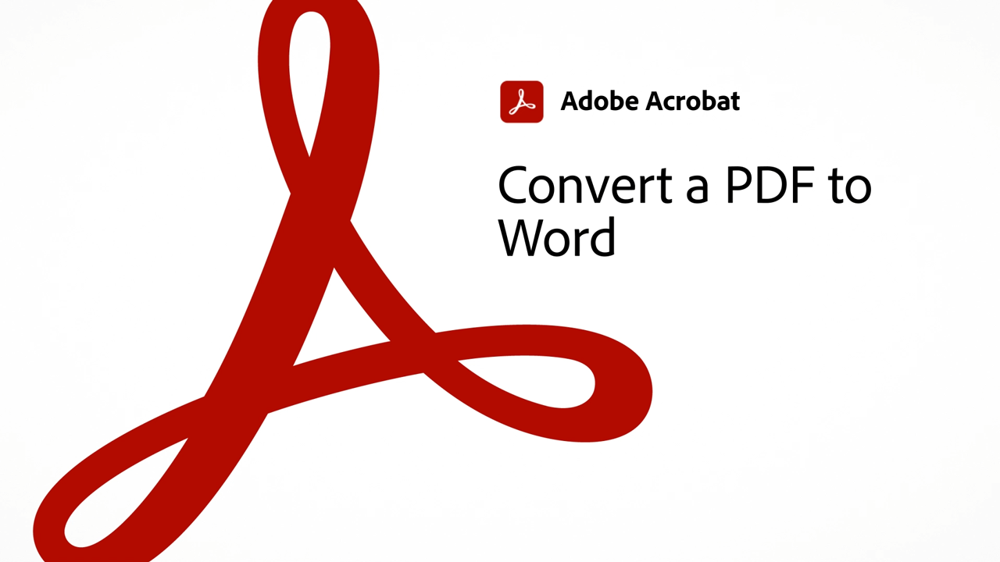

# 60-Sekunden-Acrobat - Übersicht

Mit der 60-Sekunden-Testversion von Acrobat kannst du in kleinen Tutorials einen neuen Trick in Acrobat lernen - in maximal einer Minute. Diese aufgabenbasierten Tipps helfen Ihnen, sich neue Fertigkeiten für die Arbeit mit PDF-Dateien anzueignen, indem Sie einige der versteckten Edelsteine von Acrobat entsperren. Ihr könnt euch ein Video ansehen, um eine schnelle Antwort zu erhalten, oder fünf Videos ansehen, um die Produktivität eures Dokuments zu steigern - und habt trotzdem noch Zeit, eure Kaffeepause zu genießen.

## 60-Sekunden-Tutorials zu Acrobat

## Vorlage   

<table style="table-layout:fixed">
<tr>
   <td>
    
    

    <a href="edit.md"><strong>PDF mit Acrobat Web bearbeiten</strong></a>
    

    <em>Text und Bilder bearbeiten, ohne die PDF herunterladen zu müssen</em>
     
  </td>
  <td>
    
    

     <a href="textrecognition.md"><strong>Text in einer gescannten PDF-Datei erkennen</strong></a>
    

    <em>Konvertieren einer gescannten PDF, sodass Sie auf der PDF nach Text suchen können</em>
     
  </td>
  <td>
    
    

    <a href="combine-to-one-pdf.md"><strong>Dateien auf einer PDF zusammenführen</strong></a>
    

    <em>Erstellen Sie schnell ein neues Dokument, indem Sie verschiedene Dateitypen auf einer einzigen PDF kombinieren</em>
     
  </td>
   <td>
    
    

    <a href="organize.md"><strong>Seiten schnell organisieren.</strong></a>
    

    <em>Erfahren Sie, wie Sie das Werkzeug "Seiten verwalten" verwenden, um eine Vogelperspektive auf Ihren PDF zu erhalten</em>
     
  </td>
</tr>
<tr>
  <td>
    
    

    <a href="editphoto.md"><strong>Ein Foto auf dem PDF bearbeiten.</strong></a>
    

    <em>Erfahren Sie, wie Sie mit Photoshop erweiterte Änderungen an einem Foto auf dem PDF vornehmen können.</em>
     
  </td>
  <td>
    
    

    <a href="editgraphic.md"><strong>Bearbeiten einer Grafik auf dem PDF</strong></a>
    

    <em>Erweiterte Grafikbearbeitung auf dem PDF mit Illustrator</em>
     
  </td>
  <td>
      
        

         
  </td>
  <td>
      
        

         
  </td>
</tr>
</table>

## Umwandeln

<table style="table-layout:fixed">
<tr>
  <td>
    
    

    <a href="convert-pdf-word.md"><strong>PDF in Word umwandeln</strong></a>
    

    <em>Konvertieren einer PDF-Datei in ein vollständig editierbares Microsoft Word-Dokument</em>
     
  </td>
 <td>
    
    

    <a href="convert-pdf-excel.md"><strong>PDF in Excel konvertieren</strong></a>
    

    <em>Konvertieren einer PDF-Datei in ein vollständig bearbeitbares Microsoft Excel-Dokument</em>
     
  </td>
  <td>
    
    

    <a href="convert-pdf-powerpoint.md"><strong>PDF in PowerPoint umwandeln</strong></a>
    

    <em>Konvertieren einer PDF-Datei in ein vollständig bearbeitbares Microsoft PowerPoint-Dokument</em>
     
  </td>
  <td>
    
    

    <a href="exportwordphone.md"><strong>Export PDF zu Word auf dem Smartphone.</strong></a>
    

    <em>Konvertieren einer PDF-Datei in ein vollständig editierbares Microsoft Word-Dokument mit der Acrobat-App</em>
     
  </td>
</tr>
</table>

## Erstellen

<table style="table-layout:fixed">
<tr>
  <td>
    
    

     <a href="wordform.md"><strong>Word-Datei einschließlich Formularfeldern in PDF konvertieren</strong></a>
    

    <em>Word-Dateien und -Formulare in PDF konvertieren und automatisch Formularfelder erstellen</em>
     
  </td>
  <td>
      
      

      <a href="photo.md"><strong>PDF mit wenigen Klicks erstellen</strong></a>
      

      <em>Ziehe mehrere JPG auf das Acrobat-Icon, um einen PDF zu erstellen.</em>
       
  </td>
  <td>
    
    

    <a href="phone.md"><strong>PPT- in PDF-Dateien umwandeln</strong></a>
    

    <em>Erfahren Sie, wie Sie eine E-Mail-PowerPoint-Anlage auf Ihrem Smartphone in einen PDF-Anhang konvertieren.</em>
     
  </td>
  <td>
      
      

      <a href="optimize.md"><strong>Effizienteres PDF von Dateien mit wenigen Klicks</strong></a>
      

      <em>Verwenden Sie das Optimize PDF-Tool, um die Größe Ihrer PDF-Dateien erheblich zu reduzieren</em>
       
  </td>
</tr>
</table>

## Unterschreiben

<table style="table-layout:fixed">
<tr>
  <td>
    
    

    <a href="sign.md"><strong>Papierdokument elektronisch unterschreiben</strong></a>
    

    <em>Erfahren Sie, wie Sie mit Adobe Scan ein gedrucktes Formular signieren</em>
     
  </td>
  <td>
      
        

         
  </td>
  <td>
      
        

         
  </td>
  <td>
      
        

         
  </td>
</tr>
</table>

## Schützen

<table style="table-layout:fixed">
<tr>
  <td>
    
    

    <a href="protect.md"><strong>Protect Ihrer PDF-Dateien mit einem Kennwort</strong></a>
    

    <em>Protect einen PDF, sodass zum Öffnen oder Bearbeiten des PDF ein Kennwort erforderlich ist</em>
     
  </td>
  <td>
      
        

         
  </td>
  <td>
      
        

         
  </td>
  <td>
      
        

         
  </td>
</tr>
</table>

## Vorbereiten

<table style="table-layout:fixed">
<tr>
  <td>
    
    

    <a href="accessible.md"><strong>Acrobat macht barrierefreie PDF</strong></a>
    

    <em>Prüfen Sie, ob auf einen PDF zugegriffen werden kann</em>
     
  </td>
 <td>
    
    

    <a href="conform.md"><strong>PDF einem Standardformat anpassen</strong></a>
    

    <em>Erfahren Sie, wie Sie PDF-Inhalte anhand von PDF-Standardkriterien wie PDF/X, PDF/A oder PDF/E validieren.</em>
     
  </td>
  <td>
      
        

         
  </td>
  <td>
      
        

         
  </td>
</tr>
</table>

## Weitere Themen

<table style="table-layout:fixed">
<tr>
  <td>
    
    

     <a href="search.md"><strong>Mehrere PDF-Dateien gleichzeitig durchsuchen</strong></a>
    

    <em>Starten Sie eine Suche in einer PDF-Datei, öffnen Sie die erweiterte Suche und suchen Sie einen ganzen Ordner mit PDF-Dateien</em>
     
  </td>
  <td>
    
    

    <a href="indesign.md"><strong>PDF-Kommentare in InDesign laden</strong></a>
    

    <em>Erfahren Sie, wie Sie PDF-Kommentare nach einem gemeinsamen Acrobat-Review wieder auf InDesign laden.</em>
     
  </td>
  <td>
      
        

         
  </td>
  <td>
      
        

         
  </td>
</tr>
</table>