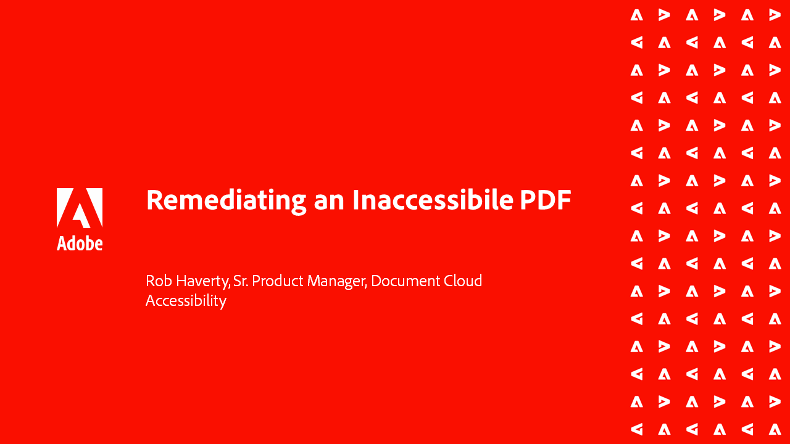

# Acrobat Accessibility-Reihe

In dieser sechsteiligen On-Demand-Webinar-Reihe lernen Sie nicht nur die Grundlagen der Barrierefreiheit kennen, sondern lernen auch, wie Sie Ihre PDF-Dateien mit Tags versehen. Jede Session enthält Übungsdateien, die das Tutorial nachvollziehen sollen.

<table style="table-layout:fixed">
<tr>
  <td>
    
    

    <a href="accessibilitysession1.md"><strong>Einführung in die PDF-Barrierefreiheit</strong></a>
    

    <em>Erfahren Sie in dieser On-Demand-Session, was es bedeutet, eine PDF barrierefrei zu machen, wie Sie Acrobat Pro so einrichten, dass es auf PDF für Barrierefreiheit arbeitet, und wie Sie den Konvertierungsprozess von einem Quelldokument in eine PDF durchführen</em>
    2 
  </td>
  <td>
    
    

    <a href="accessibilitysession2.md"><strong>Eine nicht verfügbare PDF wird bearbeitet</strong></a>
    

    <em>Lernen Sie in dieser On-Demand-Sitzung den Arbeitsablauf kennen, mit dem Sie ein Word-Dokument konvertieren und einige grundlegende Tag-Probleme mit den Acrobat Pro-Tools beheben können, die im Einführungswebinar gezeigt werden</em>
    2 
  </td>  
  <td>
    
    

    <a href="accessibilitysession3.md"><strong>Komplexe Tabellen</strong></a>
    

    <em>Diese On-Demand-Sitzung behandelt eines der häufigsten und schwierigeren Probleme bei der Behebung einer PDF für Barrierefreiheit - komplexe Tabellen</em>
    2 
  </td>
</tr>
<tr>
  <td>
    
    

    <a href="accessibilitysession4.md"><strong>Gescannte Dokumente und komplexe Listen</strong></a>
    

    <em>Diese On-Demand-Sitzung befasst sich mit komplexeren Problemen, auf die häufig zugegriffen wird, z. B. gescannte Dokumente und komplexe Listen</em>
    2 
  </td>
  <td>
    
    

    <a href="accessibilitysession5.md"><strong>Hinzufügen von Formularfeldern zu einer markierten PDF</strong></a>
    

    <em>In dieser On-Demand-Sitzung wird das Hinzufügen von Formularfeldern zu einer PDF behandelt, die zuvor mit Tags versehen wurde</em>
    2 
  </td>  
  <td>
    
    

    <a href="accessibilitysession6.md"><strong>Hinzufügen von Formularfeldern zu einer PDF ohne Tags</strong></a>
    

    <em>Diese On-Demand-Sitzung geht tiefer in die Erstellung manueller Formularfelder und zusätzlicher Formularfeldeigenschaften</em>
    2 
  </td> 
</tr>
</table>
