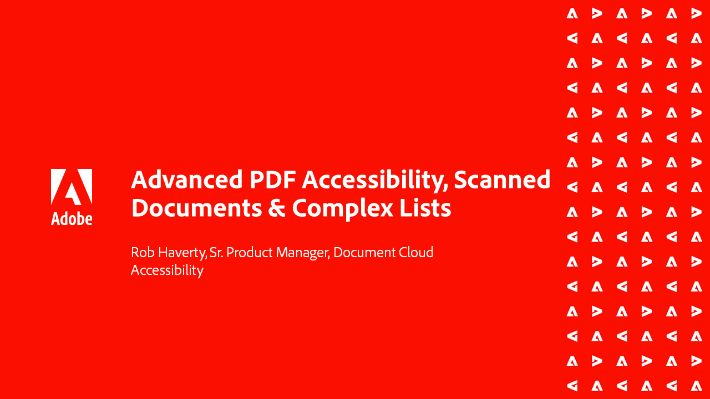

# Acrobat Accessibility-Serie

In dieser sechsteiligen On-Demand-Webinar-Reihe können Sie von den Grundlagen der Barrierefreiheit zu einem tiefen Einstieg in das Tagging Ihrer PDF-Dateien übergehen. Jede Sitzung enthält Übungsdateien, um die Schritte nachzuvollziehen.

<table style="table-layout:fixed">
<tr>
  <td>
    
    

    <a href="accessibilitysession1.md"><strong>Einführung in die PDF-Barrierefreiheit</strong></a>
    

    <em>In dieser On-Demand-Sitzung erfahren Sie, was es bedeutet, eine PDF barrierefrei zu machen, wie Sie Acrobat Pro DC so einrichten, dass PDFs barrierefrei sind, und wie Sie den Konvertierungsprozess von einem Quelldokument in ein PDF-Dokument durchführen</em>
     
  </td>
  <td>
    
    

    <a href="accessibilitysession2.md"><strong>Beheben von nicht zugänglichen PDF-Dateien</strong></a>
    

    <em>In dieser On-Demand-Sitzung erfahren Sie, wie Sie ein Word-Dokument konvertieren und einige grundlegende Tag-Probleme mit den Acrobat Pro DC-Werkzeugen beheben, die im Einführung-Webinar gezeigt werden</em>
     
  </td>  
  <td>
    
    

    <a href="accessibilitysession3.md"><strong>Komplexe Tabellen</strong></a>
    

    <em>Diese On-Demand-Sitzung behandelt eines der häufigsten und schwierigeren Probleme bei der Behebung von PDF-Dokumenten für die Barrierefreiheit - komplexe Tabellen</em>
     
  </td>
</tr>
<tr>
  <td>
    
    

    <a href="accessibilitysession4.md"><strong>Gescannte Dokumente und komplexe Listen</strong></a>
    

    <em>Diese On-Demand-Sitzung behandelt die komplexeren Probleme, auf die häufig Menschen stoßen, z. B. gescannte Dokumente und komplexe Listen</em>
     
  </td>
  <td>
    
    

    <a href="accessibilitysession5.md"><strong>Hinzufügen von Formularfeldern zu Tagged PDF</strong></a>
    

    <em>Diese On-Demand-Sitzung konzentriert sich auf das Hinzufügen von Formularfeldern zu einer zuvor mit Tags versehenen PDF-Datei</em>
     
  </td>  
  <td>
    
    

    <a href="accessibilitysession6.md"><strong>Hinzufügen von Formularfeldern zu PDF-Dateien ohne Tags</strong></a>
    

    <em>Diese On-Demand-Sitzung geht weiter in das Erstellen manueller Formularfelder und zusätzlicher Formularfeldeigenschaften</em>
     
  </td> 
</tr>
</table>
