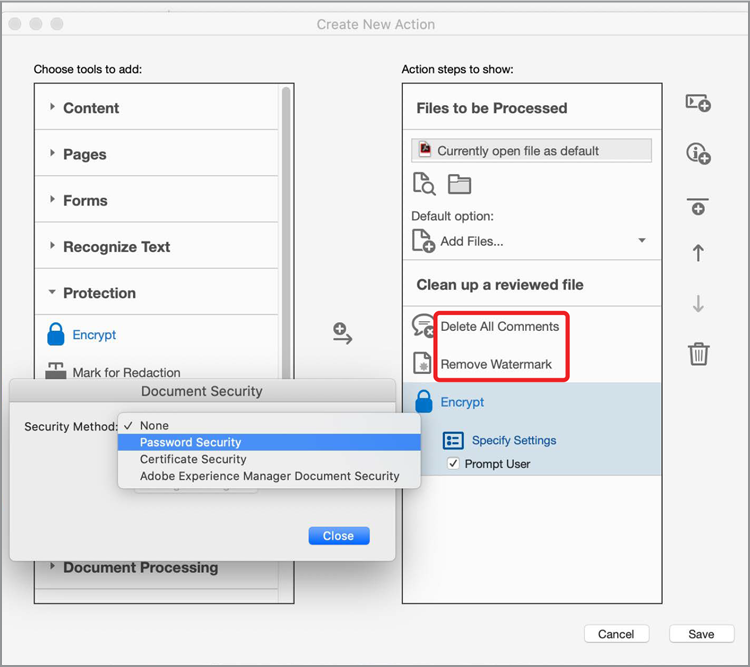

# Action Wizard

Für die Bereitstellung der besten Kundenerlebnisse müssen Inhalte schneller denn je erstellt werden. Sparen Sie Zeit und Tastenanschläge, indem Sie eine Aktion verwenden, um automatisch einen Satz von Befehlen auf eine oder mehrere Dateien anzuwenden.

>[!NOTE]
>
>Nur in Acrobat Pro verfügbar.

1. Wählen Sie **[!UICONTROL Action Wizard]** im mittleren oder rechten Fensterbereich von [!UICONTROL Tools] aus.

   

   Vordefinierte Aktionen werden in der **Aktionsliste** angezeigt.

1. Wählen Sie im oberen Menü die Option **[!UICONTROL Neue Aktion]**, um eine benutzerdefinierte Aktion zu erstellen.

   

1. Wählen Sie eine Aufgabe aus der Liste links aus, und klicken Sie dann auf den mittleren Pfeil, um sie der rechten Spalte im Dialogfeld &quot;**[!UICONTROL Neue Aktion erstellen]**&quot; hinzuzufügen.

   *Die Einstellungen für jede Aufgabe sind in diesem Dialogfeld vordefiniert, oder Sie können den Benutzer auffordern, während der Ausführung der Aktion alle erforderlichen Entscheidungen zu treffen.*

   

1. Wählen Sie **[!UICONTROL Speichern]** aus, und geben Sie Ihrer Aktion einen Namen, sodass sie in der Liste **[!UICONTROL Aktionen]** angezeigt wird.

Sie können die benutzerdefinierte Aktion jetzt jederzeit ausführen, wenn Sie diese bestimmte Schrittfolge für eine oder mehrere PDF-Dateien ausführen möchten.

>[!TIP]
>
>Dieses Video ist Teil des Kurses [Intelligenter arbeiten mit Acrobat DC und Microsoft 365](https://experienceleague.adobe.com/?recommended=Acrobat-U-1-2021.microsoft365), der kostenlos auf dem Experience League verfügbar ist!
