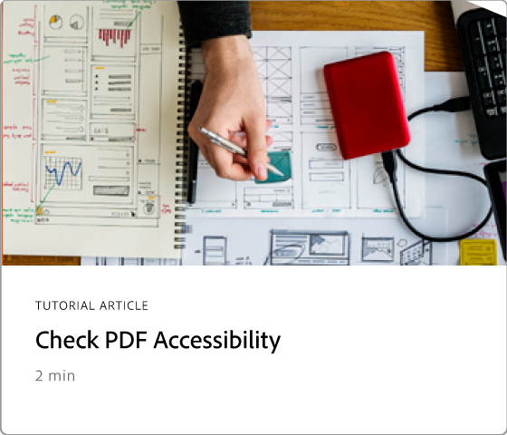

# Erweiterte Aufgabenübersicht

Mit diesen erweiterten Tools in Acrobat kannst du nicht nur die Grundlagen erlernen, Erfahren Sie, wie Sie eine Aktion erstellen, um Routineaufgaben zu wiederholen, vertrauliche Informationen zu entfernen, große Dateien zu reduzieren und zu optimieren, Formulardaten schnell zu erfassen und universell zugängliche PDF-Dateien zu erstellen.

## Neue Funktionen

* [Optimize PDF für SEO (Suchmaschinenoptimierung)](optimizeseo.md)
Erfahren Sie, wie Sie eine PDF für eine verbesserte Auffindbarkeit und ein Suchmaschinen-Ranking im Web optimieren.

## Tutorials zu erweiterten Aufgaben

<table style="table-layout:fixed">
<tr>
  <td>
    
  </td>
  <td>
    
  </td>
  <td>
    
  </td>
  <td>
    
  </td>
</tr>
<tr>
 <td>
    
  </td>
  <td>
    
  </td>
  <td>
    
  </td>
 <td>
    
  </td>
</tr>
<tr>
  <td>
    
  </td>
  <td>
    
  </td>
 <td>
    
  </td>
  <td>
    
  </td>
</tr>
<tr>
 <td>
    
  </td>
 <td>
    
  </td>
  <td>
   
    

     
  </td> 
  <td>
   
    

     
  </td>  
</tr>
</table>
