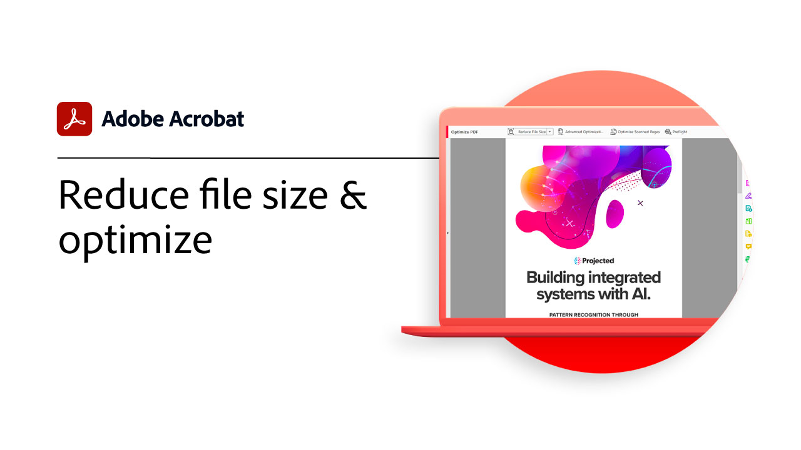

# Erweiterte Aufgabenübersicht

Mit diesen erweiterten Tools in Acrobat kannst du nicht nur die Grundlagen erlernen, Erfahren Sie, wie Sie eine Aktion erstellen, um Routineaufgaben zu wiederholen, vertrauliche Informationen zu entfernen, große Dateien zu reduzieren und zu optimieren, Formulardaten schnell zu erfassen und universell zugängliche PDF-Dateien zu erstellen.

## Tutorials zu Acrobat

<table style="table-layout:fixed">
<tr>
  <td>
    
    

    <a href="enhance.md"><strong>PDF verbessern</strong></a>
    

    <em>Transformieren Sie Ihren PDF durch Hinzufügen von Grafikverbesserungen und automatischer Nummerierung</em>
     
  </td>
  <td>
    
    

    <a href="compare.md"><strong>Unterschiede zwischen zwei PDF erkennen</strong></a>
    

    <em>Schnelle und präzise Erkennung der Unterschiede zwischen zwei PDF-Dateien zur Verbesserung der Arbeitsabläufe für die Dokumentüberprüfung</em>
     
  </td>
  <td>
    
    

    <a href="action.md"><strong>Aktionsassistent</strong></a>
    

    <em>Sparen Sie Zeit und Tastenanschläge, indem Sie mithilfe einer Aktion automatisch einen Satz von Befehlen auf eine oder mehrere Dateien anwenden</em>
     
  </td>  
</tr>
<tr>
  <td>
    
    

    <a href="redact.md"><strong>Schwärzen und bereinigen</strong></a>
    

    <em>Private oder vertrauliche Informationen dauerhaft von Ihrem PDF entfernen</em>
     
  </td>
  <td>
    
    

    <a href="reduce.md"><strong>Dateigröße reduzieren und optimieren.</strong></a>
    

    <em>Reduzierung großer Dateien und Optimierung Ihrer PDF ohne Qualitätseinbußen bei der Freigabe, Veröffentlichung oder Archivierung</em>
     
  </td>
  <td>
    
    

    <a href="formdata.md"><strong>Arbeiten mit Formulardaten</strong></a>
    

    <em>Formulardaten in einer einzigen Tabelle zusammenfassen</em>
     
  </td>
</tr>
<tr>
  <td>
    
    

    <a href="accessibility.md"><strong>Barrierefreiheit für PDF überprüfen</strong></a>
    

    <em>Erfahren Sie, wie Sie überprüfen, ob Ihr PDF für Menschen mit Behinderungen universell zugänglich ist</em>
     
  </td>
  <td>
    
    

    <a href="accessibility-series.md"><strong>Acrobat Accessibility-Reihe</strong></a>
    

    <em>In dieser sechsteiligen On-Demand-Webinar-Reihe lernen Sie nicht nur die Grundlagen der Barrierefreiheit kennen, sondern lernen auch, wie Sie Ihre PDF-Dateien mit Tags versehen</em>
     
  </td>
  <td>
   
    

     
  </td>
</tr>
</table>
