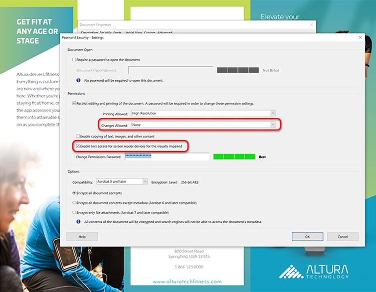

# Optimize PDF für SEO (Search Engine Optimization)

Erfahren Sie, wie Sie eine PDF für eine verbesserte Auffindbarkeit und ein Suchmaschinen-Ranking im Web optimieren.

## 1. Eindeutige Inhalte erstellen

Erstellen Sie PDF-Inhalte, die sich von den Informationen auf Ihren Webseiten unterscheiden.

+++Details zum Erstellen einzigartiger Inhalte anzeigen

PDF-Inhalte sollten eindeutig sein und wie folgt strukturiert sein:

* Verwenden einer einzelnen Hauptüberschrift/eines Titels, der mit einem Schlüsselwort beginnt
* Schlüsselwort-Unterüberschriften in einer hierarchischen Struktur verwenden
* Verwenden Sie kurze Absätze mit Schlüsselwörtern und Listen
* Interne und externe Hyperlinks (Inhalte Ihrer Website oder anderer Websites) hinzufügen
* Hinzufügen eines verlinkten Inhaltsverzeichnisses für Dokumente mit mehr als 25 Seiten
* [Texterkennung](https://experienceleague.adobe.com/docs/document-cloud-learn/acrobat-learning/getting-started/scan-and-ocr.html) für alle gescannten Dokumente ausführen
* Mobile-optimierte PDF.
Um das mobile Anzeigeerlebnis Ihres PDF zu überprüfen, öffnen Sie die Datei in der [Acrobat Reader-App](https://www.adobe.com/acrobat/mobile/acrobat-reader.html) und aktivieren Sie den Liquid Mode. Fügen Sie bei Bedarf weitere Unterüberschriften hinzu, um die Navigation zu verbessern.

  

+++

  

## 2. Dokumenteigenschaften hinzufügen

PDF-Dateien haben einen Titel und eine Meta-Beschreibung, genau wie eine Webseite.

+++Details zum Hinzufügen von Dokumenteigenschaften anzeigen

Fügen Sie den Schlüssel **[!UICONTROL Dokumenteigenschaften]** wie folgt hinzu:

1. Wählen Sie **[!UICONTROL Datei > Eigenschaften]** aus oder verwenden Sie den Tastaturbefehl *Strg + D* unter Windows bzw. *Befehl + D* unter Mac und wählen Sie die Registerkarte **[!UICONTROL Beschreibung]** aus.
1. Geben Sie einen für Stichwörter optimierten Titel in das Feld **[!UICONTROL Titel:]** ein.
1. Stellen Sie sicher, dass das Feld **[!UICONTROL Autor:]** keine bestimmte Person in Ihrer Organisation identifiziert.
1. Geben Sie im Feld **[!UICONTROL Betreff:]** eine für Stichwörter optimierte Zusammenfassung Ihres Dokuments ein.
Versuchen Sie, die Zusammenfassung mit einem Aktionsverb wie Lernen, Entdecken, Entdecken usw. zu beginnen.
1. Wählen Sie **[!UICONTROL Zusätzliche Metadaten]**, um Copyright- oder Public-Domain-Informationen hinzuzufügen, falls zutreffend.

   

+++

  

## 3. Markieren Sie Ihren PDF

Durch das Markieren von Inhalten auf Ihrem PDF wird Ihre Datei [nicht nur für Personen mit Behinderungen zugänglich](https://experienceleague.adobe.com/docs/document-cloud-learn/acrobat-learning/advanced-tasks/accessibility.html), sondern auch für SEO verbessert.

+++Anzeigen von Details zum Markieren eines PDF

Taggen Sie eine PDF wie folgt:

1. Wählen Sie **[!UICONTROL Barrierefreiheit]** im Zentrum von **[!UICONTROL Tools]** aus.
1. Wählen Sie im rechten Fensterbereich **[!UICONTROL Dokument automatisch taggen]**.
1. Befolgen Sie die Hinweise zur Reparatur im linken Bereich **[!UICONTROL Erkennungsbericht]**.
1. Führen Sie ggf. **[!UICONTROL Alternativtext festlegen]** aus.
1. Verwenden Sie Schlüsselwörter, um das Bild im **[!UICONTROL Alternativtext]** zu beschreiben.

   

+++

>[!NOTE]
>
>Nur in Acrobat Pro verfügbar.

  

## 4. Für das Web vorbereiten

Optimieren Sie die Interaktion mit Ihrem PDF, indem Sie ihn für die Webanzeige vorbereiten und [die PDF-Dateigröße reduzieren](https://www.adobe.com/de/acrobat/online/compress-pdf.html){target="_blank"}.

+++Details zur Vorbereitung Ihres PDF für das Web anzeigen

Bereiten Sie Ihren PDF wie folgt für das Web vor:

Um Ihre PDF für das Web vorzubereiten, wählen Sie **[!UICONTROL Datei > Speichern unter > PDF mit reduzierter Größe]**.

Durch diesen Schritt wird die Dateigröße reduziert und **Schnelle Webanzeige** auf der PDF aktiviert. Mit **Schnelle Webanzeige** kann die Datei sofort geöffnet, angezeigt und durchsucht werden, bevor die gesamte Datei gestreamt oder heruntergeladen wird. Dadurch wird eine optimale Endbenutzererfahrung erzielt. Öffnen Sie **[!UICONTROL Dokumenteigenschaften]** (*Strg + D* unter Windows oder *Befehl + D* unter Mac), um festzustellen, ob **Schnelle Webanzeige** aktiviert ist.

>[!TIP]
>
>Wenn Sie über Acrobat Pro verfügen, führen Sie im Action Wizard-Tool die Option &quot;Für Web und Mobil optimieren&quot; aus. Diese Aktion konvertiert Farben in sRGB und bettet Schriftarten ein, um eine einheitliche Anzeige der PDF auf allen Browsern und Mobilgeräten zu gewährleisten.

+++

  

## 5. Schlüsselwortdateinamen erstellen

+++Anzeigen von Details zum Erstellen eines Dateinamens mit Stichwörtern

Erstellen Sie einen Schlüsselwortdateinamen wie folgt:

Der Dateiname wird Teil der URL, wenn eine PDF im Internet veröffentlicht wird. Es empfiehlt sich, den für Stichwörter optimierten Titel mit dem Dateinamen zu synchronisieren. Um eine einfache Suche zu ermöglichen, verwenden Sie Kleinbuchstaben, keine Interpunktion oder Hashes und vermeiden Sie Stoppwörter (a, an, the, and, it, for, or, aber in my, your, our, and their, etc.). Wenn Sie mehrere Wörter verwenden, fügen Sie zwischen den Wörtern einen Bindestrich oder einen Unterstrich ein.

+++

  

## 6. Sichern Sie Ihren PDF

Der letzte Schritt besteht darin, [Ihren PDF zu schützen](https://www.adobe.com/de/acrobat/online/password-protect-pdf.html){target="_blank"}, um nicht autorisierte Änderungen zu verhindern.

+++Zum Sichern Ihres PDF

Sichern Sie eine PDF wie folgt:

1. Öffnen Sie **[!UICONTROL Dokumenteigenschaften]** (*Strg + D* unter Windows oder *Befehl + D* unter Mac) und wählen Sie die Registerkarte **[!UICONTROL Sicherheit]** aus.
1. Überprüfen Sie **[!UICONTROL Drucken von Bearbeitung und Drucken des Dokuments. Zum Ändern dieser Einstellungen ist ein Kennwort erforderlich.]**
1. Wählen Sie unter **[!UICONTROL Zulässige Änderungen:]** **[!UICONTROL Keine]** aus.
1. Überprüfen Sie **[!UICONTROL Textzugriff für Bildschirmlesegeräte für Sehbehinderte aktivieren.]**
1. Geben Sie ein sicheres Kennwort ein und bestätigen Sie es.
1. Wählen Sie **[!UICONTROL OK]** und speichern Sie die Datei.

   

+++

Ihr PDF kann jetzt im Web veröffentlicht werden - mit einem optimalen Keyword-Ranking-Potenzial und der Möglichkeit zur Interaktion mit den Endbenutzern.
