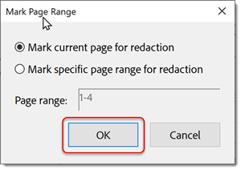

# Schwärzen und Bereinigen

Erfahren Sie, wie Sie mit dem Schwärzen-Werkzeug private oder vertrauliche Informationen dauerhaft von Ihrer PDF entfernen. Mit dem Werkzeug &quot;Bereinigen&quot;können Sie Informationen entfernen, die in der Datei nicht sichtbar sind, z. B. Kommentare, Metadaten oder ausgeblendete Ebenen.

>[!NOTE]
>
>Nur in Acrobat Pro DC verfügbar.

## Text und Bilder schwärzen

1. Auswählen **[!UICONTROL Schwärzen]** aus dem [!UICONTROL Werkzeuge] mittleren oder rechten Fensterbereich.

   

1. Auswählen **[!UICONTROL Text und Bilder schwärzen]** **>** **[!UICONTROL Eigenschaften]** um das Erscheinungsbild Ihrer Schwärzungen anzupassen, einschließlich der Farbe von Schwärzungsfeldern oder Textüberlagerung.

   

   Um Informationen zu schwärzen, markieren Sie zunächst die Elemente, die entfernt werden sollen, und wenden Sie dann die Schwärzungen an. Sie können ganze Seiten oder ausgewählte Inhalte schwärzen.

1. Auswählen **[!UICONTROL Seiten schwärzen]** wählen Sie dann die Seite oder den Seitenbereich aus, die schwärzen sollen, und wählen Sie **[!UICONTROL OK]**.

   

   Oder verwenden Sie den Cursor, um den zu schwärzenden Inhalt auszuwählen. Sie können eine Vorschau der Schwärzung anzeigen, indem Sie den Mauszeiger über den ausgewählten Inhalt bewegen.

   

1. Auswählen **[!UICONTROL Text und Bilder schwärzen]** **>** **[!UICONTROL Text suchen und schwärzen]** um bestimmte Inhalte zu finden, die schwärzen sollen.

   Verwenden Sie das Suchfeld, um nach einem bestimmten Wort oder Ausdruck zu suchen.

1. Auswählen **[!UICONTROL Muster]** um bestimmte Arten von Informationen zu suchen, aktivieren Sie die Kontrollkästchen und wählen Sie **[!UICONTROL Text suchen und entfernen]**.

   

1. Auswählen **[!UICONTROL Anwenden]** im [!UICONTROL Schwärzen] im oberen Menü, um die markierten Schwärzungen anzuwenden und die geschwärzte Datei zu speichern.

   

## Dokument bereinigen

1. Auswählen **[!UICONTROL Dokument bereinigen]** im [!UICONTROL Schwärzen] oberes Menü.

1. Auswählen **[!UICONTROL OK]** um das Entfernen ausgeblendeter Informationen zu bestätigen. Oder wählen Sie **[!UICONTROL Klicken Sie hier]** um versteckte Informationen selektiv zu entfernen.

   

>[!TIP]
>
>Um den Schwärzungsprozess zu beschleunigen, sehen Sie sich das [Action Wizard](../advanced-tasks/action.md).

Wählen Sie das PDF-Symbol aus, um das *Schwärzen und Bereinigen* Tutorial.

.
