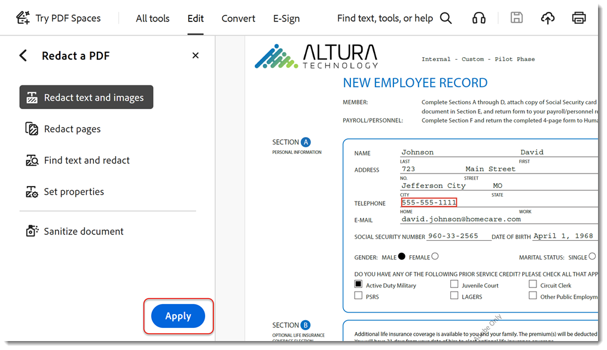

# Vertrauliche Informationen entfernen

Erfahren Sie, wie Sie mit dem Werkzeug &quot;Schwärzen&quot; private oder vertrauliche Informationen dauerhaft von einer PDF entfernen und dann das Dokument bereinigen, um Informationen zu entfernen, die nicht in der Datei angezeigt werden, wie Kommentare, Metadaten oder ausgeblendete Ebenen. Vertrauliche Inhalte und verborgene Daten müssen dauerhaft entfernt werden, damit die Informationen beim Veröffentlichen Ihres PDF nicht weitergegeben werden. In diesem Tutorial wird das [neue Acrobat-Erlebnis](../getting-started/new-workspace.md) verwendet.

>[!NOTE]
>
>Nur in Acrobat Pro verfügbar.

[!BADGE Organisatorische Auswirkungen]
Kundendatenschutz, Risikomanagement

## Informationen in Acrobat für den Desktop schwärzen

1. Öffnen Sie eine Datei, und wählen Sie **[!UICONTROL Alle Tools]** in der Symbolleiste aus. Wählen Sie dann **[!UICONTROL PDF schwärzen]**.
   

1. Wählen Sie **[!UICONTROL Eigenschaften festlegen]** aus, um das Erscheinungsbild Ihrer Schwärzungen einschließlich der Farbe der Schwärzungsfelder oder der Textüberlagerung anzupassen.

   

   Um Informationen zu schwärzen, markieren Sie zuerst die zu entfernenden Elemente und wenden Sie dann die Schwärzungen an. Du kannst ganze Seiten oder ausgewählten Inhalt schwärzen.

1. Wählen Sie **[!UICONTROL Text und Bilder schwärzen]** aus, und markieren Sie den zu schwärzenden Inhalt mit dem Cursor.

   

   Sie können eine Vorschau der Schwärzung anzeigen, indem Sie mit dem Mauszeiger auf den ausgewählten Inhalt zeigen.

    schwärzen

1. Wählen Sie **[!UICONTROL Text suchen und schwärzen]**, um nach einem bestimmten Wort oder Ausdruck zu suchen, oder suchen Sie nach einem Muster, um bestimmte Arten von Informationen zu finden. Legen Sie die Suche fest und wählen Sie &quot;Text suchen und entfernen&quot;.

1. Aktivieren Sie im Dialogfeld mit den Suchergebnissen die Kontrollkästchen neben den Elementen und wählen Sie **[!UICONTROL Markierte Ergebnisse für Schwärzung markieren]**.

    schwärzen

1. Wählen Sie **[!UICONTROL Seiten schwärzen]**, um ganze Seiten zum Schwärzen zu markieren.

   

1. Wählen Sie Ihre Seiten aus und wählen Sie **[!UICONTROL OK]**.

1. Wählen Sie im Bedienfeld &quot;PDF schwärzen&quot; die Option **[!UICONTROL Anwenden]** aus, um die markierten Schwärzungen anzuwenden.

   

1. Wählen Sie **[!UICONTROL Weiter]**, um ausgeblendete Informationen zu bereinigen und zu entfernen.

   

Sobald Sie dies bestätigen, werden die Schwärzungen und ausgeblendeten Informationen dauerhaft entfernt und in einer neuen Datei gespeichert.

>[!TIP]
>
>Um den Schwärzungsprozess zu beschleunigen, sollten Sie die [Action Wizard](../advanced-tasks/action.md) auschecken.
