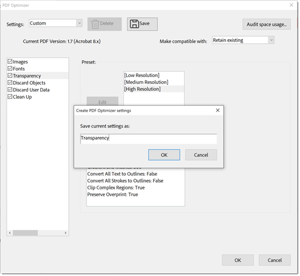

# Komprimieren und Optimieren einer PDF

Erfahren Sie, wie Sie die Größe einer PDF-Datei komprimieren und optimieren können. Das Komprimieren eines PDF vereinfacht das Teilen per E-Mail oder das Hochladen auf Websites mit eingeschränkter Dateigröße. Sie können auch das Anwendererlebnis verbessern und Speicherkosten sparen, indem Sie Ihren PDF optimieren.

## PDF in Acrobat auf dem Desktop komprimieren

1. Öffnen Sie eine Datei, und wählen Sie **[!UICONTROL Alle Tools]** in der Symbolleiste aus. Wählen Sie dann **[!UICONTROL PDF komprimieren]** aus.

   

1. Wählen Sie **[!UICONTROL Einzelne Dateien]** oder **[!UICONTROL Mehrere Dateien]** im Bedienfeld **[!UICONTROL PDF]** komprimieren aus.

   

1. Wähle **[!UICONTROL Speichern]** aus.

   

   Die Datei wird auf die kleinstmögliche Größe reduziert, wobei die Qualität des Dokuments erhalten bleibt.

## PDF in Acrobat im Internet komprimieren

1. Melden Sie sich in einem Browser bei [acrobat.adobe.com](https://acrobat.adobe.com/de/de) an.

1. Wählen Sie im oberen Menü **[!UICONTROL Konvertieren > Eine PDF komprimieren]** aus.

   

1. Wählen Sie **[!UICONTROL Dateien auswählen]**, wählen Sie Ihre Dateien aus und wählen Sie **[!UICONTROL Öffnen]**.

   

1. Wählen Sie eine Komprimierungsstufe aus und wählen Sie **[!UICONTROL Komprimieren]**.

   

## So optimieren Sie einen PDF in Acrobat auf dem Desktop

>[!NOTE]
>
>Das Optimieren eines PDF ist nur in Acrobat Pro auf dem Desktop verfügbar.

1. Öffnen Sie eine Datei, und wählen Sie **[!UICONTROL Alle Tools]** in der Symbolleiste aus. Wählen Sie dann **[!UICONTROL PDF komprimieren]** aus.

   

1. Wählen Sie **[!UICONTROL Erweiterte Optimierung]** im Bereich **[!UICONTROL PDF]** komprimieren.

   

   Standardmäßig ist **Standard** im Menü **Einstellungen** ausgewählt. Wenn Sie im Dialogfeld &quot;PDF-Optimierung&quot; Einstellungen ändern, wechselt das Menü &quot;**Einstellungen**&quot; automatisch zu &quot;**Benutzerdefiniert**&quot;.

1. Wählen Sie im Dropdown-Menü **Kompatibilität herstellen mit** aus, um die aktuelle PDF-Version beizubehalten, **Vorhandene beibehalten**, oder wählen Sie eine Acrobat-Version aus. Aktivieren Sie das Kontrollkästchen neben einem Bedienfeld (z. B. &quot;Bilder&quot;, &quot;Schriftarten&quot;, &quot;Transparenz&quot;), wählen Sie in diesem Bedienfeld Optionen aus, wählen Sie dann **[!UICONTROL OK]** und speichern Sie dann die Datei.

   

   Um zu verhindern, dass während der Optimierung alle Optionen in einem Fenster ausgeführt werden, deaktivieren Sie das Kontrollkästchen für dieses Fenster.

1. (Optional) Wählen Sie zum Speichern Ihrer benutzerdefinierten Einstellungen &quot;**[!UICONTROL Speichern]**&quot; aus und geben Sie einen Namen für die Einstellungen ein. Um eine gespeicherte Einstellung zu löschen, wählen Sie sie im Menü **Einstellungen** aus und wählen Sie **[!UICONTROL Löschen]**.

   

>[!TIP]
>
>Um mehrere PDF-Dateien zu optimieren, verwenden Sie die [Action Wizard](../advanced-tasks/action.md).

<table style="table-layout:fixed">
  <td>
    
    

    <a href="reduce.md"><strong>PDF komprimieren und optimieren</strong></a>
    

    <em>Reduzieren Sie große Dateien, und optimieren Sie Ihre PDF, ohne die Qualität für die Freigabe, Veröffentlichung oder Archivierung zu beeinträchtigen</em>
    2 
  </td>
  <td>
        
        

         
      </td>
    <td>
        
        

         
    </td>
    <td>
        
        

         
    </td>
</tr>
</table>