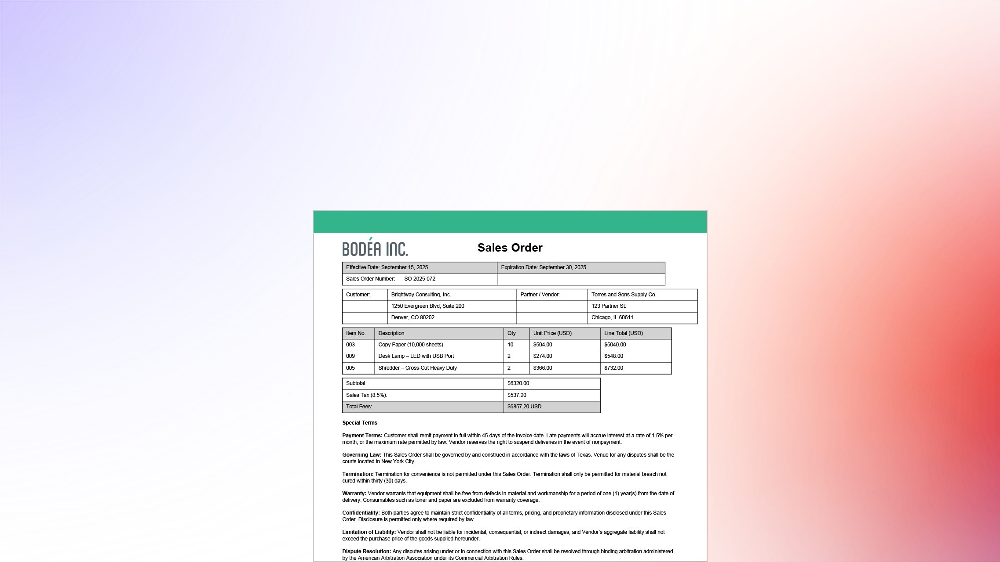

# Analyzer in Acrobat Studio - Übersicht

Analyzer in Acrobat Studio hilft Business-Anwendern, strukturierte, überprüfbare Erkenntnisse aus zehntausenden unstrukturierten Dokumenten zu extrahieren, um dokumentzentrierte Geschäftsprozesse zu automatisieren.

## Neue Funktionen

>[!BEGINTABS]

>[!TAB Erste Schritte]

[Erste Schritte](get-started.md), indem Sie lernen, wie strukturierte, zitierte Daten aus großen Dokumentmengen abgerufen werden können.

>[!TAB Sammlungen verwenden]

Erfahren Sie, wie Sie manuelle und verknüpfte [Sammlungen](collections.md) erstellen, Attribute anwenden und Dokumente organisieren, wenn Ihr Inhalt wächst.

>[!TAB Mit Attributen arbeiten]

Erfahren Sie, wie Sie [Attribute](attributes.md) mit Analyzer in Acrobat Studio erstellen, testen und optimieren.

>[!TAB Erweiterte Funktionen entdecken]

Erfahren Sie, wie Sie extrahierte Daten [exportieren, eine Sammlung freigeben, zwei Dokumente vergleichen und AI Assistant ](advanced.md) für schnelle Ad-hoc-Fragen verwenden können.

>[!ENDTABS]

## Analyzer in Acrobat Studio - Tutorials

<table style="table-layout:fixed">
<tr>
  <td>
    
    

    <a href="get-started.md"><strong>Erste Schritte</strong></a>
    

    Erfahren Sie, wie Analyzer in Acrobat Studio Ihnen hilft, strukturierte, zitierte Daten aus großen Dokumentmengen herauszuziehen.
     
  </td>
  <td>
    
    

    <a href="collections.md"><strong>Sammlungen verwenden</strong></a>
    

    Erfahren Sie, wie Sie manuelle und verknüpfte Sammlungen erstellen, Attribute anwenden und Dokumente beim Wachsen Ihrer Inhalte organisieren können.
     
  </td>
  <td>
    
    

    <a href="attributes.md"><strong>Mit Attributen arbeiten</strong></a>
    

    Erfahren Sie, wie Sie Attribute mit Analyzer in Acrobat Studio erstellen, testen und optimieren können.
     
  </td>
  <td>
    
    

    <a href="advanced.md"><strong>Erweiterte Funktionen entdecken</strong></a>
    

    Lernen Sie, wie Sie extrahierte Daten exportieren, eine Sammlung freigeben, zwei Dokumente vergleichen und AI Assistant für schnelle Ad-hoc-Fragen verwenden können.
     
  </td>
</tr>
<tr>
   <td>
    
    

    <a href="use-cases/use-case-overview.md"><strong>Analyzer in Acrobat Studio - Anwendungsfälle</strong></a>
    

    Nutzungsszenarien, die zeigen, wie Organisationen Überprüfungsprozesse optimieren, Erkenntnisse gewinnen und Dokumenteninhalte in geschäftsfähige Daten umwandeln können
     
  </td>
    <td>
    
    

     
  </td>
  <td>
    
    

     
  </td>
   <td>
    
    

     
  </td>
</tr>
</table>