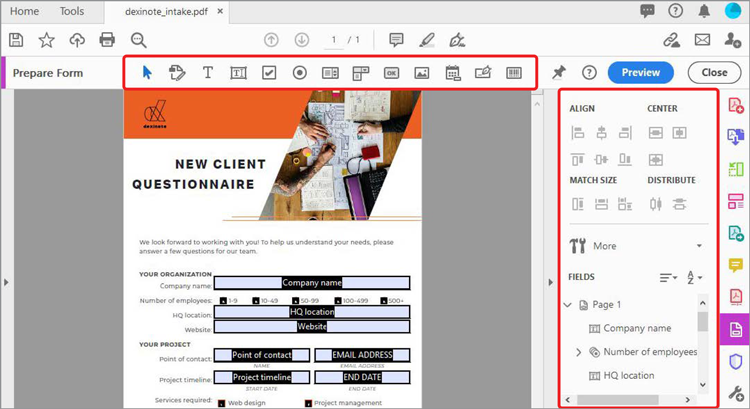

# Ausfüllbares Formular erstellen

Wandeln Sie ein gescanntes Papierformular oder ein in einer InDesign-, Microsoft Word-, Excel- oder anderen Anwendung erstelltes Dokument in ein ausfüllbares PDF-Formular um.

1. Auswählen **[!UICONTROL Prepare Form]** im Fenster &quot; [!UICONTROL Tools] mittlerer oder rechter Fensterbereich.

   

1. Wählen Sie ein vorhandenes Dokument aus, das als Formular verwendet werden soll (z. B. eine Word-, Excel-, InDesign- oder PDF-Datei), und wählen Sie **Start**.

   

   Wenn [!UICONTROL Automatische Erkennung von Formularfeldern] ist **EIN** Formularfelder werden automatisch in der PDF-Datei erkannt. Überprüfen Sie die Platzierung der Formularfelder.

   Ziehen Sie Felder per Drag-and-Drop aus dem oberen Menü und bearbeiten Sie die Formularfelddetails im rechten Fenster.

1. Auswählen **[!UICONTROL Vorschau]** , um Ihr Formular anzuzeigen.

   

1. Auswählen **[!UICONTROL Bearbeiten]** , um die Arbeit fortzusetzen, oder wählen Sie **[!UICONTROL Datei]** **>** **[!UICONTROL Speichern unter]** , um das PDF-Formular zu speichern.

   

>[!TIP]
>
>Hier könnt ihr Formulare genauer ausarbeiten. [fortgeschrittene Techniken](../advanced-tasks/advancedforms.md).