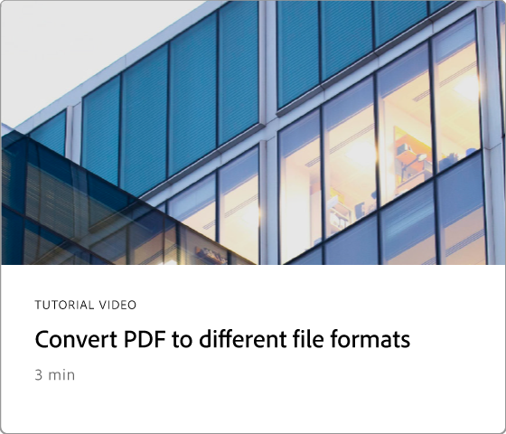

# Übersicht über die ersten Schritte

In diesen kurzen Schritt-für-Schritt-Tutorials erfahren Sie, wie Sie Adobe Acrobat verwenden. Von der Erstellung eines Dokuments bis hin zum Schützen oder [Bearbeiten Ihrer PDF-Dateien](https://www.adobe.com/de/acrobat/online/pdf-editor.html){target="_blank"} - dieser Inhalt ist so konzipiert, dass er Sie beim PDF von Arbeitsabläufen unterstützt. Lesen Sie diese fachkundig kuratierte [Wiedergabeliste](https://experienceleague.adobe.com/en/playlists/acrobat-get-started-business-users), um mit Acrobat zu beginnen.

## Neue Funktionen

>[!BEGINTABS]

>[!TAB In Echtzeit zusammenarbeiten]

Erfahren Sie, wie Sie einen [Überprüfungsprozess für Dokumente](collaborate.md) erstellen, der nicht nur die Effizienz verbessert, sondern auch die Qualität des Inhalts verbessert.

>[!TAB Neue Seite entwerfen]

Erfahren Sie, wie Sie [eine neue professionell aussehende Seite](add-custom-page.md) in Ihrem PDF mit Adobe Expreß entwerfen.

>[!TAB Grafiken auf einem PDF bearbeiten]

Erfahren Sie, wie Sie [Grafiken](edit-graphics.md) auf Ihrem PDF erstellen, bearbeiten und verbessern können.

>[!TAB Neues Arbeitsbereichserlebnis]

Erfahren Sie mehr über den [neuen Arbeitsbereich](new-workspace.md) in Acrobat, mit dem Sie schnell Tools erkennen und Ihre PDF-Aufgaben effizient erledigen können.

>[!ENDTABS]

## Tutorials zu ersten Schritten

## Erstellen, Kombinieren und Organisieren von Tutorials

<!-- START CARDS HTML - DO NOT MODIFY BY HAND -->

    

        

            

                <figure class="image x-is-16by9">
                    
                </figure>
            

            

                

                    

                        <a href="https://experienceleague.adobe.com/en/docs/document-cloud-learn/acrobat-learning/getting-started/create-pdf" target="_blank" rel="referrer" title="Erstellen von PDF-Dateien">PDF-Dateien erstellen</a>
                    

                    
PDF aus allen Dokumenttypen erstellen

                

                <a href="https://experienceleague.adobe.com/en/docs/document-cloud-learn/acrobat-learning/getting-started/create-pdf" target="_blank" rel="referrer" class="spectrum-Button spectrum-Button--outline spectrum-Button--primary spectrum-Button--sizeM" style="align-self: flex-start; margin-top: 1rem;">
                    Ansehen
                3</a>
            

        

    

    

        

            

                <figure class="image x-is-16by9">
                    
                </figure>
            

            

                

                    

                        <a href="https://experienceleague.adobe.com/en/docs/document-cloud-learn/acrobat-learning/getting-started/combine-to-pdf" target="_blank" rel="referrer" title="Dateien auf einer einzigen PDF zusammenführen">Dateien zu einer einzigen PDF zusammenführen</a>
                    

                    
Kombinieren Sie verschiedene Dateitypen nahtlos zu einer einzigen PDF

                

                <a href="https://experienceleague.adobe.com/en/docs/document-cloud-learn/acrobat-learning/getting-started/combine-to-pdf" target="_blank" rel="referrer" class="spectrum-Button spectrum-Button--outline spectrum-Button--primary spectrum-Button--sizeM" style="align-self: flex-start; margin-top: 1rem;">
                    Ansehen
                3</a>
            

        

    

    

        

            

                <figure class="image x-is-16by9">
                    
                </figure>
            

            

                

                    

                        <a href="https://experienceleague.adobe.com/en/docs/document-cloud-learn/acrobat-learning/getting-started/organize" target="_blank" rel="referrer" title="Organisieren von Seiten">Seiten organisieren</a>
                    

                    
Seiten nach Bedarf neu anordnen

                

                <a href="https://experienceleague.adobe.com/en/docs/document-cloud-learn/acrobat-learning/getting-started/organize" target="_blank" rel="referrer" class="spectrum-Button spectrum-Button--outline spectrum-Button--primary spectrum-Button--sizeM" style="align-self: flex-start; margin-top: 1rem;">
                    Ansehen
                3</a>
            

        

    

    

        

            

                <figure class="image x-is-16by9">
                    
                </figure>
            

            

                

                    

                        <a href="https://experienceleague.adobe.com/en/docs/document-cloud-learn/acrobat-learning/getting-started/add-custom-page" target="_blank" rel="referrer" title="Entwerfen einer neuen Seite">Neue Seite entwerfen</a>
                    

                    
Erfahren Sie, wie Sie eine neue professionell aussehende Seite auf Ihrem PDF erstellen

                

                <a href="https://experienceleague.adobe.com/en/docs/document-cloud-learn/acrobat-learning/getting-started/add-custom-page" target="_blank" rel="referrer" class="spectrum-Button spectrum-Button--outline spectrum-Button--primary spectrum-Button--sizeM" style="align-self: flex-start; margin-top: 1rem;">
                    Ansehen
                3</a>
            

        

    

<!-- END CARDS HTML - DO NOT MODIFY BY HAND -->

## Bearbeiten und Exportieren von Tutorials

<table style="table-layout:fixed">
  <tr>
    <td>
      
      

      <a href="edit-pdf.md"><strong>Text auf einem PDF bearbeiten</strong></a>
      

      Wörter, Sätze und sogar ganze Seiten auf dem PDF bearbeiten
       
    </td>
    <td>
      
      

      <a href="edit-graphics.md"><strong>Grafiken auf einem PDF bearbeiten</strong></a>
      

      Erfahren Sie, wie Sie Grafiken auf Ihrem PDF erstellen, bearbeiten und verbessern können.
       
    </td>
    <td>
      
      

      <a href="stylize-this-pdf.md"><strong>Diesen PDF stilisieren</strong></a>
      

      Erfahren Sie, wie Sie professionell wirkende PDF erstellen
       
    </td>
   <td>
      
      

      <a href="auto-adjust-layout.md"><strong>Layout automatisch anpassen</strong></a>
      

      Erfahren Sie mehr über den neuen Bearbeitungsmodus, mit dem Inhalte umfließen
       
    </td>
  </tr>
    <td>
      
      

      <a href="export-pdf.md"><strong>PDF in andere Dateiformate konvertieren</strong></a>
      

      Konvertieren Ihrer PDF-Dateien in verschiedene Dateiformate
       
    </td>
    <td>
   
    

     
  </td>
  <td>
   
    

     
  </td>
   <td>
   
    

     
  </td>
</tr>
</table>

## Tutorials zur Zusammenarbeit

<table style="table-layout:fixed">
  <tr>
    <td>
      
      

      <a href="collaborate.md"><strong>In Echtzeit zusammenarbeiten</strong></a>
      

      Durch Zusammenarbeit in Echtzeit bringen Sie Ihre Projekte voran.
    </td>
    <td>
      
      

      <a href="comment-on-pdf-files.md"><strong>Kommentar zu einem PDF</strong></a>
      

      Kommentare hinzufügen und den PDF für andere freigeben
       
    </td>
    <td>
    
      

       
    </td>
    <td>
    
      

       
    </td>
</tr>
</table>

## Zusätzliche Tutorials

<table style="table-layout:fixed">
<tr>
  <td>
    
    

      <a href="create-fillable-forms.md"><strong>Ausfüllbare Formulare erstellen</strong></a>
      

      Gescanntes Papier in ein ausfüllbares Formular umwandeln.
       
  </td>
  <td>
    
    

    <a href="fill-and-sign.md"><strong>Fill &amp; Sign für ein PDF-Formular </strong></a>
    

    Erfahren Sie, wie Sie ein PDF-Formular schnell und einfach ausfüllen und signieren können.
     
  </td>
  <td>
    
    

    <a href="scan-and-ocr.md"><strong>Scannen und OCR</strong></a>
    

    Scans oder Bilder in durchsuchbare, editierbare PDF-Dateien konvertieren
     
  </td>
  <td>
    
    

    <a href="password-protect.md"><strong>Protect einer PDF-Datei mit einem Kennwort</strong></a>
    

    Erfahren Sie, wie Sie Ihrem PDF ein Kennwort hinzufügen
     
  </td>
</tr>
<tr>
  <td>
    
    

    <a href="signatures.md"><strong>Signaturen abrufen</strong></a>
    

    Rechtsgültige elektronische Unterschriften einholen
     
  </td>
  <td>
    
    

    <a href="track.md"><strong>Dokumente verfolgen</strong></a>
    

    Dokumente mit elektronischen Unterschriften verfolgen und verwalten
     
  </td>
  <td>
      
      

      <a href="where-do-pdfs-come-from.md"><strong>Woher kommen die PDF?</strong></a>
      

      Erfahren Sie, woher die PDF kommen und wie Sie sie verwenden können.
       
  </td>
  <td>
   
    

     
  </td>
</tr>
</table>
