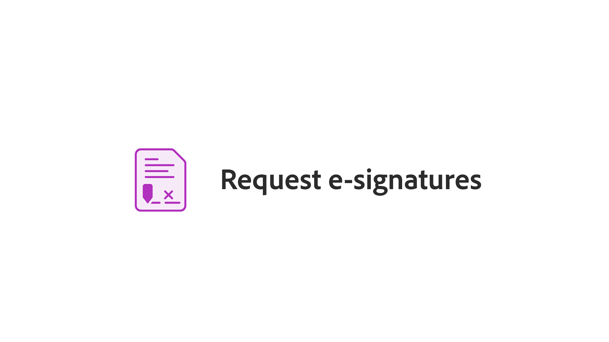

# Übersicht über die ersten Schritte

In diesen kurzen Schritt-für-Schritt-Tutorials erfahren Sie, wie Sie Adobe Acrobat verwenden. Von der Erstellung eines Dokuments bis hin zum Schützen oder [Bearbeiten Ihrer PDF-Dateien](https://www.adobe.com/de/acrobat/online/pdf-editor.html){target="_blank"} - dieser Inhalt ist so konzipiert, dass er Sie beim PDF von Arbeitsabläufen unterstützt.

## Neue Funktionen

>[!BEGINTABS]

>[!TAB Neue Seite entwerfen]

Erfahren Sie, wie Sie [eine neue professionell aussehende Seite](add-custom-page.md) in Ihrem PDF mit Adobe Expreß entwerfen.

>[!TAB Grafiken auf einem PDF bearbeiten]

Erfahren Sie, wie Sie [Grafiken](edit-graphics.md) auf Ihrem PDF erstellen, bearbeiten und verbessern können.

>[!TAB Neues Arbeitsbereichserlebnis]

Erfahren Sie mehr über den [neuen Arbeitsbereich](new-workspace.md) in Acrobat, mit dem Sie schnell Tools erkennen und Ihre PDF-Aufgaben effizient erledigen können.

>[!TAB Entdecken Sie PDF-Erkenntnisse mit dem AI-Assistenten]

Erfahren Sie, wie Sie mit dem [AI Assistant](ai-assistant.md) Einblicke in Ihre PDF-Dateien gewinnen.

>[!ENDTABS]

## Tutorials zu ersten Schritten

<table style="table-layout:fixed">
<tr>
  <td>
    
    

    <a href="new-workspace.md"><strong>Neues Arbeitsbereichserlebnis</strong></a>
    

    Erfahren Sie mehr über den neuen Arbeitsbereich in Acrobat
     
  </td>
  <td>
    
    

    <a href="get-to-know-the-acrobat-dc-interface.md"><strong>Grundlagen des Arbeitsbereichs</strong></a>
    

    Grundlagen des Acrobat-Arbeitsbereichs
     
  </td>
  <td>
    
    

    <a href="ai-assistant.md"><strong>Entdecken Sie PDF-Erkenntnisse mit dem AI-Assistenten</strong></a>
    

    Einblicke in PDF-Dateien mit dem KI-Assistenten gewinnen
     
  </td>
  <td>
    
    

    <a href="acrobatweb.md"><strong>Überall arbeiten mit Acrobat Web</strong></a>
    

    Von überall aus arbeiten
     
  </td>
</tr>
<tr>
  <td>
    
    

    <a href="productivity.md"><strong>Produktivität unterwegs</strong></a>
    

    Erfahren Sie, wie Sie auf Ihrem Tablet oder Smartphone mehr tun können.
     
  </td>
    <td>
      
      

      <a href="../integrate/integrate-overview.md#microsoft"><strong>Mit Microsoft 365 arbeiten</strong></a>
      

      Microsoft 365-PDF
        
    </td>
    <td>
      
      

      <a href="where-do-pdfs-come-from.md"><strong>Woher kommen die PDF?</strong></a>
      

      Erfahren Sie, woher die PDF kommen und wie Sie sie verwenden können.
       
    </td>
    <td>
    
      

       
    </td>
  </tr>
  </table>

## Erstellen, Kombinieren und Organisieren von Tutorials

<table style="table-layout:fixed">
  <tr>
    <td>
      
      

      <a href="create-pdf.md"><strong>PDF-Dateien erstellen</strong></a>
      

      PDF aus allen Dokumenttypen erstellen
       
    </td>
    <td>
      
      

      <a href="combine-to-pdf.md"><strong>Dateien zu einer einzigen PDF zusammenführen</strong></a>
      

      Kombinieren Sie verschiedene Dateitypen nahtlos zu einer einzigen PDF
       
    </td>
    <td>
      
      

      <a href="organize.md"><strong>Seiten organisieren</strong></a>
      

      Seiten nach Bedarf neu anordnen
       
    </td>
    <td>
      
      

      <a href="add-custom-page.md"><strong>Neue Seite entwerfen</strong></a>
      

     Erfahren Sie, wie Sie eine neue professionell aussehende Seite auf Ihrem PDF erstellen
       
    </td>
  </tr>
  </table>

## Bearbeiten und Exportieren von Tutorials

<table style="table-layout:fixed">
  <tr>
    <td>
      
      

      <a href="edit-pdf.md"><strong>Text auf einem PDF bearbeiten</strong></a>
      

      Wörter, Sätze und sogar ganze Seiten auf dem PDF bearbeiten
       
    </td>
    <td>
      
      

      <a href="edit-graphics.md"><strong>Grafiken auf einem PDF bearbeiten</strong></a>
      

      Erfahren Sie, wie Sie Grafiken auf Ihrem PDF erstellen, bearbeiten und verbessern können.
       
    </td>
    <td>
      
      

      <a href="stylize-this-pdf.md"><strong>Diesen PDF stilisieren</strong></a>
      

      Erfahren Sie, wie Sie professionell wirkende PDF erstellen
       
    </td>
   <td>
      
      

      <a href="auto-adjust-layout.md"><strong>Layout automatisch anpassen</strong></a>
      

      Erfahren Sie mehr über den neuen Bearbeitungsmodus, mit dem Inhalte umfließen
       
    </td>
  </tr>
    <td>
      
      

      <a href="export-pdf.md"><strong>PDF in andere Dateiformate konvertieren</strong></a>
      

      Konvertieren Ihrer PDF-Dateien in verschiedene Dateiformate
       
    </td>
    <td>
   
    

     
  </td>
  <td>
   
    

     
  </td>
   <td>
   
    

     
  </td>
</tr>
</table>

## Tutorials zur Zusammenarbeit

<table style="table-layout:fixed">
  <tr>
    <td>
      
      

      <a href="collaborate.md"><strong>In Echtzeit zusammenarbeiten</strong></a>
      

      Durch Zusammenarbeit in Echtzeit bringen Sie Ihre Projekte voran.
    </td>
    <td>
      
      

      <a href="comment-on-pdf-files.md"><strong>Kommentar zu einem PDF</strong></a>
      

      Kommentare hinzufügen und den PDF für andere freigeben
       
    </td>
    <td>
    
      

       
    </td>
    <td>
    
      

       
    </td>
</tr>
</table>

## Zusätzliche Tutorials

<table style="table-layout:fixed">
<tr>
  <td>
    
    

      <a href="create-fillable-forms.md"><strong>Ausfüllbare Formulare erstellen</strong></a>
      

      Gescanntes Papier in ein ausfüllbares Formular umwandeln.
       
  </td>
  <td>
    
    

    <a href="fill-and-sign.md"><strong>Fill &amp; Sign für ein PDF-Formular </strong></a>
    

    Erfahren Sie, wie Sie ein PDF-Formular schnell und einfach ausfüllen und signieren können.
     
  </td>
  <td>
    
    

    <a href="scan-and-ocr.md"><strong>Scannen und OCR</strong></a>
    

    Scans oder Bilder in durchsuchbare, editierbare PDF-Dateien konvertieren
     
  </td>
  <td>
    
    

    <a href="password-protect.md"><strong>Protect einer PDF-Datei mit einem Kennwort</strong></a>
    

    Erfahren Sie, wie Sie Ihrem PDF ein Kennwort hinzufügen
     
  </td>
</tr>
<tr>
  <td>
    
    

    <a href="signatures.md"><strong>Signaturen abrufen</strong></a>
    

    Rechtsgültige elektronische Unterschriften einholen
     
  </td>
  <td>
    
    

    <a href="track.md"><strong>Dokumente verfolgen</strong></a>
    

    Dokumente mit elektronischen Unterschriften verfolgen und verwalten
     
  </td>
  <td>
   
    

     
  </td>
  <td>
   
    

     
  </td>
</tr>
</table>
