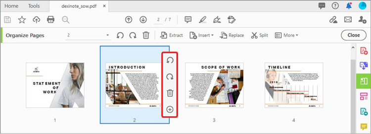
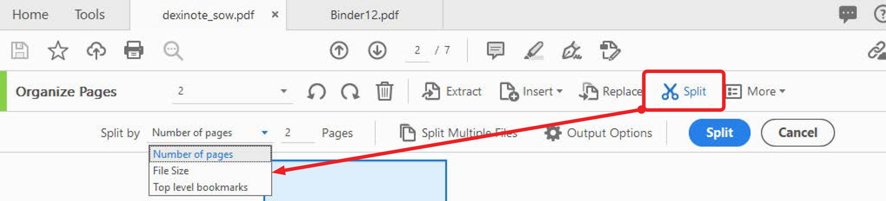

# Seiten organisieren

Verwenden **[!UICONTROL Seiten organisieren]** in Acrobat DC, um Seiten in Ihrem PDF hinzuzufügen, zu ersetzen, zu extrahieren, zu drehen, zu löschen und zu verschieben.

1. Auswählen **[!UICONTROL Seiten organisieren]** aus dem [!UICONTROL Werkzeuge] mittleren oder rechten Fensterbereich.

   

1. Bewegen Sie den Mauszeiger über eine Seite, um die Seite im oder gegen den Uhrzeigersinn zu drehen oder zu löschen.

   Um eine Seite zu verschieben, wählen Sie die Seite aus und ziehen Sie sie an die neue Position.

   

1. Auswählen **[!UICONTROL Extract]** in der Symbolleiste, um eine PDF aus einer oder mehreren Seiten zu erstellen.

1. Wählen Sie die Seite oder Seiten aus und wählen Sie dann **[!UICONTROL Extract]**.

   Sie können auch **[!UICONTROL Einfügen]** oder **[!UICONTROL Ersetzen]** Seiten und andere Optionen anzeigen, indem Sie **[!UICONTROL Mehr]**.

   

1. Auswählen **[!UICONTROL Teilen]** um einen oder mehrere PDF in mehrere kleinere PDF zu teilen.

   Beim Teilen einer PDF können Sie nach Seitenanzahl, Dateigröße oder Lesezeichen der obersten Ebene unterteilen.

   

Klicken Sie auf , um eine PDF des *Seiten organisieren* Tutorial.

