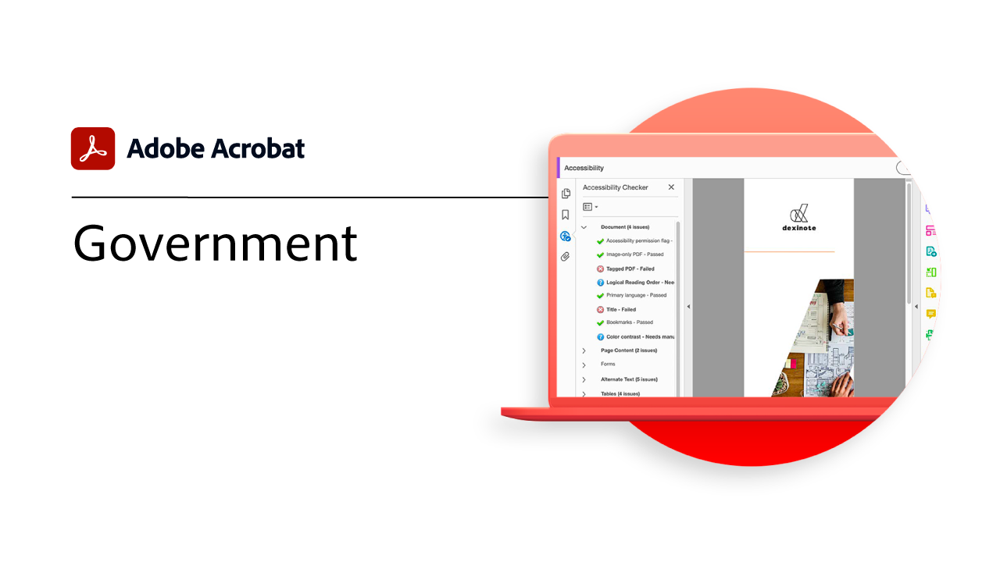

# Branchen und Abteilungen - Übersicht

Erfahrt, wie ihr Kunden- und Mitarbeitererlebnisse transformieren könnt, indem ihr Nutzungsszenarien und inspirierende Ideen in der Branche erkundet.

## Branchen und Abteilungen

<table style="table-layout:fixed">
<tr>
  <td>
    
    

    <a href="gov/gov-overview.md"><strong>Tutorials für Regierungseinrichtungen</strong></a>
    

    <em>Entdecken Sie unsere Acrobat-Tutorials speziell für Bund, Länder und Gemeinden</em>
    2 
  </td>
  <td>
   
    

     
  </td>  
  <td>
   
    

     
  </td>
  <td>
   
    

     
  </td>
</tr>
</table>
