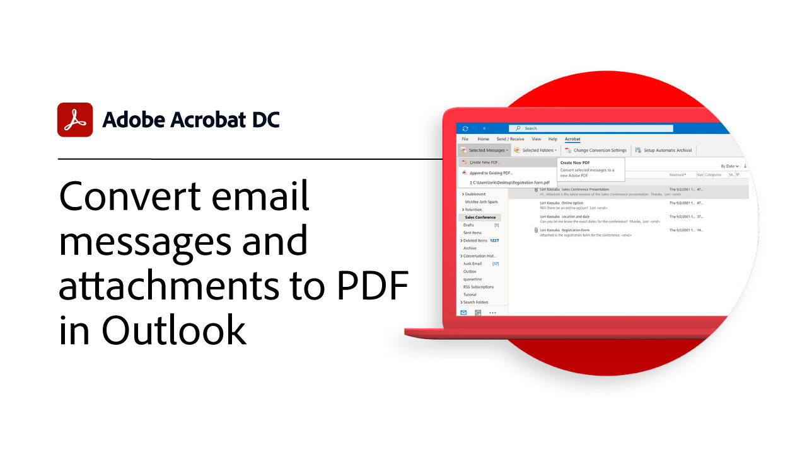

# Integrationen - Übersicht

Acrobat integrieren mit [!DNL Box], [!DNL Dropbox], [!DNL Google Drive], [!DNL OneDrive]und [!DNL Microsoft] Apps.

## Microsoft

Erfahre, wie alle Team-Mitglieder mit PDF-Dateien arbeiten können - direkt in [Microsoft 365](https://www.adobe.com/documentcloud/integrations/microsoft-office-365.html).

<table style="table-layout:fixed">
<tr>
  <td>
    
    

    <a href="createfromword.md"><strong>Erstellen von PDF-Dateien aus [!DNL Microsoft Word]</strong></a>
    

    <em>Erstellen Sie umfassende, zuverlässige PDF-Dateien mit verknüpften Inhaltsverzeichnissen, Querverweisen, Lesezeichen und sogar Anhängen direkt aus [!DNL Microsoft Word]</em>
     
  </td>
  <td>
    
    

    <a href="createofficeweb.md"><strong>PDF erstellen in [!DNL Office] für das Web</strong></a>
    

    <em>Erfahren Sie, wie Sie PDF-Dateien erstellen können, ohne Ihr [!DNL Microsoft Office] für Web-Anwendungen</em>
     
  </td>  
  <td>
    
    

    <a href="acrobatandsp.md"><strong>Arbeite mit deinen [!DNL SharePoint] files</strong></a>
    

    <em>Optimierung von Dokumenten-Workflows mit [!DNL SharePoint] und Acrobat</em>
     
  </td>  
</tr>
<tr>
  <td>
    
    

    <a href="acrobatandteams.md"><strong>PDF-Zusammenarbeit in [!DNL Microsoft Teams]</strong></a>
    

    <em>Sie können mit Kollegen zusammenarbeiten, indem Sie PDF anzeigen, kommentieren und überprüfen, ohne jemals [!DNL Microsoft Teams]</em>
     
  </td>
  <td>
    
    

    <a href="outlook.md"><strong>E-Mail-Nachrichten und Anhänge in PDF-Dateien konvertieren [!DNL Outlook]</strong></a>
    

    <em>Erfahrt, wie ihr Informationen auf professionellere und sicherere Weise innerhalb von [!DNL Outlook]</em>
     
  </td>
  <td>
    
    

    <a href="edge.md"><strong>Erstellen Sie PDF-Inhalte beim Durchsuchen mit [!DNL Microsoft Edge]</strong></a>
    

    <em>Erfahren Sie, wie Sie Webseiten mit der Adobe Acrobat-Erweiterung für [!DNL Microsoft Edge]</em>
     
  </td>
</tr>
</table>

## Google Drive

Erfahren Sie, wie Sie in kürzerer Zeit mehr erledigen können - mit den wichtigsten Tools für PDF und elektronische Signaturen in [!DNL Google Drive].

<table style="table-layout:fixed">
<tr>
  <td>
    
    

    <a href="acrobatandgoogle.md"><strong>Adobe Acrobat für [!DNL Google Drive]</strong></a>
    

    <em>Erhalten Sie Zugriff auf zeitsparende PDF-Tools und Workflows für elektronische Unterschriften direkt im [!DNL Google Drive] App</em>
     
  </td>
  <td>
   
    

     
  </td>
  <td>
   
    

     
  </td>
</tr>
</table>

## Box

Erfahren Sie, wie Acrobat DC und [Box](https://www.adobe.com/documentcloud/integrations/box.html){target=&quot;_blank&quot;} erleichtert allen Mitarbeitern in eurer Organisation die Arbeit.

## Dropbox

Hier erfahren Sie, wie einfach es ist, auf PDF im [Dropbox](https://www.adobe.com/documentcloud/integrations/dropbox.html){target=&quot;_blank&quot;}.
