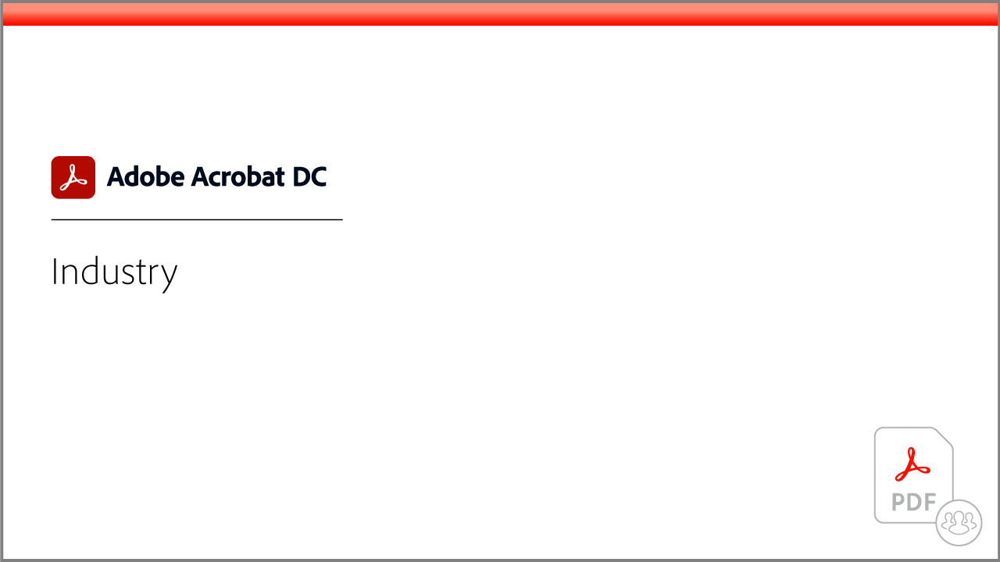

# Tutorials zu Acrobat

Mit Adobe Acrobat, einer Lösung von Adobe Document Cloud, kannst du PDF-Dokumente konvertieren, bearbeiten, weitergeben und elektronisch unterzeichnen. Hier finden Sie eine Vielzahl von Lernerlebnissen, die sowohl Anfänger als auch Fortgeschrittene schnell auf den neuesten Stand bringen.

## Lernpfade

<table style="table-layout:fixed">
<tr>
  <td>
    
    

    <a href="getting-started/getting-started-overview.md"><strong>Erste Schritte</strong></a>
    

    <em>Erfahre, wie du PDF-Dateien erstellen, bearbeiten, umwandeln, schützen und mehr</em>
     
  </td>
  <td>
    
    

    <a href="advanced-tasks/advanced-tasks-overview.md"><strong>Erweiterte Aufgaben</strong></a>
    

    <em>Gehen Sie mit bestimmten Aufgaben und Automatisierung über die Grundlagen hinaus</em>
     
  </td>
  <td>
    
    

    <a href="skill-builder/skill-builder-webinars.md"><strong>Webinare zu Skill Builder</strong></a>
    

    <em>Aufgabenbasierte Tipps, die dir helfen, digital zu werden, digital zu bleiben und Aufgaben zu erledigen</em>
     
  </td>
</tr>
<tr>
  <td>
    
    

    <a href="integrate/integrate-overview.md"><strong>Integrationen</strong></a>
    

    <em>Acrobat zu Ihren bestehenden Unternehmenssystemen, -prozessen und -anwendungen hinzufügen</em>
     
  </td>
  <td>
    
    

    <a href="industry/industry-overview.md"><strong>Branchen und Abteilungen</strong></a>
    

    <em>Erfahrt, wie Unternehmen in der realen Welt zu 100 % digital werden.</em>
     
  </td>  
  <td>
    
    

    <a href="develop/develop-overview.md"><strong>entwickeln</strong></a>
    

    <em>Entwicklungsressourcen in Adobe Acrobat</em>
     
  </td>
</tr>
<tr>
  <td>
    
    

    <a href="deploy/deploy-overview.md"><strong>Bereitstellen</strong></a>
    

    <em>Einblicke und Best Practices für die Bereitstellung von Acrobat in Ihrem Unternehmen</em>
     
  </td>
  <td>
    
    

    <a href="mobile/mobile-overview.md"><strong>Mobil</strong></a>
    

    <em>PDF auf dem Smartphone oder Tablet erstellen, ausfüllen und unterschreiben</em>
     
  </td>  
  <td>
   
    

     
  </td>
</tr>
</table>
