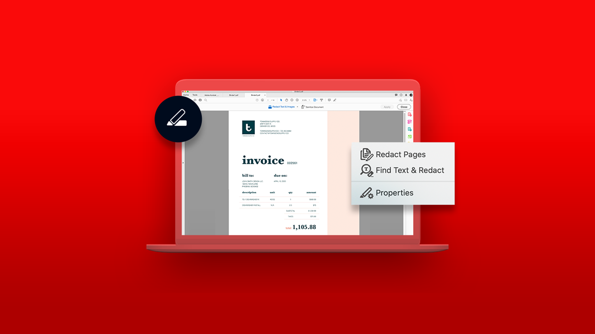

# Tutorials zu Acrobat

Mit Adobe Acrobat, einer Lösung von Adobe Document Cloud, kannst du PDF-Dokumente konvertieren, bearbeiten, weitergeben und elektronisch unterzeichnen. Hier finden Sie eine Vielzahl von Lernerlebnissen, die sowohl Anfänger als auch Fortgeschrittene schnell auf den neuesten Stand bringen.

## Vorgestellte Lernpfade

<table style="table-layout:fixed">
<tr>
 <td>
    
    

    <a href="getting-started/getting-started-overview.md"><strong>Erste Schritte</strong></a>
    

    Erfahre, wie du PDF-Dateien erstellen, bearbeiten, umwandeln, schützen und mehr.
     
  </td>
  <td>
    
    

    <a href="advanced-tasks/advanced-tasks-overview.md"><strong>Erweiterte Aufgaben</strong></a>
    

    Gehen Sie mit bestimmten Aufgaben und Automatisierung über die Grundlagen hinaus
     
  </td>
  <td>
    
  

    <a href="60-second/60-second-overview.md"><strong>Acrobat (60 Sekunden)</strong></a>
    

    Tutorials in Bissgröße, die dir helfen, in maximal einer Minute einen neuen Trick in Acrobat zu erlernen
     
  </td>
</tr>
  <td>
    
    

    <a href="integrate/integrate-overview.md"><strong>Integrationen</strong></a>
    

    Acrobat zu bestehenden Anwendungen wie Microsoft, Google Drive, Dropbox und Box hinzufügen
     
  </td>
  <td>
    
    

     
  </td>
  <td>
    
    

     
  </td>
</tr>
</table>
