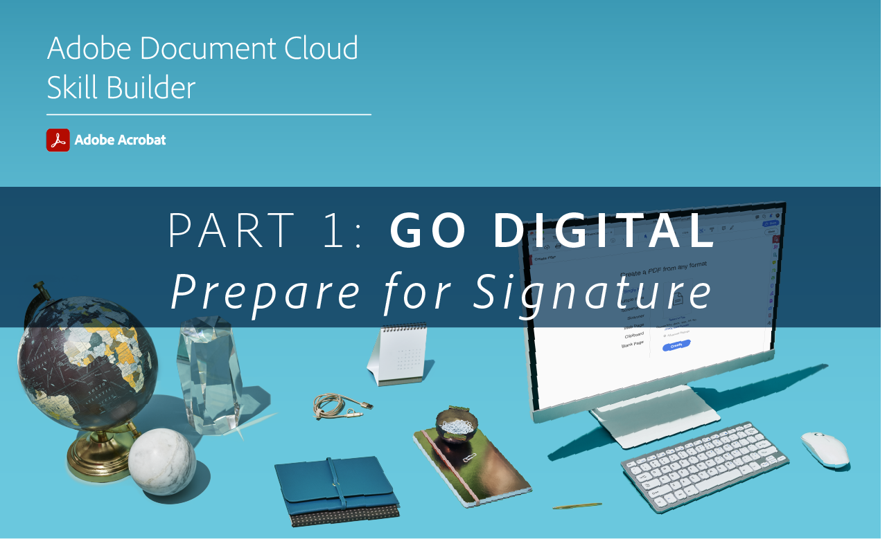

# Acrobat Skill Builders.

Diese interaktiven Tutorials zeigen dir, wie du Acrobat einsetzt. Oder nehmen Sie an einem [monatliche Live-Sitzung](skill-builder-webinars.md).

## Digitalisierung

<table style="table-layout:fixed">
<tr>
  <td>
    
    

    <a href="https://doccloud.adobeconnect.com/paperpdf/" target="_blank"><strong>Vom Papier zum PDF</strong></a>
    

    <em>Papierdokumente digital in PDF umwandeln.</em>
     
  </td>
  <td>
    
    

    <a href="https://doccloud.adobeconnect.com/skillbuilder-sigforms/" target="_blank"><strong>Vorbereitung für die Signatur</strong></a>
    

    <em>PDF mit Feldern für elektronische Unterschriften erstellen</em>
     
  </td>
  <td>
    
    

     
  </td>
</tr>
</table>

## Bleiben Sie digital

<table style="table-layout:fixed">
<tr>
 <td>
    
    

    <a href="https://doccloud.adobeconnect.com/createpdfs/" target="_blank"><strong>PDF erstellen und verwalten</strong></a>
    

    <em>Erstellen und Organisieren von PDF aus jedem Dateityp</em>
     
  </td>
  <td>
    
    

    <a href="https://doccloud.adobeconnect.com/micro/" target="_blank"><strong>Acrobat und Microsoft 101</strong></a>
    

    <em>PDF direkt in SharePoint erstellen und verwalten</em>
     
  </td>
  <td>
    
    

    <a href="https://doccloud.adobeconnect.com/editpdf/" target="_blank"><strong>PDF bearbeiten</strong></a>
    

    <em>Text, Bilder, Links und Wasserzeichen zu PDF hinzufügen</em>
     
  </td>
</tr>
<tr>
  <td>
    
    

    <a href="https://doccloud.adobeconnect.com/sign/" target="_blank"><strong>Unterschreiben Sie Ihre Arbeit</strong></a>
    

    <em>Dokumente direkt in Microsoft Outlook unterschreiben</em>
     
  </td>
  <td>
    
    

    <a href="https://doccloud.adobeconnect.com/convertpdfs/" target="_blank"><strong>PDF-Dateien konvertieren</strong></a>
    

    <em>PDF in Word, Excel oder PowerPoint konvertieren</em>
     
  </td>
  <td>
    
    

    <a href="https://doccloud.adobeconnect.com/fillsign/" target="_blank"><strong>Überall ausfüllen und unterschreiben.</strong></a>
    

    <em>Formulare auf jedem Gerät elektronisch ausfüllen, unterzeichnen und versenden</em>
     
  </td>
</tr>
<tr>
  <td>
    
    

    <a href="https://doccloud.adobeconnect.com/optimizepdfs/" target="_blank"><strong>PDF optimieren</strong></a>
    

    <em>PDF für die Weitergabe vorbereiten</em>
     
  </td>
  <td>
   
    

     
  </td>
  <td>
   
    

     
  </td>
</tr>
</table>

## Arbeiten erledigen

<table style="table-layout:fixed">
<tr>
  <td>
    
    

    <a href="https://doccloud.adobeconnect.com/skillbuilder-share/" target="_blank"><strong>Feedback geben und einholen</strong></a>
    

    <em>PDF-Feedback einholen</em>
     
  </td>
  <td>
    
    

    <a href="https://doccloud.adobeconnect.com/securepdfs/" target="_blank"><strong>PDF schützen</strong></a>
    

    <em>Vertrauliche Informationen in Ihren PDF schwärzen und schützen</em>
     
  </td>
  <td>
   
    

     
  </td>
</tr>
</table>
