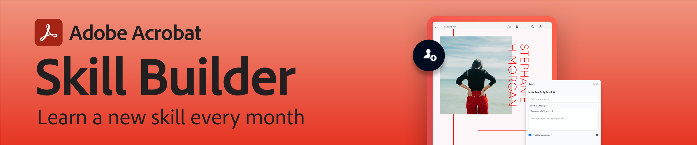

# Webinare zur Adobe Acrobat Skill Builder.

Adobe Acrobat Skill Builder sind 30-minütige Sessions, die deine PDF-Workflows auf die nächste Stufe heben sollen. Jeden Monat wird ein neues Thema vorgestellt.

## Monatliche Sitzungen

* **[Mit PDF in Microsoft-Programmen arbeiten.](https://adobe-acrobat-skill-builder.joinus.adobeevents.com/attendease/networking/experience/f7e3961b-e322-4253-bfa4-ff1957a08d99/c1111644-e958-41bf-ad6e-dffafafa7fa0){target=&quot;_blank&quot;}**
Datum: 15. Dezember 2022 Acrobat ist vollständig in Microsoft 365-Applikationen integriert, sodass Sie nicht zwischen den Bildschirmen wechseln müssen und im Laufe Ihrer Arbeit mehr erledigen können. In dieser Session von Skill Builder lernst du, wie du PDF-Workflows zu deinen täglich verwendeten Microsoft-Programmen hinzufügen kannst, darunter Teams, Outlook, SharePoint, Word, PowerPoint und Excel.

* **[PDF-Zusammenarbeit: Dokumente teilen, überprüfen und gemeinsam bearbeiten.](https://adobe-acrobat-skill-builder.joinus.adobeevents.com/attendease/networking/experience/d1eb8544-6268-4855-8500-2370b1e68045/0dd92858-0587-49f4-be60-8d48c140ef39){target=&quot;_blank&quot;}**
Datum: 17. November 2022 In diesem Skill Builder geht es um die Zusammenarbeit an digitalen Dokumenten. Lerne, wie du mit deinem Team Dokumente überprüfen kannst, und lasse dich von den Kommentierungswerkzeugen inspirieren, die dir zur Verfügung stehen. Wir beschäftigen uns auch mit dem Review von PDF mit anderen in Microsoft Teams und wie Sie von überall aus über die mobile Acrobat-App und Acrobat Web Feedback geben können.

* **[PDF-Inhalte wiederverwenden: Bearbeiten und exportieren](https://adobe-acrobat-skill-builder.joinus.adobeevents.com/attendease/networking/experience/68a9bbf2-91ca-40f0-baa1-812dd0730e0b/48c2399c-7392-4d7d-ba51-f623dead313a){target=&quot;_blank&quot;}**
Datum: 27. Oktober 2022. Erfahren Sie, wie Sie Ihre bestehenden PDF ändern können: Bearbeite Text und Bilder. Füge Hyperlinks und Lesezeichen hinzu. Wandle Dokumente in Microsoft Word-, PowerPoint- und Excel-Dateien um.

* **[Erste Schritte mit Acrobat](https://adobe-acrobat-skill-builder.joinus.adobeevents.com/attendease/networking/experience/360c9159-3f6f-47ae-8320-d0ad391883e1/e54db15b-af50-40ff-a274-6e927a22c6e7){target=&quot;_blank&quot;}**
Datum: 22. September 2022 Erste Schritte mit Adobe Acrobat und PDF. In diesem Video lernen Sie die Oberfläche von Acrobat kennen und erfahren, wie Sie: * Erstelle PDF aus Bilddateien und anderen Dokumenten - z. B. Word, Excel und PowerPoint. * Kombiniere mehrere Dateien - PDF, Word, Bilder und vieles mehr - zu einer bearbeitbaren PDF. * Mit Acrobat Web und Mobile kannst du jederzeit und überall arbeiten.

* **[PDF-Sicherheit](https://adobe-acrobat-skill-builder.joinus.adobeevents.com/attendease/networking/experience/ad3778d2-f2c3-4966-98ed-8b1bb90e4b2b/180ad785-1b5b-4c80-80ab-1df345f082ff){target=&quot;_blank&quot;}**
Datum: 25. August 2022 Erhalten Sie alle Informationen, die Sie zum Schutz Ihrer PDF-Inhalte benötigen. In dieser Session werden Techniken zum Hinzufügen von Kennwörtern vorgestellt, die das Anzeigen, Bearbeiten oder Drucken von PDF verhindern. Außerdem wird erläutert, wie vertrauliche Informationen - auch aus nicht sichtbaren Metadaten - dauerhaft entfernt werden.

* **[Einfache Automatisierung mit Action Wizard](https://adobe-acrobat-skill-builder.joinus.adobeevents.com/attendease/networking/experience/45ef14f7-e5e4-4fe0-ba26-905adac092a2/24bf421e-f489-47dc-a5a4-d8d70858348c){target=&quot;_blank&quot;}**
Datum: 28. Juli 2022 Wiederholt keine einfachen manuellen Aufgaben mehr! In dieser Session erfährst du, wie du Action Wizard in Acrobat einsetzt, um PDF-Dateien im Stapel zu verarbeiten und serielle, sich wiederholende Aufgaben automatisch auszuführen.

* **[Lesbarkeit für alle: Erstellen barrierefreier PDF](https://adobe-acrobat-skill-builder.joinus.adobeevents.com/attendease/networking/experience/18c111bd-9c63-4636-a4fd-8dc045a20423/8484f6c9-e2c9-4e1c-8d03-c2ca1d4db77c){target=&quot;_blank&quot;}**
Datum: 23. Juni 2022. Mit neuen Barrierefreiheitsfunktionen für PDF können alle Leser auf die Inhalte zugreifen. In dieser Session erfahrt ihr, wie ihr mit Acrobat konforme, barrierefreie PDF erstellen könnt.

* **[Vom Papier zu Pixeln zu Wörtern: Scannen und OCR](https://adobe-acrobat-skill-builder.joinus.adobeevents.com/attendease/networking/experience/db1178ff-fd0e-4429-9a91-dae080cac9c3/611fa8dd-1b65-4135-800b-feb61541615f){target=&quot;_blank&quot;}**
Datum: 26. Mai 2022 Erfahre, wie leicht du Papierdokumente als editierbare, durchsuchbare PDF-Dateien scannen kannst.

* **[PDF forms 201](https://adobe-acrobat-skill-builder.joinus.adobeevents.com/attendease/networking/experience/e05d5e32-598e-49a2-b847-a06207dcbfd7/39c070e1-4ef4-4fc2-aa1e-bf89fb59215e){target=&quot;_blank&quot;}**
Datum: 21. April 2022 Noch einen Schritt weiter gehen und mehr über die Verteilungsoptionen und die Verwendung von JavaScript zum Erstellen narrensicherer Formulare erfahren.

* **[PDF forms 101](https://adobe-acrobat-skill-builder.joinus.adobeevents.com/attendease/networking/experience/c7f08842-3d62-4b98-bb2a-029feef13621/5f8f1f46-c321-4fba-8c49-4b89d3de6d36){target=&quot;_blank&quot;}**
Datum: 24. März 2022 Grundlagen der Arbeit mit PDF forms: So fügen Sie Formularfelder zu einer PDF hinzu, um Informationen von anderen zu erfassen, und wie Sie ein Formular selbst ausfüllen und signieren.

* **[PDF interaktiv machen.](https://adobe-acrobat-skill-builder.joinus.adobeevents.com/attendease/networking/experience/c3150e33-0164-4f94-ac46-aec99b843291/14ea3de0-529f-4c79-9020-cd0a4f98aab0){target=&quot;_blank&quot;}**
Datum: 24. Februar 2022 In dieser Session erfahrt ihr, wie ihr PDF mit Videos, Hyperlinks, Buttons und Lesezeichen interaktiv macht.

* **[Produktivität an jedem Ort.](https://adobe-acrobat-skill-builder.joinus.adobeevents.com/attendease/networking/experience/99e0622a-adf9-4a8b-918f-fd4f4b3a3235/53620704-6da7-4b88-97da-a1f9f0fff3f4){target=&quot;_blank&quot;}**
Datum: 27. Januar 2022 In dieser Session erfährst du, wie du über jeden Webbrowser oder dein Mobilgerät auf deine bevorzugten Acrobat-Tools zugreifen kannst. Mit Acrobat im Internet können Sie von überall aus arbeiten. Und mit der mobilen Acrobat-App können Sie Ihre Produktivität auch unterwegs steigern.