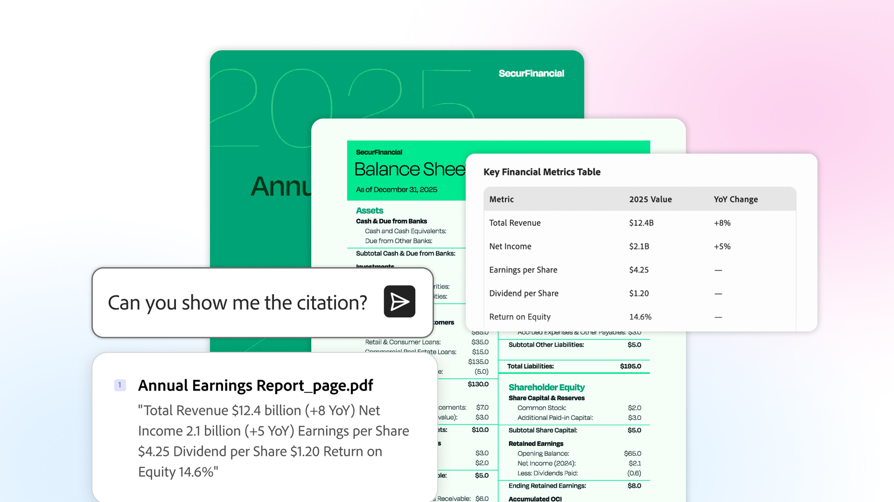

# Nutzungsszenarien - Übersicht

Erfahrt, wie ihr mit Acrobat die Produktivität steigern und Informationen in verwertbare Erkenntnisse für euer Team und eure Branche verwandeln könnt.

## Geschäftsbereich

Erfahrt, wie Teams in verschiedenen Geschäftsbereichen Acrobat einsetzen, um alltägliche Dokumentenprobleme zu lösen, Workflows zu optimieren und unternehmenskritische Aufgaben zu unterstützen.

<table style="table-layout:fixed">
<tr>
  <td>
    
    

    <a href="lob/finance/finance-overview.md"><strong>Nutzungsszenarien für Finanzierungen</strong></a>
    

    <em>Erfahren Sie, wie Finanzteams Acrobat zum Erstellen, Verwalten, Analysieren und Sichern von Finanzdokumenten verwenden</em>
    2
   </td>
  <td>
        
        

         
  </td>
  <td>
        
        

         
  </td>
  <td>
        
        

         
  </td>
</tr>
</table>

## Branche

<!-- START CARDS HTML - DO NOT MODIFY BY HAND -->

    

        

            

                <figure class="image x-is-16by9">
                    
                </figure>
            

            

                

                    

                        <a href="https://experienceleague.adobe.com/en/docs/document-cloud-learn/acrobat-learning/use-cases/gov/gov-overview" target="_self" rel="referrer" title="Acrobat für Behörden">Acrobat für Behörden</a>
                    

                    
Unsere Tutorials zu Acrobat sind speziell für Bund, Länder und Gemeinden konzipiert.

                

                <a href="https://experienceleague.adobe.com/en/docs/document-cloud-learn/acrobat-learning/use-cases/gov/gov-overview" target="_self" rel="referrer" class="spectrum-Button spectrum-Button--outline spectrum-Button--primary spectrum-Button--sizeM" style="align-self: flex-start; margin-top: 1rem;">
                    Tutorials durchsuchen
                3
            </a>

        

    

<!-- END CARDS HTML - DO NOT MODIFY BY HAND -->