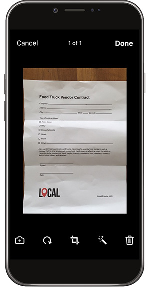
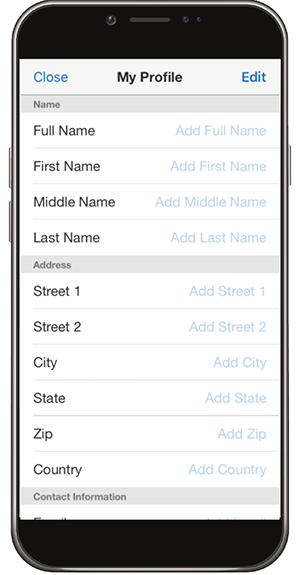

# Formulare auf dem Desktop, Smartphone oder Tablet ausfüllen und unterschreiben

Sie können Formulare auf Ihrem Desktop, in Ihrem Browser oder in der mobilen App schnell ausfüllen, signieren und senden. Adobe Sensei erkennt und speichert häufig verwendete Daten für die Verwendung in einem PDF-Formular. Erstellen Sie eine Signatur durch Zeichnen, Importieren eines Scans oder Eingeben Ihres Namens und wenden Sie sie dann sicher auf ein Dokument an.

In dieser Übung werden Sie Dokumente mithilfe Ihres Mobilgeräts importieren, ausfüllen, signieren und versenden.

Hier sind die [Demodateien](assets/03_FillSignScan.zip) für diese Übung.

**Schritt 1:** Laden Sie die [!DNL Adobe Fill & Sign] App aus dem Fenster &quot; [!DNL Apple App] speichern oder [!DNL Google Play].

**Schritt 2:** Öffnen Sie die App und tippen Sie auf **[!UICONTROL Formular zum Ausfüllen auswählen]**.

**Schritt 3:** Wählen Sie eine der Importoptionen aus. Für diese Übung werden wir ein &quot;Foto&quot; machen.

**Schritt 4:** Nehmen Sie mit der weißen Schaltfläche ein Bild auf und tippen Sie anschließend auf **[!UICONTROL Foto verwenden]**. Tippen **[!UICONTROL Fertig]** in der oberen rechten Ecke.

**Schritt 5:** Tippen Sie unten in der App auf das **[!UICONTROL Beschneiden]** und verwenden Sie die Hilfslinien, um [Bild zuschneiden.](https://www.adobe.com/acrobat/online/crop-pdf.html). Tippen **[!UICONTROL Fertig]** wenn Sie fertig sind.

**Schritt 6:** Verwende das Zauberstab-Werkzeug, um das Bild zu säubern. Tippen **[!UICONTROL Fertig]** wenn Sie fertig sind.

**Schritt 7:** Tippen Sie auf eine beliebige Stelle auf der Seite, um ein Feld zu erstellen und dem Dokument die erforderlichen Informationen hinzuzufügen. Wählen Sie die Ellipse aus, um weitere Optionen anzuzeigen.

**Schritt 8:** Tippen Sie auf **[!UICONTROL Unterschrift]** am unteren Rand der App, um Ihre Signatur hinzuzufügen.

**Schritt 9:** Verwenden Sie einen Stift oder Ihren Finger, um im Signaturfeld zu signieren. Verschieben und platzieren Sie das Signaturfeld.

**Schritt 10:** Tippen Sie auf **[!UICONTROL Profil]** am unteren Rand der App, um vordefinierte Werte wie Ihren Namen und Ihr Datum abzurufen. Sie müssen diese Informationen nur einmal eingeben und können sie dann in allen zukünftigen Formularen verwenden, die Sie mit der Fill &amp; Sign-App ausfüllen.

**Schritt 11:** Wenn das Formular fertig ist, tippen Sie in der unteren rechten Ecke auf die Schaltfläche Freigeben , um eine E-Mail zu senden.

## Wiederholen:

* Öffne eine Datei im Anhang einer E-Mail, oder fotografiere ein Papierformular mit deinem Smartphone oder Tablet.

* Tippen Sie hier, um Text in die Formularfelder einzugeben oder Häkchen zu setzen. Mit der intelligenten Ausfüllliste lassen sich Formulare noch schneller ausfüllen.

* Erstellen Sie Ihre Signatur mit dem Finger oder einem Eingabestift. und füge sie anschließend zum betreffenden Formular hinzu. Oder gib, wenn nötig, deine Initialen ein.
