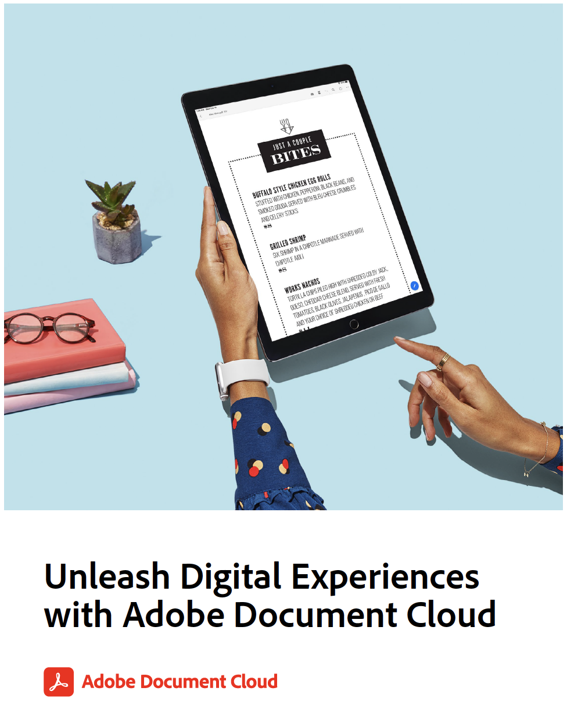

# Übungen zur Freisetzung digitaler Erlebnisse mit Adobe Document Cloud

Dieses Handbuch enthält weitere Übungen und eine Übersicht über die behandelten Arbeitsabläufe. Im Folgenden finden Sie die Demodateien, die wir in den folgenden Übungen verwenden. Bei jeder Übung wird auch dieser Inhalt erneut aufgeführt:

* Beispiel 1: Scannen Sie jedes Formular - verwenden Sie Ihre eigenen Visitenkarten, Belege oder andere Papierdokumente
* [Beispiel 2: Formulare ausfüllen und unterschreiben.](assets/03_FillSignScan.zip)
* [Beispiel 3: PDF-Dateien freigeben und online überprüfen](assets/01_Review.zip)
