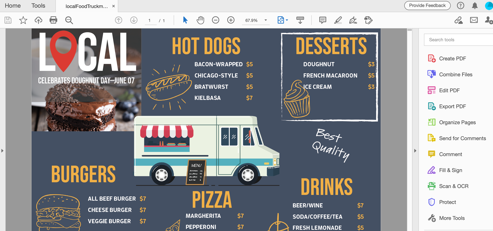
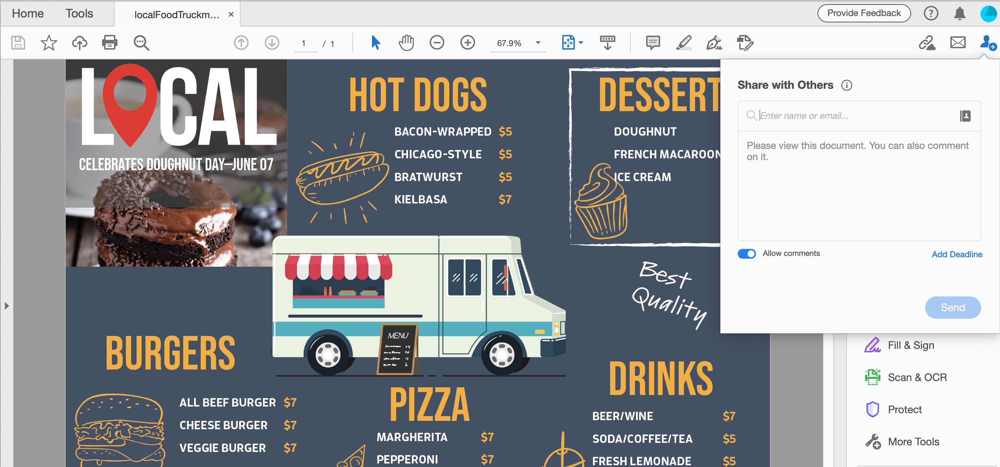

# PDF-Dateien freigeben und online überprüfen

Mit dem Adobe Document Cloud-Überprüfungsdienst können Sie PDF-Dateien ganz einfach über den Acrobat-Client, das Document Cloud-Web oder die mobile Acrobat Reader-App zum Review freigeben. Wenn Überprüfer auf ihrem Computer auf die URL in der E-Mail-Einladung klicken, können sie ihr Feedback ganz einfach in einem Browser abgeben, ohne sich anmelden oder zusätzliche Software installieren zu müssen.

In dieser Übung überprüfen wir, wie

* Personalisierte Einladungen zum Kommentieren senden
* Anonymen oder öffentlichen Link in einer E-Mail senden

Hier sind die [Demodateien](assets/01_Review.zip) für diese Übung.

## Personalisierte Einladungen zum Kommentieren senden

**Schritt 1:** Öffnen Sie die Datei `localFoodTruckmenu_start.pdf` in Adobe Acrobat.

**Schritt 2:** Klicken Sie im rechten Fenster auf **[!UICONTROL Send for Comments]** oder auf das Symbol **[!UICONTROL Diese Datei für andere freigeben]**  in der oberen rechten Ecke.

**Schritt 3:** Geben Sie die E-Mail-Adressen der Empfänger ein. Sie können eine Nachricht an die Empfänger eingeben oder einen Abgabetermin für die Überprüfung hinzufügen.

Sie erhalten eine E-Mail-Benachrichtigung, sobald Empfänger Ihre Datei angezeigt haben.

## Prüfererlebnis

Die Überprüfer erhalten eine E-Mail-Einladung mit einem Link zur entsprechenden PDF. Wenn sie in der Einladung auf den Link oder die Schaltfläche **[!UICONTROL Überprüfen]** klicken, wird die PDF in einem Webbrowser geöffnet. Sie können Kommentarwerkzeuge verwenden, um Kommentare zur PDF hinzuzufügen. Sie können auch Acrobat Reader- oder Acrobat-Desktop-Applikationen verwenden, um Kommentare hinzuzufügen.

## Anonymen oder öffentlichen Link in einer E-Mail senden

**Schritt 1:** Öffnen Sie die Datei `localFoodTruckmenu_start.pdf` in Adobe Acrobat.

**Schritt 2:** Klicken Sie auf **[!UICONTROL Link freigeben]** . Der freigegebene Link wird sofort generiert. Sie müssen nicht warten, bis die Datei in die Cloud hochgeladen wurde. Standardmäßig ist der Schalter [!UICONTROL Kommentare zulassen] aktiviert.

**Schritt 3:** Klicken Sie auf **[!UICONTROL Link kopieren]** und geben Sie den Link für die Empfänger frei.

## Kommentare abgeben

**Schritt 1:** Klicken Sie auf den **[!UICONTROL Kommentar]** im rechten Fenster.

**Schritt 2:** Verwenden Sie die Werkzeuge des oberen Menübands, um das Dokument zu markieren und/oder einen Kommentar einzugeben.

Ihre Kommentare werden automatisch gespeichert und können von anderen Benutzern angezeigt werden.

## Importieren von PDF-Kommentaren auf InDesign

Mit InDesign CC 2019 können Sie Kommentare direkt aus PDF-Dateien importieren. Sie können die Änderungen mit nur einem Klick importieren, akzeptieren und anwenden. Wenn Sie einen Kommentar im neuen Kommentarfenster des PDF auswählen, wird der Kommentar in Ihrer InDesign-Datei gesucht und hervorgehoben.

**Schritt 1:** Laden Sie die PDF-Datei herunter, die die Kommentare enthält.

**Schritt 2:** Öffnen Sie Ihre InDesign-Datei.

**Schritt 3:** Klicken Sie im oberen Menü auf **[!UICONTROL Datei]**.

**Schritt 4:** Klicken Sie auf **[!UICONTROL PDF-Kommentare importieren]** aus dem Dropdown-Menü.

**Schritt 5:** Öffnen Sie die PDF, die die Kommentare enthält.

Kommentare werden in der Benutzeroberfläche angezeigt.

## Wiederholen:

Reviews und Freigeben von Designversionen mit Acrobat. Mit Acrobat kannst du

* Sende den Link zu einer PDF, damit andere sie überprüfen können.
* Überall arbeiten - auf dem Desktop, im Browser, auf dem Smartphone oder Tablet.
* Dateien in einem einzigen Dokument zusammenführen.
* führe das Feedback mehrerer Personen in einer einzigen Datei zusammen.
* Du brauchst nur einen Browser.

Sende und verfolge Kommentare jederzeit und überall. Empfänger können die Datei auch anzeigen, wenn sie nicht über Acrobat verfügen! Sie können jemanden über einen Browser zum Kommentieren einladen. Zeit und Aufwand sparen.
