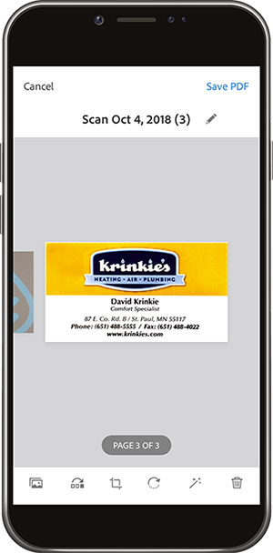
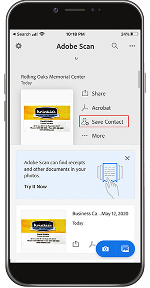
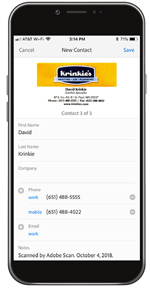
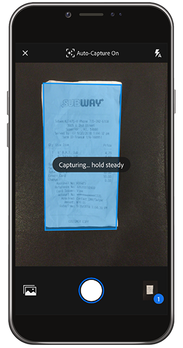
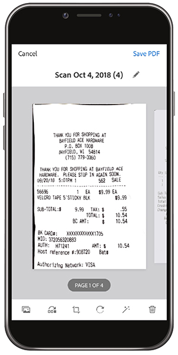

# Digitalisierung mit Adobe Scan

Übersichtlichkeit beseitigen, Inhalte organisieren oder Inhalte teilen. Riesige Papierberge auf dem Schreibtisch und Geldbeutel gehören der Vergangenheit an. Die Adobe Scan-App scannt Papierdokumente direkt in die PDF und erkennt automatisch Text.

In dieser Übung laden Sie Inhalte von einer Visitenkarte direkt in Ihre Kontakte hoch. Scannen und speichern Sie eine Quittung.

Erfassen Sie eine Visitenkarte, eine Quittung oder ein anderes Papierelement, mit dem Sie arbeiten möchten.

## Visitenkarte scannen

**Schritt 1:** Laden Sie die Adobe Scan-App aus dem Apple App Store oder Google Play herunter.

**Schritt 2:** Öffnen Sie die Adobe Scan-App.

**Schritt 3:** Nehmen Sie in der App ein Foto der Visitenkarte mit den Kontaktinformationen auf, die Sie auf Ihrem Telefon speichern möchten.

**Schritt 4:** Nehmen Sie nach Abschluss des Scannens die Anpassungen vor, um sicherzustellen, dass sich Ihre Karte innerhalb des Begrenzungsrahmens befindet.

**Schritt 5:** Tippen Sie oben rechts auf **[!UICONTROL PDF speichern]**. Tippen Sie anschließend auf **[!UICONTROL Kontakt speichern]**.

**Schritt 6:** Nehmen Sie die gewünschten Änderungen oder Ergänzungen der Kontaktinformationen vor, bevor Sie sie auf Ihrem Smartphone speichern. Tippen Sie erneut auf &quot;Speichern&quot;, um das Speichern in Kontakten abzuschließen.

## Quittung scannen und speichern

Die Adobe Scan-App kann auch nützlich sein, um eine Quittung, die Sie später benötigen, zu scannen und zu speichern (z. B. eine Spesenabrechnung oder eine andere Kostenerstattung).

**Schritt 1:** Fotografiere die Quittung, die du speichern möchtest, während die Adobe Scan-App geöffnet ist.

 scannen

**Schritt 2:** Beobachten Sie, wie die App Ihre Quittung automatisch erkennt und ihren Inhalt erfasst.

**Schritt 3:** Tippen Sie oben rechts auf **[!UICONTROL PDF speichern]**, um die Quittung auf Ihrem Smartphone zu speichern.

## Wiederholen:

* Scanne Papierdokumente und -formulare direkt auf den PDF.
* Konvertieren Sie JPG-Images auf PDF.
* Fotos auf dem Smartphone oder Tablet bearbeiten.
* Fügen Sie Visitenkarteninformationen direkt zu Ihren Kontakten hinzu.

Lass die Zeitung los!
