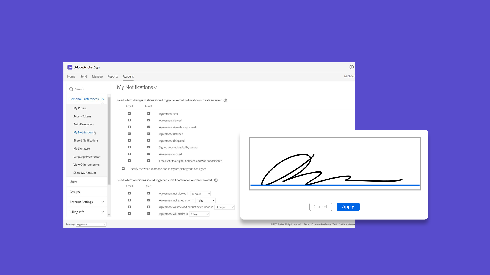
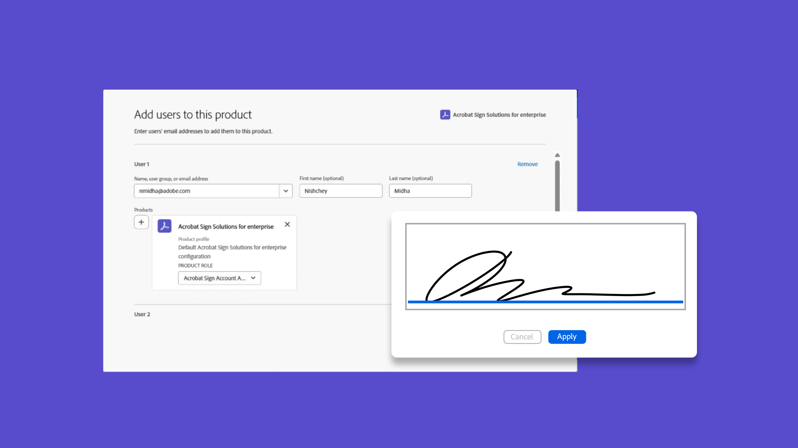
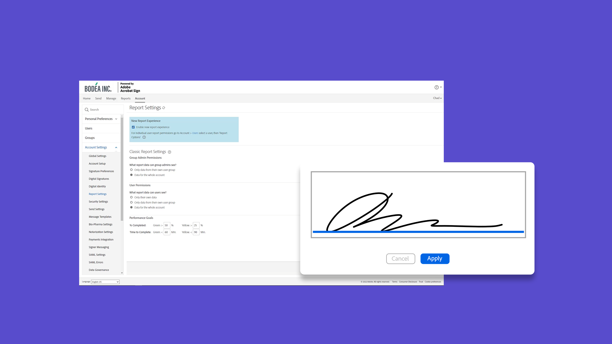

# Administratoren - Übersicht

Erfahren Sie mehr über das Hinzufügen von Benutzern zu Ihrem Konto, das Einrichten von Gruppen, das Freigeben des Zugriffs und das Einrichten eines Workflows, eines externen Archivs sowie über freigegebene Ereignisse und Warnungen. Diese Tutorials richten sich an Administratoren, die die Installationsphase bereits hinter sich haben und mit der Verwaltung von Acrobat Sign beginnen können. Unter Erweiterte Aufgaben werden Themen behandelt, die über die Einrichtung des Administrators hinausgehen und sich auf die Definition globaler Einstellungen, den Kontozugriff und die Freigabe sowie die Textformatierung beziehen.

## Neue Funktionen

>[!BEGINTABS]

>[!TAB Neuen Benutzer hinzufügen]

Erfahren Sie, wie Sie [neue Benutzer zu Acrobat Sign hinzufügen](add-users-to-your-account.md).

>[!TAB Einrichten von Datenschutzadministratoren]

Erfahren Sie, wie Sie [Datenschutzadministratoren](privacy.md) einrichten und verwenden.

>[!TAB Massen-Download-Tool]

Erfahren Sie, wie Sie das [Tool für den Massendownload](bulk-download-tool.md) verwenden, um schnell alle Ihre signierten Vereinbarungen herunterzuladen.

>[!ENDTABS]

## Erste Schritte

<table style="table-layout:fixed">
<tr>
  <td>
    
    

    <a href="get-started-admin.md"><strong>Erste Schritte für neue Administratoren</strong></a>
    

    <em>Informieren Sie sich in diesem umfassenden Videoleitfaden über alle Tools, die erforderlich sind, damit Ihr Unternehmen mit Acrobat Sign arbeiten kann</em>
    2 
  </td>
  <td>
    
    

    <a href="up-and-running-admin.md"><strong>Verfügbar für Administratoren</strong></a>
    

    <em>Übersicht über 7 wichtige Bereiche, in denen Administratoren schnell mit Acrobat Sign arbeiten können</em>
    2 
  </td>
  <td>
    
    

    <a href="set-up-shared-events-and-alert.md"><strong>Benachrichtigungen für Ereignisse und Warnungen konfigurieren</strong></a>
    

    <em>Benachrichtigungen für Ereignisse und Warnungen für Ihr Konto konfigurieren</em>
    2 
  </td>
  <td>
    
    

    <a href="add-users-to-your-account.md"><strong>Neuen Benutzer hinzufügen</strong></a>
    

    <em>Weitere Informationen zum Hinzufügen neuer Benutzer zu Acrobat Sign</em>
    2 
  </td>
</tr>
<tr>
 <td>
    
    

    <a href="add-admin.md"><strong>Neuen Kontoadministrator hinzufügen</strong></a>
    

    <em>Erfahren Sie, wie Sie einen neuen Benutzer erstellen oder einen bestehenden Benutzer zur Acrobat Sign-Administratorrolle hochstufen</em>
    2 
  </td>
  <td>
    
    

    <a href="create-and-manage-groups.md"><strong>Erstellen und Verwalten von Gruppen</strong></a>
    

    <em>Gruppen erstellen, Benutzer zu Gruppen hinzufügen und Gruppeneinstellungen bearbeiten</em>
    2 
  </td>
  <td>
    
    

    <a href="set-up-your-external-archive.md"><strong>Einrichten eines externen Archivs</strong></a>
    

    <em>Ein externes Archiv für Sicherungskopien von signierten Vereinbarungen erstellen</em>
    2 
  </td>
  <td>
    
    

    <a href="../sign-advanced-users/create-a-template.md"><strong>Erstellen einer Dokumentvorlage</strong></a>
    

    <em>Eine wiederverwendbare Dokumentvorlage erstellen, um Geschwindigkeit und Konsistenz sicherzustellen</em>
    2 
  </td>
</tr>
<tr>
  <td>
    
    

    <a href="../sign-advanced-users/creating-a-report.md"><strong>Berichterstellung und Transaktionsnutzung</strong></a>
    

    <em>Erfahren Sie, wie Sie Berichte generieren und die Transaktionsnutzung verfolgen</em>
    2 
  </td>
  <td>
    
    

    <a href="report-options.md"><strong>Berichtsoptionen für Benutzer</strong></a>
    

    <em>Informationen zum Einrichten von Berichtsoptionen für Benutzer</em>
    2 
  </td>
  <td>
    
    

    <a href="../sign-advanced-users/webform.md"><strong>Erstellen eines Webformulars</strong></a>
    

    <em>Erstellen Sie ein Dokument, das direkt auf Ihrer Website elektronisch signiert werden kann</em>
    2 
  </td>
  <td>
    
    

    <a href="../sign-advanced-users/modify-webform.md"><strong>Vorhandenes Webformular ändern</strong></a>
    

    <em>Erfahren Sie, wie Sie ein vorhandenes Webformular deaktivieren, bearbeiten und wieder aktivieren</em>
    2 
  </td>
</tr>
<tr>
  <td>
    
    

    <a href="../sign-advanced-users/megasign.md"><strong>Massenversand</strong></a>
    

    <em>Mehrere Tausend Unterschriften gleichzeitig für jedes Dokument einholen</em>
    2 
  </td>
  <td>
    
    

    <a href="building-a-custom-workflow.md"><strong>Einrichten eines Workflows</strong></a>
    

    <em>Automatisieren von Dokumenten-Workflows, um elektronische Signaturen und Daten schnell zu erhalten</em>
    2 
  </td>
  <td>
    
    

    <a href="audit-reports.md"><strong>Audit-Berichte</strong></a>
    

    <em>Weitere Informationen zum Zugriff, zur Verwendung und Konfiguration von Audit-Berichten</em>
    2 
  </td>
  <td>
    
    

    <a href="promote-admin.md"><strong>Produkt- und Support-Administratorrollen zuweisen</strong></a>
    

    <em>Erfahren Sie, wie Sie der Admin Console eine Acrobat Sign-Benutzerproduktadministrator- und Supportadministratorrolle zuweisen</em>
    2 
  </td>
</tr> 
</table>

## Erweiterte Aufgaben

<table style="table-layout:fixed">
<tr>
  <td>
    
    

    <a href="learn-about-global-settings.md"><strong>Globale Einstellungen</strong></a>
    

    <em>Produkteinstellungen global für Ihre gesamte Organisation oder für bestimmte Gruppen bearbeiten</em>
    2 
  </td>
  <td>
      
    

    <a href="share-account-access.md"><strong>Kontozugriff wird freigegeben</strong></a>
    

    <em>Einrichten eines schreibgeschützten Zugriffs auf Transaktionen im Konto eines anderen Benutzers</em>
    2 
  </td>
  <td>
    
    

    <a href="advanced-account-sharing.md"><strong>Erweiterte Kontofreigabe</strong></a>
    

    <em>Richten Sie die Kontofreigabe ein, damit Administratoren und Benutzer ihre Sende-, Änderungs- und Anzeigeberechtigungen delegieren können</em>
    2 
  </td>
  <td>
    
    

    <a href="bulk-download-tool.md"><strong>Massen-Download-Tool</strong></a>
    

    <em>Erfahren Sie, wie Sie mit dem Massen-Download-Tool schnell alle Ihre signierten Vereinbarungen herunterladen</em>
    2 
  </td> 
</tr>
<tr>
   <td>
     
    

    <a href="../sign-advanced-users/adobe-sign-text-tagging.md"><strong>Acrobat Sign-Text-Tagging</strong></a>
    

    <em>Acrobat Sign-Formularfelder durch Text-Tagging mit Adobe Acrobat erstellen</em>
    2 
  </td>
  <td>
    
    

    <a href="use-bio-pharma-settings.md"><strong>Bio-Pharma-Einstellungen verwenden</strong></a>
    

    <em>Richten Sie Bio-Pharma-Einstellungen ein, mit denen Sie die Anforderungen von FDA 21 CFR Part 11 erfüllen können</em>
    2 
  </td>
  <td>
    
    

    <a href="privacy.md"><strong>Einrichten von Datenschutzadministratoren</strong></a>
    

    <em>Informationen zum Einrichten und Verwenden von Datenschutzadministratoren</em>
    2 
  </td>
  <td>
    
    

     
  </td>
</tr>
</table>
