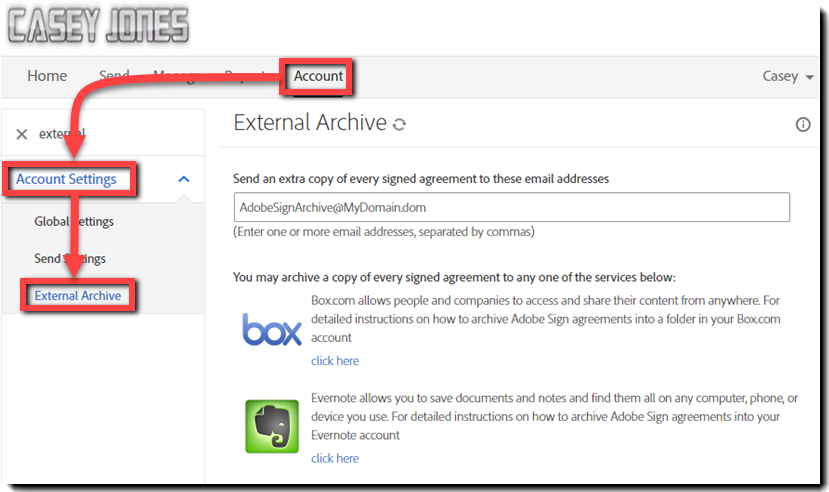

# Einrichten eines externen Archivs

Erfahren Sie, wie Sie ein externes Archiv für Sicherungskopien von Vereinbarungen erstellen, die gesendet wurden. Sie können Kopien der signierten Vereinbarungen an eine beliebige E-Mail-Adresse oder an Box und Evernote archivieren. Eine Kopie der E-Mail-Adresse &quot;Signiert&quot;und &quot;Abgelegt&quot;wird entweder an die E-Mail-Adresse oder an den Dienst gesendet, den Sie eingerichtet haben.

## Externes Archiv: E-Mail-Adresse

1. Melden Sie sich als Kontoadministrator an.

1. Klicken Sie auf **[!UICONTROL Kontoeinstellungen]** > **[!UICONTROL Externes Archiv]** unter der Registerkarte [!UICONTROL Konto].

   

1. Geben Sie die archivierte E-Mail-Adresse ein und klicken Sie auf **[!UICONTROL Änderungen speichern]**.

   

## Externes Archiv: Box.com

1. Melden Sie sich als Kontoadministrator an.

1. Klicken Sie auf **[!UICONTROL Kontoeinstellungen]** > **[!UICONTROL Externes Archiv]** unter der Registerkarte [!UICONTROL Konto].

1. Wählen Sie den Link [!UICONTROL Klicken Sie hier] rechts neben dem Box-Logo.

   

1. Befolgen Sie die im Popup-Fenster angezeigten Anweisungen für Box.

   

## Externes Archiv: Evernote

1. Melden Sie sich als Kontoadministrator an.

1. Klicken Sie auf **[!UICONTROL Kontoeinstellungen]** > **[!UICONTROL Externes Archiv]** unter der Registerkarte [!UICONTROL Konto].

1. Wählen Sie den Link **[!UICONTROL Klicken Sie hier]** rechts neben dem Evernote-Logo.

   

1. Befolgen Sie die im Popup-Fenster angezeigten Anweisungen für Evernote.

   
