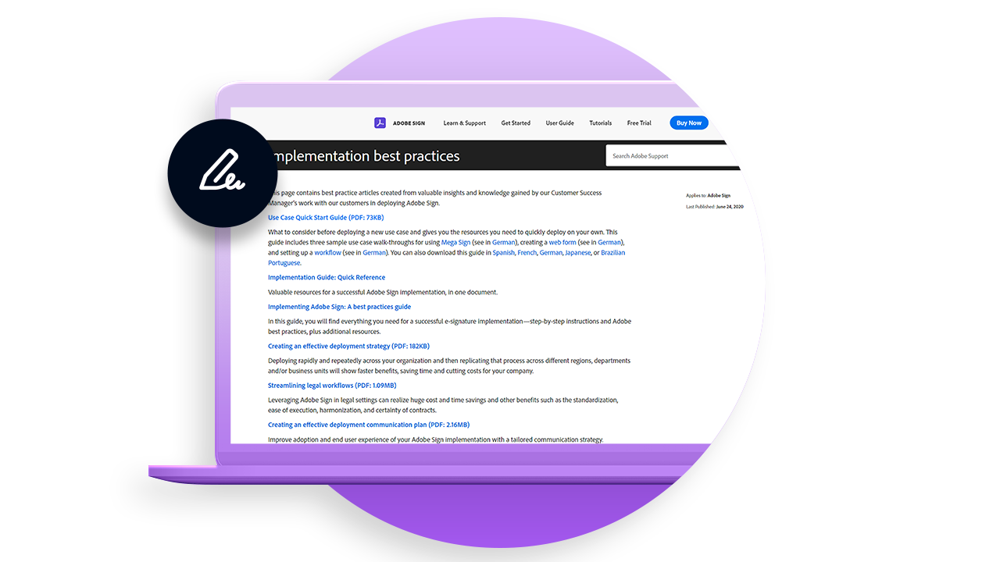

# Übersicht bereitstellen

Best Practices mit wertvollen Einblicken in die Bereitstellung von Adobe Sign innerhalb Ihres Unternehmens.

<table style="table-layout:fixed">
<tr>
  <td>
    
    

    <a href="https://helpx.adobe.com/enterprise/using/adobe-sign-for-enterprise.html" target="_blank"><strong>Adobe Sign auf der Admin Console verwalten</strong></a>
    

    <em>Erfahren Sie, wie Sie Adobe Sign-Benutzer und -Lizenzen auf der Unternehmensplattform der Adobe Adobe Admin Console verwalten</em>
     
  </td>
  <td>
    
    

    <a href="https://helpx.adobe.com/sign/using/adobe-sign-training-best-practice.html" target="_blank"><strong>Empfohlene Vorgehensweisen</strong></a>
    

    <em>Lesen Sie die wertvollen Erkenntnisse und Kenntnisse, die unser Customer Success Manager mit unseren Kunden bei der Bereitstellung von Adobe Sign gewonnen hat.</em>
     
  </td>  
  <td>
    
    

    <a href="https://www.adobe.com/trust/document-cloud-security.html" target="_blank"><strong>Adobe Trust Center</strong></a>
    

    <em>Erfahren Sie mehr über unsere laufenden Bemühungen in den Bereichen Sicherheit, Rechtmäßigkeit und Standards für Adobe Sign</em>
     
  </td>
</tr>
<tr>
  <td>
    
    

    <a href="assets/SignStudyGuide.pdf"><strong>Adobe Sign Essentials Study Guide</strong></a>
    

    <em>Adobe Sign Study Guide for the Adobe Sign Essentials Assessment (AD3-D104)</em>
     
  </td>
  <td>
    
    

     
  </td>
  <td>
    
    

     
  </td>
</tr>
</table>
