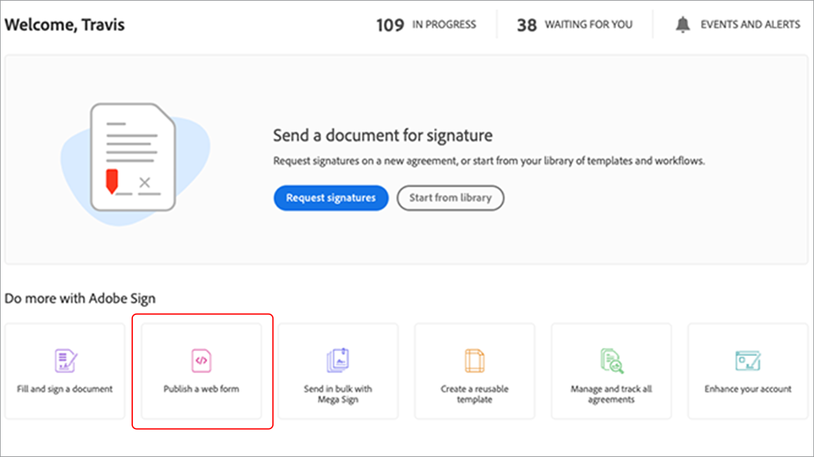

# Erlebnisse für eingebettete E-Signaturen und Dokumente erstellen

Erfahren Sie, wie Sie mit Adobe Sign APIs die e-Signatur- und Dokumenterlebnisse in Ihre Webplattformen und Content- und Dokumentenmanagementsysteme einbetten. Dieses Tutorial enthält vier Teile, die in den folgenden Links beschrieben werden:

<table style="table-layout:fixed">
<tr>
  <td>
    
    

    <a href="embeddedesignature.md#part1"><strong>Teil 1: Was Sie brauchen</strong></a>
    

  </td>
  <td>
    
    

    <a href="embeddedesignature.md#part2"><strong>Teil 2: Code Niedrig/Nein — die Leistungsfähigkeit von Webformularen</strong></a>
    

  </td>
  <td>
   
    

    <a href="embeddedesignature.md#part3"><strong>Teil 3: Vertrag mit einem Formular senden und Daten zusammenführen</strong></a>
    

  </td>
  <td>
   
    

    <a href="embeddedesignature.md#part4"><strong>Teil 4: Signiererlebnis, Umleitungen und mehr einbetten</strong></a>
    

  </td>
</tr>
</table>

## Teil 1: Was Sie brauchen {#part1}

Im ersten Teil lernen Sie, wie Sie mit allem beginnen, was Sie für die Teile 2-4 benötigen. Beginnen wir mit API-Anmeldedaten.

* [Adobe Sign-Entwicklerkonto](https://acrobat.adobe.com/de/de/sign/developer-form.html)
* [Starter-Code](https://github.com/benvanderberg/adobe-sign-api-tutorial)
* [VS-Code (oder Editor Ihrer Wahl)](https://code.visualstudio.com)
* Python 3.x
   * Mac - Homebrew
   * Linux — Integriertes Installationsprogramm
   * Windows — Schokolade
   * Alle — https://www.python.org/downloads/

## Teil 2: Code Niedrig/Nein — die Leistungsfähigkeit von Webformularen {#part2}

Im zweiten Teil lernen Sie die Option &quot;Niedrig/Kein-Code&quot;, wenn Sie Webformulare verwenden. Es empfiehlt sich immer zu prüfen, ob Sie es vermeiden können, zuerst Code zu schreiben.

1. Greifen Sie mit Ihrem Entwicklerkonto auf Adobe Sign zu.
1. Klicken Sie auf der Startseite auf **Webformular veröffentlichen**.

   

1. Vereinbarung erstellen.

   

1. Betten Sie Ihre Vereinbarung auf einer einfachen HTML-Seite ein.
1. Experimentieren Sie mit dem dynamischen Hinzufügen von Abfrageparametern.

   

## Teil 3: Vertrag mit einem Formular senden und Daten zusammenführen {#part3}

In Teil 3 erstellen Sie Vereinbarungen dynamisch.

Zuerst müssen Sie den Zugriff festlegen. Mit Adobe Sign gibt es zwei Möglichkeiten, eine Verbindung über API herzustellen. OAuth Tokens &amp; Integrationsschlüssel. Wenn Sie keinen speziellen Grund haben, OAuth mit Ihrer Anwendung zu verwenden, sollten Sie zuerst die Integrationsschlüssel durchsuchen.

1. Wählen Sie **Integrationsschlüssel** im Menü **API-Informationen** unter der Registerkarte **Konto** in Adobe Sign aus.

   

Nachdem Sie nun Zugriff auf die API haben und mit ihr interagieren können, erfahren Sie, was Sie mit der API machen können.

1. Navigieren Sie zu [Adobe Sign REST API Version 6 Methods](http://adobesign.com/public/docs/restapi/v6).

   

1. Verwenden Sie das Token als &quot;Inhaberwert&quot;.

   

Um Ihre erste Vereinbarung zu senden, sollten Sie sich mit der Verwendung der API vertraut machen.

1. Erstellen Sie ein temporäres Dokument und senden Sie es.

>[!NOTE]
>
>JSON-basierte Anforderungsaufrufe haben die Option &quot;Modell&quot;und &quot;Minimales Modellschema&quot;. Dadurch erhalten Sie Spezifikationen und einen minimalen Nutzlastsatz.

Nachdem Sie eine Vereinbarung zum ersten Mal gesendet haben, können Sie die Logik hinzufügen. Es empfiehlt sich immer, einige Helfer einzurichten, um Wiederholungen zu minimieren. Nachstehend sind einige Beispiele aufgeführt:

**Überprüfung**

**Kopfzeilen/Auth**

**Basis-URI**

Achten Sie darauf, wo Transiente Dokumente innerhalb des großen Schemas des Sign-Ökosystems landen.
Transient -> Vereinbarung
Transient -> Vorlage -> Vereinbarung
Transient -> Widget -> Vereinbarung

In diesem Beispiel wird eine Vorlage als Dokumentquelle verwendet. Dies ist in der Regel die beste Methode, es sei denn, Sie haben einen soliden Grund, Dokumente dynamisch zum Unterschreiben zu generieren (z. B. alten Code oder Dokumentengenerierung).

Der Code ist recht einfach. Es verwendet ein Bibliotheksdokument (Vorlage) für die Dokumentquelle. Der erste und der zweite Unterzeichner werden dynamisch zugewiesen. Der Status `IN_PROCESS` bedeutet, dass das Dokument sofort gesendet wird. Außerdem wird `mergeFieldInfo` verwendet, um Felder dynamisch auszufüllen.

## Teil 4: Signiererlebnis, Umleitungen und mehr einbetten {#part4}

In vielen Fällen möchten Sie dem auslösenden Teilnehmer möglicherweise erlauben, eine Vereinbarung sofort zu signieren. Dies ist nützlich für kundenorientierte Anwendungen und Kiosks.

Wenn Sie nicht möchten, dass die erste gesendete E-Mail ausgelöst wird, können Sie das Verhalten einfach verwalten, indem Sie den API-Aufruf ändern.

So steuern Sie die Umleitung nach der Signatur:

Nach der Aktualisierung des Vereinbarungsvorgangs wird im letzten Schritt die Signatur-URL generiert. Dieser Aufruf ist ebenfalls recht einfach und generiert eine URL, über die ein Unterzeichner auf seinen Teil des Signiervorgangs zugreifen kann.

>[!NOTE]
>
>Beachten Sie, dass der Vereinbarungserstellungsaufruf technisch asynchron ist. Dies bedeutet, dass eine Vereinbarungsaufforderung &quot;POST&quot;durchgeführt werden kann, die Vereinbarung jedoch noch nicht fertig ist. Die beste Methode ist, eine Wiederholungsschleife zu erstellen. Verwenden Sie eine Wiederholung oder eine andere Methode, die für Ihre Umgebung am besten geeignet ist.

Wenn alles zusammengesetzt ist, ist die Lösung ziemlich einfach. Sie erstellen eine Vereinbarung und generieren dann eine Signatur-URL, auf die der Unterzeichner klicken und das Signaturritual starten kann.

### Zusätzliche Themen

* [JS-Ereignisse](https://www.adobe.io/apis/documentcloud/sign/docs.html#!adobedocs/adobe-sign/master/events.md)
* Webhook-Ereignisse
   * [REST API](https://sign-acs.na1.echosign.com/public/docs/restapi/v6#!/webhooks/createWebhook)
   * [Webhooks in Adobe Sign v6](https://www.adobe.io/apis/documentcloud/sign/docs.html#!adobedocs/adobe-sign/master/webhooks.md)
* [Anforderungs-E-Mails erneut aktivieren (mit Ereignissen)](https://sign-acs.na1.echosign.com/public/docs/restapi/v6#!/agreements/updateAgreement)
* [Zeitüberschreitung durch Wiederholung ersetzen](https://stackoverflow.com/questions/23267409/how-to-implement-retry-mechanism-into-python-requests-library)

     
* Benutzerdefinierte Erinnerungen
   * Mit der ersten Erstellung

      

   * Oder fügen Sie einen [In-flight](https://sign-acs.na1.echosign.com/public/docs/restapi/v6#!/agreements/createReminderOnParticipant) hinzu

## Weitere Ressourcen

http://bit.ly/Summit21-T126

Enthält:
* Adobe Sign-Entwicklerkonto
* Adobe Sign API-Dokumente
* Beispielcode
* Visual Studio-Code
* Python
