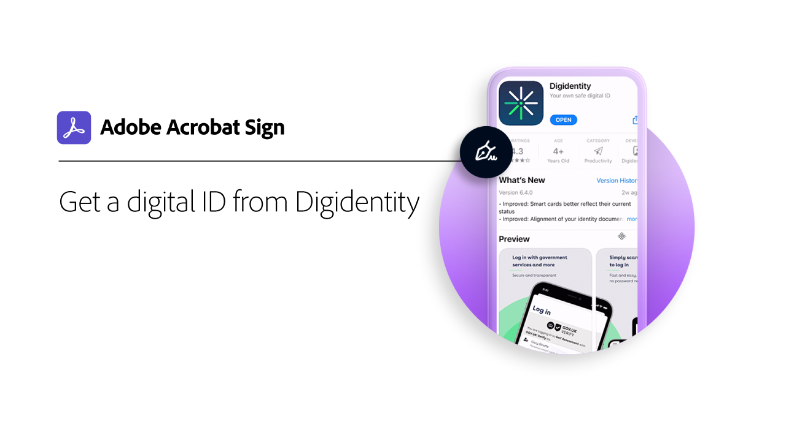

# Digitale ID - Übersicht

Ähnlich wie ein Reisepass in elektronischer Form ermöglicht Ihnen eine digitale Identität (digitale ID) den sicheren Nachweis, dass Sie derjenige sind, der Sie vorgeben zu sein. Eine digitale ID bietet zusätzliche Sicherheit bei der elektronischen Unterzeichnung in Acrobat Sign, wenn du die Autorisierung deiner elektronischen Unterschrift auf einem bestimmten Dokument vorgenommen hast. Die folgenden Tutorials zeigen Ihnen, wie Sie digitale IDs aus der ganzen Welt mit Acrobat Sign verwenden.

>[!NOTE]
>
>Bevor Sie eine digitale ID mit einer Cloud-Signatur verwenden können, fragen Sie den Administrator Ihres Unternehmens, ob die Lösung des Anbieters in Acrobat Sign aktiviert ist.

## [!DNL Aadhaar]

<table style="table-layout:fixed">
<tr>
 <td>
    
    

    <a href="aadhaar-sign.md"><strong>Signieren mit [!DNL Aadhaar]</strong></a>
    

    <em>Erfahren Sie, wie Sie Ihr [!DNL Aadhaar] digitale ID mit Acrobat Sign</em>
     
  </td>
  <td>
    
    

     
  </td>
  <td>
    
    

     
  </td>
</tr>
</table>

## [!DNL Digidentity]

<table style="table-layout:fixed">
<tr>
 <td>
    
    

    <a href="digidentity-reg.md"><strong>Abrufen einer digitalen ID von [!DNL Digidentity]</strong></a>
    

    <em>Erfahren Sie, wie Sie ein digitales Signaturzertifikat von [!DNL Digidentity]</em>
     
  </td>
  <td>
    
    

    <a href="digidentity-sign.md"><strong>Signieren mit [!DNL Digidentity]</strong></a>
    

    <em>Erfahren Sie, wie Sie Ihr [!DNL Digidentity] digitale ID mit Acrobat Sign</em>
     
  </td>
  <td>
    
    

     
  </td>
</tr>
</table>

## [!DNL D-Trust]

<table style="table-layout:fixed">
<tr>
  <td>
    
    

    <a href="d-trust.md"><strong>Registrieren und signieren Sie mit D-Trust</strong></a>
    

    <em>Weitere Informationen zur Registrierung Ihrer Identität bei [!DNL D-Trust], und verwenden Sie dann den Katalog [!DNL D-Trust] Unterschreiben eines Dokuments in Acrobat Sign</em>
     
  </td>
  <td>
    
    

     
  </td>
  <td>
    
    

     
  </td>
  </tr>
  </table>

## [!DNL Intesi Group]

<table style="table-layout:fixed">
<tr>
  <td>
    
    

    <a href="intesi-advanced.md"><strong>Abrufen einer digitalen ID von [!DNL Intesi Group] (Erweitert)</strong></a>
    

    <em>Hier erfahren Sie, wie Sie ein erweitertes digitales Signaturzertifikat von [!DNL Intesi Group]</em>
     
  </td>
  <td>
    
    

    <a href="intesi-qualified.md"><strong>Abrufen einer digitalen ID von [!DNL Intesi Group] (Qualifiziert)</strong></a>
    

    <em>Erfahren Sie, wie Sie ein qualifiziertes digitales Signaturzertifikat von [!DNL Intesi Group]</em>
     
  </td>
  <td>
    
    

    <a href="intesi-sign.md"><strong>Signieren mit [!DNL Intesi Group]</strong></a>
    

    <em>Erfahren Sie, wie Sie Ihr [!DNL Intesi Group] digitale ID mit Acrobat Sign</em>
     
  </td>
</tr>
</table>
