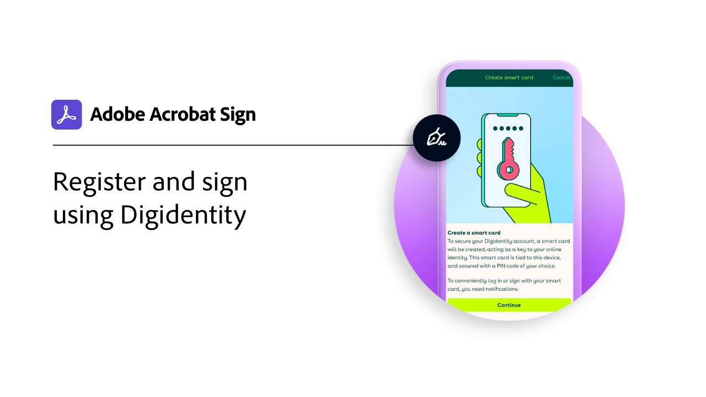

# Digitale ID - Übersicht

Ähnlich wie ein Reisepass in elektronischer Form ermöglicht Ihnen eine digitale Identität (digitale ID) den sicheren Nachweis, dass Sie derjenige sind, der Sie vorgeben zu sein. Eine digitale ID bietet zusätzliche Sicherheit bei der elektronischen Unterzeichnung in Acrobat Sign, wenn du die Autorisierung deiner elektronischen Unterschrift auf einem bestimmten Dokument vorgenommen hast. Die folgenden Tutorials zeigen Ihnen, wie Sie digitale IDs aus der ganzen Welt mit Acrobat Sign verwenden.

>[!NOTE]
>
>Bevor Sie eine digitale ID mit einer Cloud-Signatur verwenden können, wenden Sie sich an den Administrator Ihres Unternehmens, um zu bestätigen, dass die Lösung des Anbieters in Acrobat Sign aktiviert ist.

## Neue Funktionen

>[!BEGINTABS]

>[!TAB Registrieren und Signieren mit Digidentity]

Erfahren Sie, wie Sie Ihre [[!DNL Digidentity]](digidentity-sign.md) digitale ID bei Acrobat Sign registrieren und verwenden.

>[!TAB Registrieren und Signieren mit D-Trust]

Erfahren Sie, wie Sie Ihre Identität bei [[!DNL D-Trust]](d-trust.md) registrieren und dann die [!DNL D-Trust] digitale Signatur für ein Dokument in Acrobat Sign verwenden.

>[!ENDTABS]

## [!DNL Aadhaar]

<table style="table-layout:fixed">
<tr>
 <td>
    
    

    <a href="aadhaar-sign.md"><strong>Signieren mit [!DNL Aadhaar]</strong></a>
    

    <em>Weitere Informationen zur Verwendung Ihrer [!DNL Aadhaar] digitalen ID mit Acrobat Sign</em>
     
  </td>
  <td>
    
    

     
  </td>
  <td>
    
    

     
  </td>
  <td>
    
    

     
  </td>
</tr>
</table>

## [!DNL Digidentity]

<table style="table-layout:fixed">
<tr>
  <td>
    
    

    <a href="digidentity-sign.md"><strong>Registrieren und signieren mit [!DNL Digidentity]</strong></a>
    

    <em>Erfahren Sie, wie Sie Ihre [!DNL Digidentity] digitale ID bei Acrobat Sign registrieren und verwenden</em>
     
  </td>
  <td>
    
    

     
  </td>
  <td>
    
    

     
  </td>
  <td>
    
    

     
  </td>
</tr>
</table>

## [!DNL D-Trust]

<table style="table-layout:fixed">
<tr>
  <td>
    
    

    <a href="d-trust.md"><strong>Registrieren und Signieren mit D-Trust</strong></a>
    

    <em>Erfahren Sie, wie Sie Ihre Identität bei [!DNL D-Trust] registrieren und dann die [!DNL D-Trust] digitale Signatur für ein Dokument in Acrobat Sign verwenden</em>
     
  </td>
  <td>
    
    

     
  </td>
  <td>
    
    

     
  </td>
  <td>
    
    

     
  </td>
  </tr>
  </table>

## [!DNL Intesi Group]

<table style="table-layout:fixed">
<tr>
  <td>
    
    

    <a href="intesi-advanced.md"><strong>Digitale ID von [!DNL Intesi Group] abrufen (erweitert)</strong></a>
    

    <em>Erfahren Sie, wie Sie ein erweitertes digitales Signaturzertifikat von [!DNL Intesi Group]</em> erhalten.
     
  </td>
  <td>
    
    

    <a href="intesi-qualified.md"><strong>Eine digitale ID von [!DNL Intesi Group] abrufen (qualifiziert)</strong></a>
    

    <em>Erfahren Sie, wie Sie ein qualifiziertes digitales Signaturzertifikat von [!DNL Intesi Group]</em> erhalten.
     
  </td>
  <td>
    
    

    <a href="intesi-sign.md"><strong>Signieren mit [!DNL Intesi Group]</strong></a>
    

    <em>Weitere Informationen zur Verwendung Ihrer [!DNL Intesi Group] digitalen ID mit Acrobat Sign</em>
     
  </td>
  <td>
    
    

     
  </td>
</tr>
</table>
