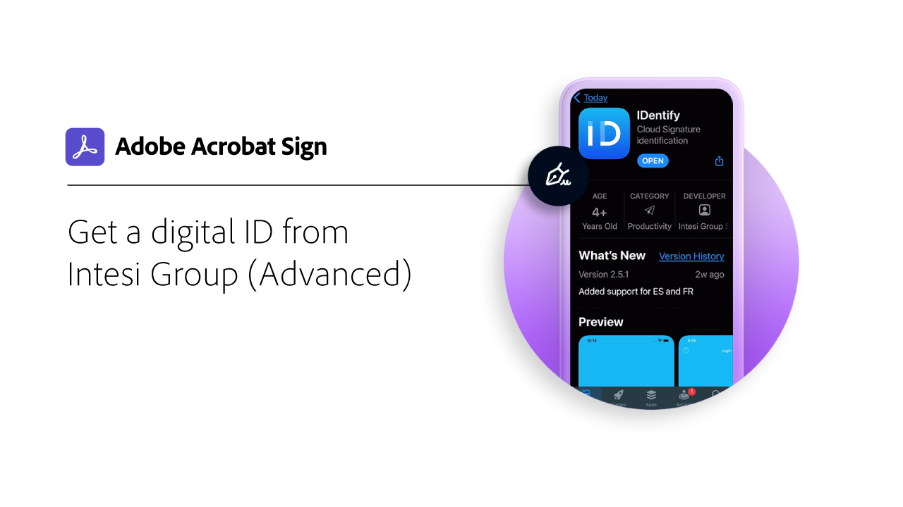

# Digitale ID - Übersicht

Ähnlich wie bei einem elektronischen Reisepass ermöglicht Ihnen eine digitale Identität (digitale ID) den sicheren Beweis, dass Sie der sind, der Sie sagen, sind. Und wenn Sie sich in Adobe Sign elektronisch unterschreiben, bietet die Verwendung einer digitalen ID eine höhere Sicherheit, dass Sie Ihre e-Signatur für das betreffende Dokument autorisiert haben. Die folgenden Tutorials zeigen Ihnen, wie Sie digitale IDs aus aller Welt mit Adobe Sign verwenden.

>[!NOTE]
>
>Bevor Sie eine digitale ID mit einer Cloud-Signatur verwenden können, sollten Sie sich an den Administrator Ihres Unternehmens wenden, um zu bestätigen, dass die Lösung des Anbieters in Adobe Sign aktiviert ist.

## [!DNL Digidentity]

<table style="table-layout:fixed">
<tr>
 <td>
    
    

    <a href="digidentity-reg.md"><strong>Digitale ID von [!DNL Digidentity] abrufen</strong></a>
    

    <em>Erfahren Sie, wie Sie ein digitales Signaturzertifikat von [!DNL Digidentity] erhalten</em>
     
  </td>
  <td>
    
    

    <a href="digidentity-sign.md"><strong>Unterschreiben mit [!DNL Digidentity]</strong></a>
    

    <em>Erfahren Sie, wie Sie Ihre [!DNL Digidentity] digitale ID mit Adobe Sign verwenden</em>
     
  </td>
  <td>
    
    

     
  </td>
</tr>
</table>

## [!DNL Intesi Group]

<table style="table-layout:fixed">
<tr>
  <td>
    
    

    <a href="intesi-advanced.md"><strong>Digitale ID von [!DNL Intesi Group] (erweitert) abrufen</strong></a>
    

    <em>Erfahren Sie, wie Sie ein erweitertes Zertifikat für digitale Signaturen von [!DNL Intesi Group] erhalten</em>
     
  </td>
  <td>
    
    

    <a href="intesi-qualified.md"><strong>Digitale ID von [!DNL Intesi Group] (Qualifiziert) abrufen</strong></a>
    

    <em>Erfahren Sie, wie Sie ein qualifiziertes digitales Signaturzertifikat von [!DNL Intesi Group] erhalten</em>
     
  </td>
  <td>
    
    

    <a href="intesi-sign.md"><strong>Unterschreiben mit [!DNL Intesi Group]</strong></a>
    

    <em>Erfahren Sie, wie Sie Ihre [!DNL Intesi Group] digitale ID mit Adobe Sign verwenden</em>
     
  </td>
</tr>
</table>
