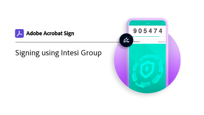

# Digitale ID von [!DNL Intesi Group] abrufen (Erweitert)

Erfahren Sie, wie Sie ein erweitertes digitales Signaturzertifikat von [!DNL Intesi Group] erhalten. Nach der Registrierung und Verifizierung Ihrer Identität stellt [!DNL Intesi Group] Ihnen eine digitale ID aus, die zum Anwenden einer Acrobat Sign-Cloud-Signatur verwendet wird.

>[!VIDEO](https://video.tv.adobe.com/v/3449915?captions=ger&quality=12&learn=on&hidetitle=true)

  

**Wählen Sie die folgende Abbildung aus, um zu erfahren, wie Sie Ihre erweiterte [!DNL Intesi Group]-ID in Acrobat Sign verwenden.**

