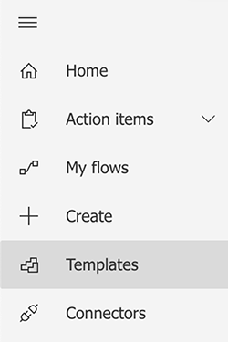
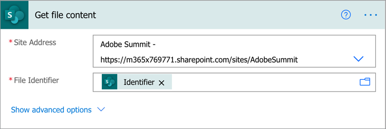
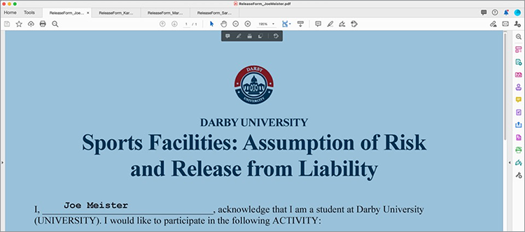
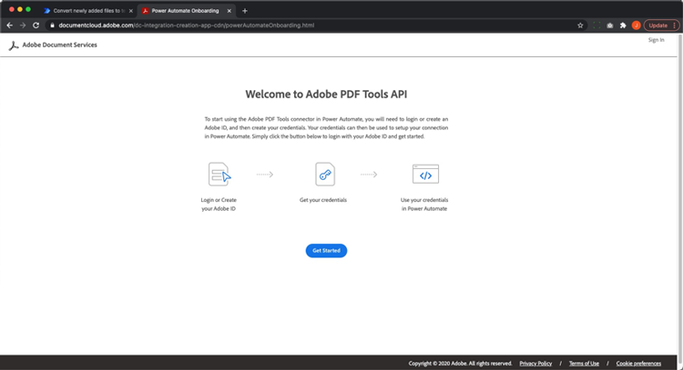
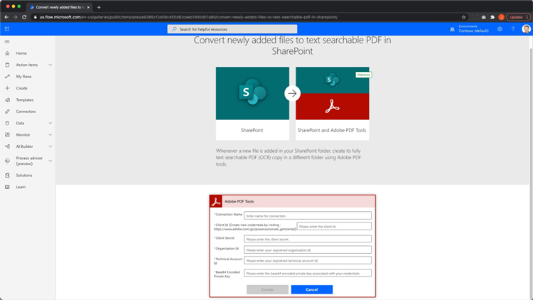
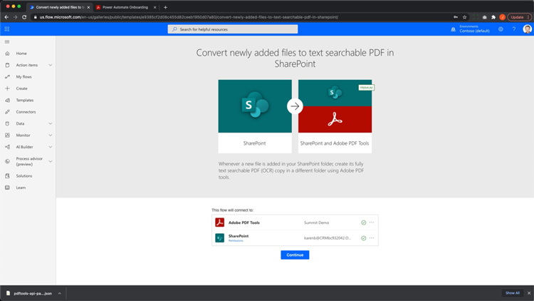
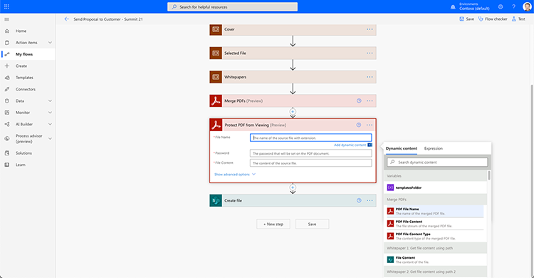

# Automatisierung von Dokumenten mit Acrobat Sign für Microsoft Power Platform.

Erfahren Sie, wie Sie die Connectors für Acrobat Sign und Adobe PDF Tools für Microsoft Power Apps aktivieren und verwenden. Workflows zur Automatisierung von Genehmigungs- und Unterschriftsprozessen lassen sich schnell und sicher implementieren - ganz ohne Code. Dieses praktische Tutorial besteht aus vier Teilen, die unter den folgenden Links beschrieben werden:

<table style="table-layout:fixed">
<tr>
  <td>
    
    

    <a href="documentautomation.md#part1"><strong>Teil 1: Signierte Vereinbarungen mit Acrobat Sign in SharePoint speichern</strong></a>
    

  </td>
  <td>
    
    

    <a href="documentautomation.md#part2"><strong>Teil 2: Automatisierter Genehmigungsprozess für elektronische Unterschriften mit Acrobat Sign</strong></a>
    

  </td>
  <td>
   
    

    <a href="documentautomation.md#part3"><strong>Teil 3: Automatisierte OCR mit Adobe PDF Tools</strong></a>
    

  </td>
  <td>
   
    

    <a href="documentautomation.md#part4"><strong>Teil 4: Automatisierte Zusammenstellung von Dokumenten mit Adobe PDF Tools</strong></a>
    

  </td>
</tr>
</table>

## Voraussetzungen

* Vertrautheit mit Microsoft 365 und Power Automate
* Acrobat Sign Knowledge
* Microsoft 365-Konto mit Zugriff auf SharePoint und Power Automate (Basic für Acrobat Sign, Premium für Adobe PDF Tools)
* Entwicklerkonto für Acrobat Sign für Unternehmen oder Acrobat Sign

**Übungen 1 und 2**

* Acrobat Sign-Konto mit Zugriff auf die API. Ein Entwicklerkonto oder ein Unternehmenskonto.
* Auf die SharePoint-Website kann von Power Automate zugegriffen werden, für die Sie Bearbeitungsberechtigungen haben. Vollständiger Administratorzugriff wird empfohlen.
* Beispieldokument für die Signaturgenehmigungsanforderung und -unterzeichnung.

**Übungen 3 und 4**

Materialien herunterladen [hier](https://github.com/benvanderberg/adobe-sign-pdftools-powerautomate-tutorial)

## Teil 1: Signierte Vereinbarungen mit Acrobat Sign in SharePoint speichern {#part1}

Im ersten Teil verwendest du eine Power Automate Flow-Vorlage, um einen automatisierten Workflow einzurichten, der alle signierten Verträge auf deiner SharePoint-Website speichert.

1. Navigieren Sie zu Power Automate.
1. Suchen Sie nach Acrobat Sign.

   

1. Auswählen **Eine abgeschlossene Acrobat Sign-Vereinbarung in der SharePoint-Bibliothek speichern**.

   

1. Überprüfen Sie den Bildschirm und konfigurieren Sie alle erforderlichen Verbindungen. Aktivieren Sie die Acrobat Sign-Verbindung.
1. Klicken Sie auf das blaue `+` Symbol.

   

1. Geben Sie Ihre E-Mail-Adresse für das Acrobat Sign-Konto ein und klicken Sie im neuen Fenster auf das Kennwortfeld.

   

   Warten Sie einen Moment, bis Adobe Ihr Konto überprüft hat.

   >[!NOTE]
   >
   >Bei dieser Prüfung werden Sie an den entsprechenden Anmeldenamen weitergeleitet, wenn Sie eine Adobe ID oder unser Unternehmens-SSO verwenden.

1. Vollständige Anmeldung.
1. Klicken **Weiter** , um zum Bearbeitungsbildschirm von Flow zu gelangen.
1. Benennen Sie den Trigger.

   

1. SharePoint-Einstellungen konfigurieren.

   

   **Site-Adresse:** Ihre SharePoint-Site
   **Ordnerpfad:** Pfad zu den freigegebenen Dokumenten, die Sie verwenden möchten
   **Dateiname:** Übernehmen Sie die Standardeinstellung
   **Dateiinhalt:** Übernehmen Sie die Standardeinstellung

1. Ablauf speichern.

   

1. Navigieren Sie mit dem blauen Zurück-Pfeil zum Übersichtsbildschirm des Textflusses. Du wirst diesen Flow im zweiten Teil testen.

   

Sie werden diesen Flow im nächsten Teil testen.

## Teil 2: Automatisierter Genehmigungsprozess für elektronische Unterschriften mit Acrobat Sign {#part2}

Im zweiten Teil bauen wir den ersten Teil mit einem robusteren Flow auf und testen beide Flows, um sie in Aktion zu sehen.

1. Auswählen **Vorlagen** auf der linken Seite der Power Automate-Oberfläche.

   

1. Suchen Sie nach &quot;Genehmigung durch Manager&quot;.
1. Auswählen **Genehmigung einer ausgewählten Datei durch den Anforderungs-Manager**.

   

   Überprüfen Sie die Verbindungen und fügen Sie fehlende Verbindungen hinzu.

   >[!NOTE]
   >
   >Wenn dies der erste Flow ist, der mit Genehmigungen ausgeführt wird, werden diese vollständig konfiguriert, sobald der Flow ausgeführt wird.

1. Klicken **Weiter** , um zum Flussbearbeitungsbildschirm zu wechseln.

   Dieser Textfluss enthält viele vorkonfigurierte Schritte, einschließlich Fehlerüberprüfung und verschachtelte bedingte Schritte.

1. Konfigurieren **Für eine ausgewählte Datei** wie folgt:
   **Site-Adresse:** Ihre SharePoint-Site
   **Bibliotheksname:** Ihr Dokumentenrepository
1. Fügen Sie wie folgt eine Eingabe hinzu:
   **Typ**: Email
   **Name**: E-Mail des Unterzeichners

   

1. Konfigurieren **Dateieigenschaften abrufen:** wie folgt:
   **Site-Adresse:** Ihre SharePoint-Site
   **Bibliotheksname:** Ihr Dokumentenrepository

1. Scrollen Sie nach unten und suchen Sie nach **Wenn ja**.

   

1. Klicken **Aktion hinzufügen** in der **Wenn ja** , um die Schritte hinzuzufügen, die zum Signieren gesendet werden sollen.

   

1. Suchen nach **SharePoint Dateiinhalt abrufen** und wählen Sie **Dateiinhalt abrufen**.

   

1. Konfigurieren Sie die **Dateiinhalt abrufen** wie folgt:

   

   **Site-Adresse:** Deine SharePoint-Website.
   **Dateikennung:** Suchen Sie nach &quot;identifier&quot; und wählen Sie Identifier aus der Liste **Dateieigenschaften abrufen** -Schritt.
1. Suchen Sie nach &quot;Adobe&quot; und wählen Sie **Acrobat Sign** , um eine weitere Aktion hinzuzufügen.

   

1. Geben Sie &quot;upload&quot; in das Suchfeld für Acrobat Sign ein und wählen Sie **Dokument hochladen und Dokument-ID abrufen**.
1. Suchen nach der dynamischen Variable **Name** , um den Namen des im Trigger ausgewählten Elements/Dokuments unter **Dateiname**.
1. Klicken **Expression** im variablen Assistenten unter **Dateiinhalt**.

   

1. Einen einzelnen Apostroph hinzufügen und zurück klicken, um **Dynamischer Inhalt**, löschen Sie Ihren Apostroph, wählen Sie **Dateiinhalt** und dann auf **OK**.

   Stellen Sie sicher, dass keine zusätzlichen Apostrophe vorhanden sind und es wie in der folgenden Beispieldatei aussieht.

   

1. Gib im Suchbereich von Acrobat Sign &quot;create&quot; ein, um eine weitere Acrobat Sign-Aktion hinzuzufügen.
1. Auswählen **Dokumente aus hochgeladenem Dokument erstellen und zur Unterzeichnung versenden**.

   

1. Konfigurieren Sie die erforderlichen Informationen: Auswählen **Name** aus dem Assistenten für dynamische Variablen in **Vereinbarungsname**.
Auswählen **Dokument-ID** aus dem Assistenten für dynamische Variablen in **Dokument-ID**.
Auswählen **E-Mail des Unterzeichners** aus dem Assistenten für dynamische Variablen in **E-Mail des Teilnehmers**.
Geben Sie &quot;1&quot; in **Reihenfolge der Teilnehmer**.
Auswählen **Unterzeichner** aus der Dropdown-Liste in **Rolle des Teilnehmers**.

   

1. **Speichern** den Flow fest.

### Testen des Textflusses

Rufe das Dokument-Repository deiner SharePoint-Website auf, um es zu testen.

1. Wählen Sie das Dokument aus und wählen Sie **Automatisieren** und die **Fluss** erstellt hast.

   

1. Starten Sie den Flow, um die Verbindungen zu validieren (nur beim ersten Flow).
1. Geben Sie eine nette Nachricht an den Genehmiger in **Nachricht**.
1. E-Mail für das Dokument eingeben Unterzeichner in **E-Mail des Unterzeichners**.
1. Klicken **Textfluss ausführen**.

Der konfigurierte Genehmiger für den Benutzer, der den Flow startet, erhält eine Genehmigungsanforderung. Sie können die Genehmigung per E-Mail oder über das Menü &quot;Power Automate-Aktionselemente&quot; erteilen.
Nach der Genehmigung unterschreiben Sie Ihr Dokument. Abhängig von Ihrem Benutzer und wenn er bei Sign angemeldet ist, müssen Sie die Signaturfenster möglicherweise in einem privaten Browserfenster öffnen.

Schließen Sie die Signatur ab und sehen Sie dann in Ihrem SharePoint-Ordner nach.

## Teil 3: Automatisierte OCR mit Adobe PDF Tools {#part3}

Im dritten Teil lernen Sie, wie Sie OCR in PDF automatisieren, wenn diese in Microsoft SharePoint importiert werden. Damit wird ein Problem behoben, das bei gescannten PDF-Dokumenten auftritt, die in SharePoint nicht durchsucht werden können.

### Einrichten eines Ordners in SharePoint

Wechseln Sie zu Microsoft SharePoint, wo Sie Dokumente speichern möchten.

1. Klicken **+ Neu** , um einen neuen Ordner mit dem Namen &quot;Verarbeitete Verträge&quot; zu erstellen.
1. Klicken **+ Neu** , um einen neuen Ordner mit dem Namen &quot;Alte Verträge&quot; zu erstellen.

   

Diese Ordner werden jetzt als Teil Ihres Power Automate -Ablaufs referenziert.

### Textfluss aus Vorlage erstellen

1. Melden Sie sich bei https://flow.microsoft.com an.
1. Klicken **Vorlagen** in der Seitenleiste.

   

1. Auswählen **Konvertieren neu hinzugefügter Dateien in durchsuchbare PDF mit Text in SharePoint**.
1. Klicken Sie auf **+** neben Adobe PDF Tools.

   

1. Navigieren Sie auf einer neuen Registerkarte zu https://www.adobe.com/go/powerautomate_getstarted .
1. Klicken Sie auf **Erste Schritte**.

   

1. Mit der Adobe ID anmelden

   

1. Geben Sie den Namen der Anmeldeinformationen und die Beschreibung der Anmeldeinformationen ein und klicken Sie auf **Anmeldeinformationen erstellen**.

   

   Lassen Sie das Fenster mit den Anmeldeinformationen geöffnet. Sie müssen sie in Microsoft Power Automate eingeben.

   

1. Geben Sie die Anmeldeinformationen ein und klicken Sie auf **In Microsoft Power Automate erstellen**.

   

1. Klicken Sie auf **Fortfahren**.

   

   Jetzt können Sie eine Ansicht des Workflows anzeigen und müssen ihn für Ihre Umgebung konfigurieren.

1. Wählen Sie das Feld Site-Adresse aus, und wählen Sie unter dem Trigger namens die SharePoint-Site aus, die Sie verwenden. **Wenn eine Datei in einem Ordner erstellt wird**.

   

1. Klicken Sie auf das Ordnersymbol, um zum Ordner Alte Verträge unter Ordner-ID zu navigieren.

   

1. Bearbeiten Sie die **Datei erstellen** Aktion am Ende des Textflusses:

   Ändern **Site-Adresse** zu Ihrer Site-Adresse.
Geben Sie den Speicherort des Ordners &quot;Verarbeitete Verträge&quot; im Ordnerpfad an.

1. Klicken **Speichern** in der rechten oberen Ecke.
1. Klicken **Test**.
1. Auswählen **Manuell**.
1. Klicken **Test**.

   

### Neuen Flow testen

1. Navigieren Sie zum Ordner Alte Verträge in SharePoint.
1. Navigieren Sie in den Übungsdateien, die Sie heruntergeladen haben, zu &quot;E03/Old Contracts&quot;.
1. Kopieren Sie die Dateien ReleaseFormXX.pdf in den Ordner Alte Verträge in SharePoint.

   

Wenn Sie jetzt zum Ordner &quot;Verarbeitete Verträge&quot; navigieren, werden Ihre PDF angezeigt, nachdem der Flow einige Sekunden lang ausgeführt wurde. Wenn Sie die PDF öffnen, können Sie sehen, dass der Text ausgewählt werden kann.
Darüber hinaus indiziert SharePoint das Dokument, sodass Sie den Inhalt Ihrer Dokumente über die Suchleiste in SharePoint durchsuchen können.

## Teil 4: Automatisierte Zusammenstellung von Dokumenten mit Adobe PDF Tools {#part4}

Im vierten Teil dieses Tutorials lernen Sie, wie Sie anhand der Informationen, die Sie bei der Auswahl und beim Starten eines Flows in Microsoft SharePoint erhalten, eine Vielzahl von Dokumenten zusammenführen. In diesem Szenario hat der Textfluss folgende Auswirkungen:

* Fragen Sie nach Informationen, um auszuwählen, was in einem Paket für einen Kunden enthalten sein soll.
* Auf der Grundlage der bereitgestellten Informationen werden zahlreiche Dokumente zusammengeführt. Diese Dokumente enthalten ein Deckblatt und optionale Whitepaper.
* Das zusammengeführte Dokument wird in SharePoint gespeichert.

### Importieren von Übungsdateien in SharePoint

1. Öffnen Sie den Ordner E04 in den Übungsdateien.
1. Importieren Sie die Ordner &quot;Angebot&quot;, &quot;Vorlagen&quot; und &quot;Generierte Dokumente&quot; in SharePoint.

   

Diese Ordner werden als Referenz verwendet. Insbesondere verwenden Sie die Datei proposal.docx für Ihr Angebot.

Der Ordner &quot;Vorlagen&quot; enthält die Titelseiten-Designs für verschiedene Städte. Es gibt auch einen Whitepaper-Ordner, der optionale zusätzliche Whitepaper enthält, die bei Auswahl an das Ende angehängt werden.

### Textfluss in Microsoft Power Automate importieren

1. Melden Sie sich bei Microsoft Power Automate an (https://flow.microsoft.com).
1. Klicken **Meine Flows**.

   

1. Klicken Sie auf **Importieren**.

   

1. Klicken **Hochladen** und wählen Sie den Ordner Generateproposal_20210311231623.zip in E04/Flows/.

   

1. Klicken Sie auf **Importieren**.

1. Klicken Sie auf das Schraubenschlüsselsymbol unter Aktion neben **Angebot an Kunden senden**.

   

1. Auswählen **Neu erstellen** unter Setup.
1. Legen Sie den Namen des Textflusses unter &quot;Ressourcenname&quot; fest.
1. Klicken Sie auf **Speichern**.

   Wiederholen Sie diesen Vorgang für die anderen Ressourcen des Typs &quot;Verwandte Themen&quot;, und wählen Sie die Verbindung aus.

   

1. Klicken **Importieren** nachdem Sie alle Ihre Verbindungen hergestellt haben.

### Festlegen für eine ausgewählte Datei

Nachdem der Textfluss erstellt wurde, gehen Sie wie folgt vor:

1. Klicken Sie auf **Bearbeiten**.

   

1. Auslöser auswählen **Für eine ausgewählte Datei**.

   Fügen Sie Ihre SharePoint-Site der Site-Adresse hinzu.
Fügen Sie Ihre Bibliothek der Bibliothek hinzu.

   

### VorlageOrdnerpfad festlegen

1. Klicken Sie auf die Variable &quot;templateFolderPath&quot;.
1. Legen Sie den Pfad fest, zu dem sich der Vorlagenordner innerhalb der von Ihnen importierten SharePoint-Site befindet.

### Cover festlegen Dateiinhalt abrufen

1. Klicken **Abdeckung** , wodurch der Bereich erweitert wird.
1. Erweitern **Deckblatt: Dateiinhalt abrufen**.

   Legen Sie die Site-Adresse auf Ihre SharePoint-Site fest.

   

### Ausgewählte Datei festlegen

1. Erweitern Sie die **Ausgewählte Datei** Bereichsaktion.

   Ändern Sie die Site-Adresse und den Bibliotheksnamen in Ihre SharePoint-Site bzw. Bibliothek unter **Dateieigenschaften abrufen**.
Ändern Sie die Site-Adresse in Ihre SharePoint-Site unter **Dateiinhalt abrufen**.

   

### Festlegen von Whitepapern

1. Klicken **Whitepaper** Aktion.
1. Erweitern **Bedingung: Whitepaper hinzufügen**.

   

1. Erweitern **Whitepaper 1: Dateiinhalte über den Pfad abrufen**.
Bearbeiten Sie die Site-Adresse für die angegebene SharePoint-Site.

Wiederholen Sie dieselben Schritte für **Bedingung: Whitepaper 2 hinzufügen**.

### Erstellungsdatei festlegen

1. Erweitern **Datei erstellen**.

   Bearbeiten Sie Site-Adresse und Ordnerpfad zur SharePoint-Site und zum Pfad, in dem sich der Ordner &quot;Generated Docs&quot; befindet.

1. Klicken Sie auf **Speichern**.

### Den Flow testen

1. Navigieren Sie in SharePoint zum Angebotsordner.
1. Wählen Sie den Ordner Angebot.docx .

   

1. Wählen Sie Ihren Textfluss unter dem **Automatisieren** Menü.

   

1. Klicken **Weiter** , um den Textfluss zu beginnen.

   

1. Wählen Sie Ihr Cover und die Whitepaper, die Sie anhängen möchten.
1. Klicken **Textfluss ausführen**.

   

Navigieren Sie zum Ordner &quot;Dokumente generieren&quot;. Sie sollten jetzt Ihre generierte PDF-Datei sehen.

### Hinzufügen von Protect und anderen Aktionen zum Flow

Nachdem Sie einen Textfluss erstellt haben, bearbeiten Sie diesen, um das PDF-Dokument mit einem Kennwort zu verschlüsseln. Dies zeigt auch, wie Sie andere Aktionen verwenden können.

1. Navigieren Sie zurück zum Ende des Flows.
1. Klicken Sie auf **+** Zeichen zwischen **PDF zusammenführen** und **Datei erstellen**.

   

1. Auswählen **Aktion hinzufügen**.
1. Suchen Sie nach &quot;Adobe PDF Tools&quot;.

   

1. Auswählen **Protect PDF von der Anzeige**.
1. Setzen Sie das Feld Dateiname mithilfe von dynamischem Inhalt auf **PDF-Dateiname von Merge-PDF**.

   

   Im Trigger befindet sich das Feld Kennwort, das Teil des Initiierungsformulars ist. Wir können das hier verwenden.

1. Suchen nach **Kennwortfeld** Dynamischen Inhalt verwenden und ihn in das Feld &quot;Kennwort&quot; platzieren.

   

1. Dynamischen Inhalt verwenden, um ihn auf **PDF von Dateiinhalten aus Merge-PDF** im Feld Dateiinhalt .
1. Ändern Sie die **Datei erstellen** , um den Dateiinhalt von Protect PDF anstatt von Merge-PDF zu erhalten.
1. Erweitern **Datei erstellen**.
1. Löschen Sie das Feld Dateiinhalt.
1. Platzieren von dynamischem Inhalt **PDF von Dateiinhalten** von **Protect PDF von der Anzeige**.

### Den Flow testen

1. Navigieren Sie in SharePoint zum Angebotsordner.
1. Wählen Sie Angebot.docx.

   

1. Auswählen **Automatisieren** , um Ihren Flow auszuwählen.

   

1. Klicken **Weiter** , um den Textfluss zu beginnen.

   

1. Wählen Sie das Cover und die Whitepaper aus, die Sie anhängen möchten.
1. Legen Sie im Feld Kennwort das Kennwort fest, das Sie festlegen möchten.
1. Klicken **Textfluss ausführen**.

   

1. Navigieren Sie zum Ordner &quot;Dokumente generieren&quot;.
Sie sollten Ihre generierte PDF-Datei sehen. Öffnen Sie die PDF-Datei und Sie werden aufgefordert, Ihr PDF-Kennwort einzugeben.

   
