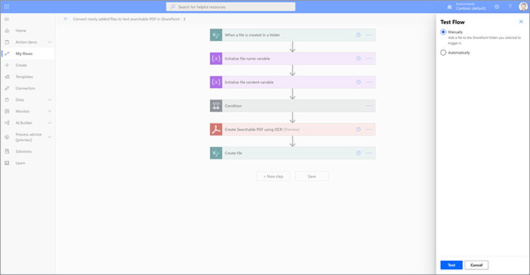
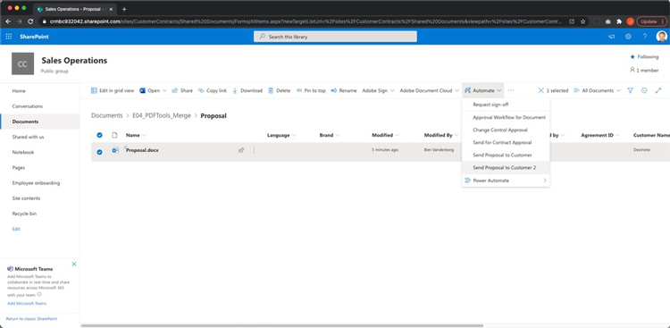

# Dokumentautomatisierung mit Adobe Sign für Microsoft Power Platform

Erfahren Sie, wie Sie die Adobe Sign- und Adobe PDF Tools-Connectors für Microsoft Power Apps aktivieren und verwenden. Erstellen Sie Arbeitsabläufe, die die Genehmigung und Unterschrift von Unternehmen schnell und sicher automatisieren, ohne Code zu schreiben. Dieses Tutorial enthält vier Teile, die in den folgenden Links beschrieben werden:

<table style="table-layout:fixed">
<tr>
  <td>
    
    

    <a href="documentautomation.md#part1"><strong>Teil 1: Signierte Vereinbarung in SharePoint mit Adobe Sign speichern</strong></a>
    

  </td>
  <td>
    
    

    <a href="documentautomation.md#part2"><strong>Teil 2: Automatisierter Genehmigungsprozess für e-Signatur mit Adobe Sign</strong></a>
    

  </td>
  <td>
   
    

    <a href="documentautomation.md#part3"><strong>Teil 3: OCR für automatisierte Dokumente mit Adobe PDF Tools</strong></a>
    

  </td>
  <td>
   
    

    <a href="documentautomation.md#part4"><strong>Teil 4: Automatisierte Dokumentenmontage mit Adobe PDF Tools</strong></a>
    

  </td>
</tr>
</table>

## Voraussetzungen

* Vertrautheit mit Microsoft 365 und Power Automate
* Adobe Sign-Kenntnisse
* Microsoft 365-Konto mit Zugriff auf SharePoint und Power Automate (Basic for Adobe Sign, Premium for Adobe PDF Tools)
* Adobe Sign für Enterprise- oder Adobe Sign-Entwicklerkonto

**Übungen 1 und 2**

* Adobe Sign-Konto mit Zugriff auf die API. Ein Entwicklerkonto oder ein Unternehmenskonto.
* SharePoint-Site, auf die über Power Automate zugegriffen werden kann und für die Sie Bearbeitungsberechtigungen haben. Vollständiger Administratorzugriff wird empfohlen.
* Beispieldokument für die Signaturgenehmigungsanforderung und -signatur.

**Übungen 3 und 4**

Materialien [hier](https://github.com/benvanderberg/adobe-sign-pdftools-powerautomate-tutorial) herunterladen

## Teil 1: Signierte Vereinbarung in SharePoint mit Adobe Sign speichern {#part1}

Im ersten Teil verwenden Sie eine Power Automate Flow-Vorlage, um einen automatisierten Arbeitsablauf einzurichten, der alle signierten Vereinbarungen auf Ihrer SharePoint-Site speichert.

1. Navigieren Sie zu Power Automate.
1. Search for Adobe Sign.

   

1. Wählen Sie **Abgeschlossene Adobe Sign-Vereinbarung in SharePoint-Bibliothek speichern**.

   

1. Überprüfen Sie den Bildschirm und konfigurieren Sie die erforderlichen Verbindungen. Aktivieren Sie die Adobe Sign-Verbindung.
1. Klicken Sie auf das blaue `+`-Symbol.

   

1. Geben Sie Ihre E-Mail-Adresse für das Adobe Sign-Konto ein und klicken Sie im neuen Fenster auf das Kennwortfeld.

   

   Warten Sie einen Moment, bis die Adobe Ihr Konto überprüft.

   >[!NOTE]
   >
   >Diese Prüfung leitet Sie zur entsprechenden Anmeldung, wenn Sie ein Adobe ID oder unser Corporate SSO verwenden.

1. Melden Sie sich vollständig an.
1. Klicken Sie auf **Continue**, um zum Flow-Bearbeitungsbildschirm zu gelangen.
1. Benennen Sie den Trigger.

   

1. Konfigurieren Sie Ihre SharePoint-Einstellungen.

   

   **Site-Adresse:** Ihre SharePoint-Site
   **Ordnerpfad:** Pfad zu den freigegebenen Dokumenten, die Sie verwenden möchten
   **Dateiname:Standard** akzeptieren
   **Dateiinhalt:Standard** akzeptieren

1. Ablauf speichern.

   

1. Navigieren Sie zum Übersichtsbildschirm für den Textfluss mit dem blauen Zurück-Pfeil. Sie testen diesen Fluss in Teil 2.

   

Sie werden diesen Textfluss im nächsten Teil testen.

## Teil 2: Automatisierter Genehmigungsprozess für e-Signatur mit Adobe Sign {#part2}

Im zweiten Teil bauen wir den ersten Teil mit einem robusteren Fluss auf und testen beide Flows, um sie in Aktion zu sehen.

1. Wählen Sie auf der linken Seite der Power Automate-Schnittstelle **Vorlagen** aus.

   

1. Suchen Sie nach &quot;Genehmigung durch den Manager&quot;.
1. Wählen Sie **Genehmigung durch den Manager anfordern für eine ausgewählte Datei**.

   

   Überprüfen Sie die Verbindungen und fügen Sie fehlende Verbindungen hinzu.

   >[!NOTE]
   >
   >Wenn dies der erste Textfluss ist, den Sie mit Genehmigungen durchführen, werden sie bei der Ausführung des Textflusses vollständig konfiguriert.

1. Klicken Sie auf **Continue**, um zum Flow-Bearbeitungsbildschirm zu gelangen.

   Dieser Textfluss enthält viele vorkonfigurierte Schritte, einschließlich Fehlerprüfung und verschachtelten bedingten Schritten.

1. Konfigurieren Sie **Für eine ausgewählte Datei** wie folgt:
   **Site-Adresse:** Ihre SharePoint-Site
   **Bibliotheksname:** Ihr Documents-Repository
1. Fügen Sie eine Eingabe wie folgt hinzu:
   **Typ**: E-Mail
   **Name**: E-Mail des Unterzeichners

   

1. Konfigurieren Sie **Dateieigenschaften abrufen:** wie folgt:
   **Site-Adresse:** Ihre SharePoint-Site
   **Bibliotheksname:** Ihr Documents-Repository

1. Scrollen Sie nach unten und suchen Sie nach **If yes**.

   

1. Klicken Sie auf **Aktion hinzufügen** im Feld **If yes** (nicht die unterste), um die Schritte hinzuzufügen, die zum Unterschreiben gesendet werden sollen.

   

1. Suchen Sie nach **SharePoint-Dateiinhalt abrufen** und wählen Sie **Dateiinhalt abrufen**.

   

1. Konfigurieren Sie den **Dateiinhalt abrufen** wie folgt:

   

   **Site-Adresse:** Ihre SharePoint-Site.
   **Datei-ID:** Suchen Sie nach &quot;identifier&quot;und wählen Sie im Schritt  **Dateieigenschaften abrufen den** Eintrag &quot;Identifier&quot;.
1. Suchen Sie nach &quot;Adobe&quot;und wählen Sie **Adobe Sign**, um eine weitere Aktion hinzuzufügen.

   

1. Geben Sie &quot;upload&quot;in das Suchfeld für Adobe Sign ein und wählen Sie **Hochladen eines Dokuments und erhalten Sie eine Dokument-ID**.
1. Suchen Sie nach der dynamischen Variable **Name**, um den Namen des Elements/Dokuments abzurufen, das im Trigger unter **Dateiname** ausgewählt wurde.
1. Klicken Sie im Variablenassistenten unter **Dateiinhalt** auf **Ausdruck**.

   

1. Fügen Sie einen einzelnen Apostroph hinzu, klicken Sie zurück zu **Dynamischer Inhalt**, löschen Sie Ihren Apostroph, wählen Sie **Dateiinhalt** und klicken Sie dann auf **OK**.

   Achten Sie darauf, dass es keine zusätzlichen Apostrophe gibt, und es sieht wie im Beispiel unten aus.

   

1. Suchen Sie im Adobe Sign-Suchbereich nach &quot;Erstellen&quot;, um eine weitere Adobe Sign-Aktion hinzuzufügen.
1. Wählen Sie **Aus einem hochgeladenen Dokument erstellen und Vereinbarung erstellen und zum Unterschreiben senden**.

   

1. Konfigurieren Sie die erforderlichen Informationen:
Wählen Sie **Name** aus dem Assistenten für dynamische Variablen in **Vereinbarungsname**.
Wählen Sie **Dokument-ID** aus dem Assistenten für dynamische Variablen in **Dokument-ID**.
Wählen Sie **E-Mail-Adresse des Unterzeichners** aus dem Assistenten der dynamischen Variablen in **E-Mail des Teilnehmers**.
Geben Sie &quot;1&quot;in **Teilnehmerreihenfolge** ein.
Wählen Sie **Unterzeichner** aus der Dropdownliste **Teilnehmerrolle**.

   

1. **Fluss** speichern.

### Fluss testen

Testen Sie das Dokument im Dokumentrepository Ihrer SharePoint-Site.

1. Wählen Sie das Dokument aus und wählen Sie **Automatisch** und **Fluss**, den Sie gerade erstellt haben.

   

1. Starten Sie den Flow, um die Verbindungen zu überprüfen (nur erste Flow-Ausführung).
1. Geben Sie eine nette Nachricht an den Genehmiger in **Nachricht** ein.
1. Geben Sie unter **E-Mail-Adresse des Unterzeichners des Dokuments** die E-Mail-Adresse des Unterzeichners ein.
1. Klicken Sie auf **Flow ausführen**.

Der konfigurierte Genehmiger für den Benutzer, der den Flow startet, erhält eine Genehmigungsanforderung. Sie können die Genehmigung per E-Mail oder über das Menü &quot;Power Automate Action Items&quot;erteilen.
Sobald Sie genehmigt haben, signieren Sie Ihr Dokument. Abhängig von Ihrem Benutzer und wenn sie bei Sign angemeldet sind, müssen Sie die Signaturfenster möglicherweise in einem privaten Browserfenster öffnen.

Schließen Sie die Signatur ab und schauen Sie dann in Ihren SharePoint-Ordner zurück.

## Teil 3: OCR für automatisierte Dokumente mit Adobe PDF Tools {#part3}

Im dritten Teil lernen Sie, wie Sie OCR in PDF-Dateien automatisieren, wenn sie in Microsoft SharePoint importiert werden. Dadurch wird ein Problem behoben, das bei gescannten PDF-Dokumenten auftritt, die in SharePoint nicht durchsucht werden können.

### Ordner in SharePoint einrichten

Wechseln Sie zu Microsoft SharePoint, wo Sie Dokumente speichern möchten.

1. Klicken Sie auf **+ Neu**, um einen neuen Ordner mit dem Namen &quot;Verarbeitete Verträge&quot;zu erstellen.
1. Klicken Sie auf **+ Neu**, um einen neuen Ordner mit dem Namen &quot;Alte Verträge&quot;zu erstellen.

   

Diese Ordner werden jetzt als Teil Ihres Power Automate-Textflusses referenziert.

### Erstellen eines Textflusses aus einer Vorlage

1. Melden Sie sich bei https://flow.microsoft.com an.
1. Klicken Sie in der Seitenleiste auf **Vorlagen**.

   

1. Wählen Sie **Neu hinzugefügte Dateien in PDF-Dateien mit durchsuchbarem Text in SharePoint** konvertieren.
1. Klicken Sie auf das Symbol **+** neben Adobe PDF Tools.

   

1. Navigieren Sie auf einer neuen Registerkarte zu https://www.adobe.com/go/powerautomate_getstarted.
1. Klicken Sie auf **Erste Schritte**.

   

1. Melden Sie sich mit Ihrem Adobe ID an.

   

1. Geben Sie den Berechtigungsnamen und die Anmeldeinformationen ein und klicken Sie auf **Anmeldeinformationen erstellen**.

   

   Lassen Sie das Fenster mit den Anmeldedaten geöffnet. Sie müssen sie in Microsoft Power Automate eingeben.

   

1. Geben Sie die Anmeldeinformationen ein und klicken Sie auf **In Microsoft Power Automate erstellen**.

   

1. Klicken Sie auf **Fortfahren**.

   

   Jetzt können Sie eine Ansicht des Arbeitsablaufs sehen und müssen sie für Ihre Umgebung konfigurieren.

1. Wählen Sie das Feld Site-Adresse und wählen Sie unter dem Trigger **Wenn eine Datei in einem Ordner** erstellt wird, die verwendete SharePoint-Site aus.

   

1. Klicken Sie auf das Ordnersymbol, um zum Ordner &quot;Alte Verträge&quot;unter &quot;Ordner-ID&quot;zu navigieren.

   

1. Bearbeiten Sie die Aktion **Datei erstellen** am unteren Rand des Textflusses:

   Ändern Sie **Site-Adresse** in Ihre Site-Adresse.
Geben Sie den Speicherort des Ordners &quot;Verarbeitete Verträge&quot;im Ordnerpfad an.

1. Klicken Sie in der rechten oberen Ecke auf **Speichern**.
1. Klicken Sie auf **Test**.
1. Wählen Sie **Manuell**.
1. Klicken Sie auf **Test**.

   

### Neuen Textfluss testen

1. Navigieren Sie zum Ordner &quot;Alte Verträge&quot;in SharePoint.
1. Navigieren Sie in den Übungsdateien, die Sie heruntergeladen haben, zu E03/Old Contracts.
1. Kopieren Sie die Dateien ReleaseFormXX.pdf in den Ordner Alte Verträge in SharePoint.

   

Wenn Sie jetzt zum Ordner &quot;Verarbeitete Verträge&quot;navigieren, werden die verfügbaren PDFs angezeigt, nachdem der Textfluss einige Augenblicke lang ausgeführt werden konnte. Wenn Sie die PDF-Dateien öffnen, können Sie sehen, dass der Text ausgewählt werden kann.
Darüber hinaus indiziert SharePoint das Dokument, sodass Sie den Inhalt Ihrer Dokumente über die Suchleiste in SharePoint durchsuchen können.

## Teil 4: Automatisierte Dokumentenmontage mit Adobe PDF Tools {#part4}

Im vierten Teil lernen Sie, wie Sie viele Dokumente basierend auf Informationen zusammenführen, die beim Auswählen und Starten eines Textflusses aus Microsoft SharePoint bereitgestellt werden. In diesem Szenario wird der Textfluss:

* Fragen Sie nach Informationen, um auszuwählen, was in einem Paket für einen Kunden enthalten sein soll.
* Basierend auf den bereitgestellten Informationen werden zahlreiche Dokumente zusammengeführt. Diese Dokumente enthalten eine Titelseite und optionale Whitepaper.
* Das zusammengeführte Dokument wird in SharePoint gespeichert.

### Übungsdateien in SharePoint importieren

1. Öffnen Sie den Ordner E04 in den Übungsdateien.
1. Importieren Sie die Ordner &quot;Angebot&quot;, &quot;Vorlagen&quot;und &quot;Generierte Dokumente&quot;in SharePoint.

   

Diese Ordner werden als Referenz verwendet. Insbesondere verwenden Sie die Datei &quot;proposal.docx&quot;für Ihr Angebot.

Im Ordner &quot;Templates&quot;befindet sich ein Ordner &quot;Covers&quot;, der Deckblatt-Designs für verschiedene Städte enthält. Es gibt auch einen Ordner &quot;Whitepapers&quot;, der optionale zusätzliche Whitepapers enthält, die bei Auswahl am Ende angehängt werden.

### Textfluss in Microsoft Power Automate importieren

1. Melden Sie sich bei Microsoft Power Automate an (https://flow.microsoft.com).
1. Klicken Sie auf **Meine Flows**.

   

1. Klicken Sie auf **Importieren**.

   

1. Klicken Sie auf **Upload** und wählen Sie den Ordner Generateproposal_20210311231623.zip in E04/Flows/.

   

1. Klicken Sie auf **Importieren**.

1. Klicken Sie unter Aktion auf das Schraubenschlüsselsymbol neben **Angebot an Kunden senden**.

   

1. Wählen Sie unter &quot;Setup&quot;die Option **Als neu erstellen**.
1. Legen Sie den Namen des Textflusses unter &quot;Ressourcenname&quot;fest.
1. Klicken Sie auf **Speichern**.

   Wiederholen Sie diesen Vorgang für die anderen Ressourcen für verwandte Themen und wählen Sie Ihre Verbindung aus.

   

1. Klicken Sie auf **Importieren**, nachdem Sie alle Ihre Verbindungen hergestellt haben.

### Für eine ausgewählte Datei festlegen

Nachdem der Textfluss erstellt wurde, gehen Sie wie folgt vor:

1. Klicken Sie auf **Bearbeiten**.

   

1. Wählen Sie den Auslöser **Für eine ausgewählte Datei**.

   Fügen Sie Ihre SharePoint-Site in die Site-Adresse ein.
Fügen Sie Ihre Bibliothek in die Bibliothek ein.

   

### TemplateFolderPath festlegen

1. Klicken Sie auf die Variable templateFolderPath.
1. Legen Sie den Pfad fest, zu dem sich der Vorlagenordner innerhalb der importierten SharePoint-Site befindet.

### Deckblatt für Dateiinhalt abrufen festlegen

1. Klicken Sie auf die Aktion **Cover**, um den Umfang zu erweitern.
1. &lt; a0/>Deckblatt erweitern: Dateiinhalt abrufen **.**

   Legen Sie die Site-Adresse auf Ihre SharePoint-Site fest.

   

### Ausgewählte Datei festlegen

1. Erweitern Sie die Bereichsaktion **Ausgewählte Datei**.

   Ändern Sie die Site-Adresse und den Bibliotheksnamen in Ihre SharePoint-Site bzw. Ihre Bibliothek unter **Dateieigenschaften abrufen**.
Ändern Sie die Site-Adresse in Ihre SharePoint-Site unter **Dateiinhalt abrufen**.

   

### Whitepaper festlegen

1. Klicken Sie auf die Aktion **Whitepapers**.
1. **Bedingung erweitern: Whitepaper hinzufügen**.

   

1. **Whitepaper 1 erweitern: Dateiinhalte über den Pfad abrufen**.
Bearbeiten Sie die Site-Adresse auf der angegebenen SharePoint-Site.

Wiederholen Sie die gleichen Schritte für **Bedingung: Whitepaper 2** hinzufügen.

### Datei erstellen festlegen

1. Erweitern Sie **Datei erstellen**.

   Bearbeiten Sie Site-Adresse und Ordnerpfad zur SharePoint-Site und zum Pfad, unter dem sich der Ordner &quot;Generierte Dokumente&quot;befindet.

1. Klicken Sie auf **Speichern**.

### Fluss testen

1. Navigieren Sie zum Ordner &quot;Angebot&quot;in SharePoint.
1. Wählen Sie den Ordner &quot;proposal.docx&quot;.

   

1. Wählen Sie den Textfluss im Menü **Automate** aus.

   

1. Klicken Sie auf **Weiter**, um den Textfluss zu starten.

   

1. Wählen Sie die Titelseite und die Whitepaper aus, die Sie anhängen möchten.
1. Klicken Sie auf **Flow ausführen**.

   

Navigieren Sie zum Ordner &quot;Dokumente generieren&quot;. Die generierte PDF-Datei sollte jetzt angezeigt werden.

### Hinzufügen von Protect und anderen Aktionen

Nachdem Sie einen Textfluss erstellt haben, bearbeiten Sie den Textfluss, um das PDF-Dokument mit einem Kennwort zu verschlüsseln. Dies zeigt auch, wie Sie andere Aktionen verwenden können.

1. Navigieren Sie zum Ende des Textflusses zurück.
1. Klicken Sie auf das Symbol **+** zwischen **PDFs zusammenführen** und **Datei erstellen**.

   

1. Wählen Sie **Aktion hinzufügen**.
1. Suchen Sie nach &quot;Adobe PDF Tools&quot;.

   

1. Wählen Sie **Protect PDF aus Anzeigen**.
1. Verwenden Sie dynamischen Inhalt, um das Feld &quot;Dateiname&quot;auf **PDF-Dateiname aus Zusammenführen von PDF** festzulegen.

   

   Im Trigger befindet sich ein Kennwortfeld, das Teil des Initiierungsformulars ist. Wir können das hier benutzen.

1. Suchen Sie mithilfe von dynamischen Inhalten nach dem Feld **Kennwort** und platzieren Sie es im Feld Kennwort.

   

1. Verwenden Sie dynamischen Inhalt, um im Feld &quot;Dateiinhalt&quot;den Wert **PDF-Dateiinhalt aus zusammengeführten PDF-Dateien** festzulegen.
1. Ändern Sie die Option **Datei erstellen**, um den Dateiinhalt aus Protect PDF anstatt aus PDFs zusammenführen zu erhalten.
1. Erweitern Sie **Datei erstellen**.
1. Löschen Sie das Feld Dateiinhalt.
1. Verwenden Sie dynamischen Inhalt, um **PDF-Dateiinhalt** von **Protect PDF aus Anzeigen** zu platzieren.

### Fluss testen

1. Navigieren Sie zum Ordner &quot;Angebot&quot;in SharePoint.
1. Wählen Sie &quot;proposal.docx&quot;.

   

1. Wählen Sie **Automatisieren**, um Ihren Textfluss auszuwählen.

   

1. Klicken Sie auf **Weiter**, um den Textfluss zu starten.

   

1. Wählen Sie die Titelseite und die Whitepaper aus, die Sie anhängen möchten.
1. Legen Sie im Feld Kennwort das Kennwort fest, das Sie festlegen möchten.
1. Klicken Sie auf **Flow ausführen**.

   

1. Navigieren Sie zum Ordner &quot;Dokumente generieren&quot;.
Die generierte PDF-Datei sollte angezeigt werden. Öffnen Sie die PDF-Datei und Sie werden aufgefordert, Ihr PDF-Kennwort einzugeben.

   
