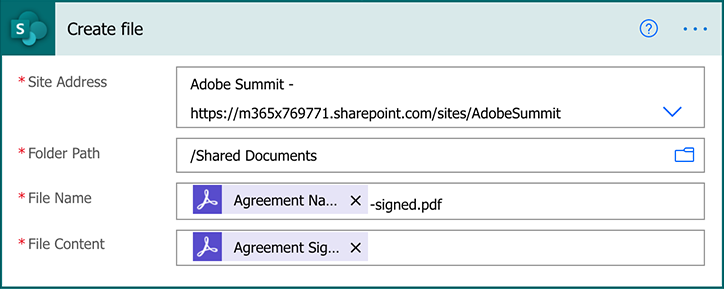
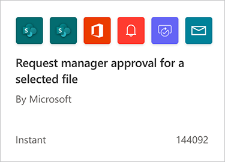
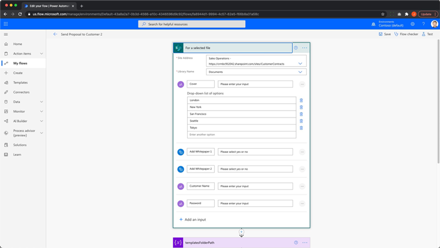
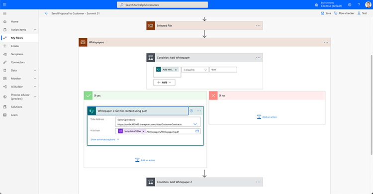
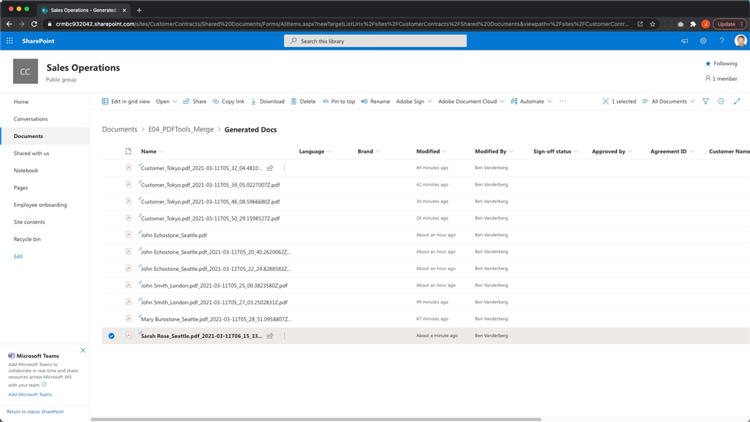
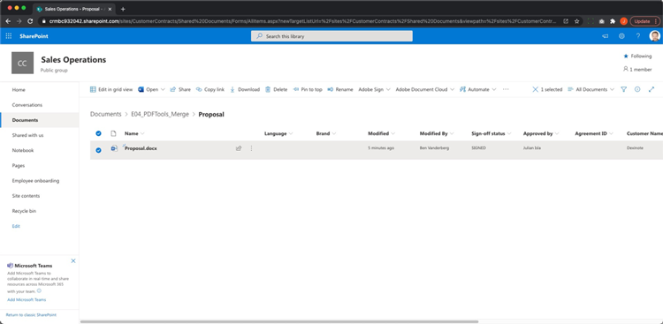

# Automatisierung von Dokumenten mit Acrobat Sign für Microsoft Power Platform.

Erfahren Sie, wie Sie die Connectors für Acrobat Sign und Adobe PDF Tools für Microsoft Power Apps aktivieren und verwenden. Workflows zur Automatisierung von Genehmigungs- und Unterschriftsprozessen lassen sich schnell und sicher implementieren - ganz ohne Code. Dieses praktische Tutorial besteht aus vier Teilen, die unter den folgenden Links beschrieben werden:

<table style="table-layout:fixed">
<tr>
  <td>
    
    

    <a href="documentautomation.md#part1"><strong>Teil 1: Signierte Vereinbarung in SharePoint mit Acrobat Sign speichern</strong></a>
    

  </td>
  <td>
    
    

    <a href="documentautomation.md#part2"><strong>Teil 2: Automatisierter Genehmigungsprozess für E-Signaturen mit Acrobat Sign</strong></a>
    

  </td>
  <td>
   
    

    <a href="documentautomation.md#part3"><strong>Teil 3: Automatisierte OCR für Dokumente mit Adobe PDF Tools</strong></a>
    

  </td>
  <td>
   
    

    <a href="documentautomation.md#part4"><strong>Teil 4: Automatisierte Dokumentzusammenstellung mit Adobe PDF Tools</strong></a>
    

  </td>
</tr>
</table>

## Voraussetzungen

* Vertrautheit mit Microsoft 365 und Power Automate
* Acrobat Sign Knowledge
* Microsoft 365-Konto mit Zugriff auf SharePoint und Power Automate (Basic für Acrobat Sign, Premium für Adobe PDF Tools)
* Entwicklerkonto für Acrobat Sign für Unternehmen oder Acrobat Sign

**Übungen 1 und 2**

* Acrobat Sign-Konto mit Zugriff auf die API. Ein Entwicklerkonto oder ein Unternehmenskonto.
* Auf die SharePoint-Website kann von Power Automate zugegriffen werden, für die Sie Bearbeitungsberechtigungen haben. Vollständiger Administratorzugriff wird empfohlen.
* Beispieldokument für die Signaturgenehmigungsanforderung und -unterschrift.

**Übungen 3 und 4**

Materialien [hier herunterladen](https://github.com/benvanderberg/adobe-sign-pdftools-powerautomate-tutorial)

## Teil 1: Signierte Vereinbarungen in SharePoint mit Acrobat Sign speichern {#part1}

Im ersten Teil verwendest du eine Power Automate Flow-Vorlage, um einen automatisierten Workflow einzurichten, der alle signierten Verträge auf deiner SharePoint-Website speichert.

1. Navigieren Sie zu Power Automate.
1. Suchen Sie nach Acrobat Sign.

   

1. Wählen Sie **Eine abgeschlossene Acrobat Sign-Vereinbarung in der SharePoint-Bibliothek speichern**.

   

1. Überprüfen Sie den Bildschirm und konfigurieren Sie alle erforderlichen Verbindungen. Aktivieren Sie die Acrobat Sign-Verbindung.
1. Klicken Sie auf das blaue `+`-Symbol.

   

1. Geben Sie Ihre E-Mail-Adresse für das Acrobat Sign-Konto ein und klicken Sie im neuen Fenster auf das Kennwortfeld.

   

   Warten Sie einen Moment, bis Adobe Ihr Konto überprüft.

   >[!NOTE]
   >
   >Bei dieser Prüfung werden Sie an den entsprechenden Anmeldenamen weitergeleitet, wenn Sie eine Adobe ID oder unser Unternehmens-SSO verwenden.

1. Vollständige Anmeldung.
1. Klicken Sie auf **Weiter**, um zum Bearbeitungsbildschirm für den Flow zu wechseln.
1. Benennen Sie den Auslöser.

   

1. SharePoint-Einstellungen konfigurieren.

   

   **Site-Adresse:** Ihre SharePoint-Site
   **Ordnerpfad:** Pfad zu den freigegebenen Dokumenten, die Sie verwenden möchten
   **Dateiname:** Akzeptieren Sie den Standardwert.
   **Dateiinhalt:** Akzeptieren Sie den Standard

1. Spare den Fluss.

   

1. Navigieren Sie mit dem blauen Zurück-Pfeil zum Übersichtsbildschirm des Textflusses. Du wirst diesen Flow im zweiten Teil testen.

   

Sie werden diesen Flow im nächsten Teil testen.

## Teil 2: Automatisierter Genehmigungsprozess für elektronische Unterschriften mit Acrobat Sign {#part2}

Im zweiten Teil bauen wir den ersten Teil mit einem robusteren Flow auf und testen beide Flows, um sie in Aktion zu sehen.

1. Wählen Sie auf der linken Seite der Power Automate-Schnittstelle **Vorlagen** aus.

   

1. Suchen Sie nach &quot;Genehmigung durch Manager&quot;.
1. Wählen Sie **Genehmigung des Anforderungs-Managers für eine ausgewählte Datei** aus.

   

   Überprüfen Sie die Verbindungen und fügen Sie fehlende Verbindungen hinzu.

   >[!NOTE]
   >
   >Wenn dies der erste Flow ist, der mit Genehmigungen ausgeführt wird, werden diese vollständig konfiguriert, sobald der Flow ausgeführt wird.

1. Klicken Sie auf **Weiter**, um zum Textflussbearbeitungsbildschirm zu wechseln.

   Dieser Textfluss enthält viele vorkonfigurierte Schritte, einschließlich Fehlerüberprüfung und verschachtelte bedingte Schritte.

1. Konfigurieren Sie **Für eine ausgewählte Datei** wie folgt:
   **Site-Adresse:** Ihre SharePoint-Site
   **Bibliotheksname:** Ihr Dokumentenrepository
1. Fügen Sie wie folgt eine Eingabe hinzu:
   **Typ**: E-Mail
   **Name**: E-Mail des Unterzeichners

   

1. Konfigurieren Sie **Dateieigenschaften abrufen:** wie folgt:
   **Site-Adresse:** Ihre SharePoint-Site
   **Bibliotheksname:** Ihr Dokumentenrepository

1. Scrollen Sie nach unten und suchen Sie nach **Wenn ja**.

   

1. Klicken Sie auf **Aktion hinzufügen** im Feld **Wenn ja** (nicht der unterste), um die Schritte zum Senden zur Signatur hinzuzufügen.

   

1. Suchen Sie nach **SharePoint get file content** und wählen Sie **Get file content**.

   

1. Konfigurieren Sie **Dateiinhalt abrufen** wie folgt:

   

   **Site-Adresse:** Ihre SharePoint-Site.
   **Dateibezeichner:** Suchen Sie nach &quot;Bezeichner&quot; und wählen Sie &quot;Bezeichner&quot; aus dem Schritt **Dateieigenschaften abrufen**.
1. Suchen Sie nach &quot;Adobe&quot; und wählen Sie **Acrobat Sign** aus, um eine weitere Aktion hinzuzufügen.

   

1. Geben Sie &quot;upload&quot; in das Suchfeld für Acrobat Sign ein und wählen Sie **Dokument hochladen und Dokument-ID abrufen**.
1. Suchen Sie nach der dynamischen Variable &quot;**Name**&quot;, um den Namen des im Trigger ausgewählten Elements/Dokuments unter &quot;**Dateiname**&quot; abzurufen.
1. Klicken Sie im Variablenassistenten unter **Dateiinhalt** auf **Ausdruck**.

   

1. Fügen Sie einen einzelnen Apostroph hinzu, klicken Sie dann auf &quot;**Dynamischer Inhalt**&quot; zurück, löschen Sie den Apostroph, wählen Sie &quot;**Dateiinhalt**&quot; aus und klicken Sie dann auf &quot;**OK**&quot;.

   Stellen Sie sicher, dass keine zusätzlichen Apostrophe vorhanden sind und es wie in der folgenden Beispieldatei aussieht.

   

1. Gib im Suchbereich von Acrobat Sign &quot;create&quot; ein, um eine weitere Acrobat Sign-Aktion hinzuzufügen.
1. Wählen Sie **Vereinbarung aus hochgeladenem Dokument erstellen und zum Unterschreiben senden**.

   

1. Konfigurieren Sie die erforderlichen Informationen:
Wählen Sie **Name** aus dem Assistenten für dynamische Variablen in **Vereinbarungsname**.
Wählen Sie **Dokument-ID** aus dem Assistenten für dynamische Variablen in **Dokument-ID**.
Wählen Sie **E-Mail des Unterzeichners** aus dem Assistenten für dynamische Variablen in **E-Mail des Teilnehmers** aus.
Geben Sie in **Teilnehmerreihenfolge** &quot;1&quot; ein.
Wählen Sie im Dropdown-Menü **Teilnehmerrolle** die Option **Unterzeichner** aus.

   

1. **Speichern** Sie den Flow.

### Testen des Flows

Rufe das Dokument-Repository deiner SharePoint-Website auf, um es zu testen.

1. Wählen Sie das Dokument aus, und wählen Sie **Automate** und den **Flow** aus, den Sie gerade erstellt haben.

   

1. Starten Sie den Flow, um die Verbindungen zu validieren (nur beim ersten Flow).
1. Geben Sie eine nette Nachricht an den Genehmiger in **Nachricht** ein.
1. Geben Sie die E-Mail-Adresse für den Unterzeichner des Dokuments in **E-Mail des Unterzeichners** ein.
1. Klicken Sie auf **Textfluss ausführen**.

Der konfigurierte Genehmiger für den Benutzer, der den Flow startet, erhält eine Genehmigungsanforderung. Sie können die Genehmigung per E-Mail oder über das Menü &quot;Power Automate-Aktionselemente&quot; erteilen.
Nach der Genehmigung unterschreiben Sie Ihr Dokument. Abhängig von Ihrem Benutzer und wenn er bei Sign angemeldet ist, müssen Sie die Signaturfenster möglicherweise in einem privaten Browserfenster öffnen.

Schließen Sie die Signatur ab und sehen Sie dann in Ihrem SharePoint-Ordner nach.

## Teil 3: Automatisierte OCR mit Adobe PDF Tools {#part3}

Im dritten Teil lernen Sie, wie Sie OCR in PDF automatisieren, wenn diese in Microsoft SharePoint importiert werden. Damit wird ein Problem behoben, das bei gescannten PDF-Dokumenten auftritt, die in SharePoint nicht durchsucht werden können.

### Einrichten eines Ordners in SharePoint

Wechseln Sie zu Microsoft SharePoint, wo Sie Dokumente speichern möchten.

1. Klicken Sie auf **+ Neu**, um einen neuen Ordner mit dem Namen &quot;Verarbeitete Verträge&quot; zu erstellen.
1. Klicken Sie auf **+ Neu**, um einen neuen Ordner mit dem Namen &quot;Alte Verträge&quot; zu erstellen.

   

Diese Ordner werden jetzt als Teil Ihres Power Automate -Ablaufs referenziert.

### Erstellen von Textflüssen aus Vorlagen

1. Melden Sie sich bei https://flow.microsoft.com an.
1. Klicken Sie auf der Seitenleiste auf **Vorlagen**.

   

1. Wählen Sie **Neu hinzugefügte Dateien in durchsuchbaren PDF in SharePoint umwandeln**.
1. Klicken Sie auf das Symbol **+** neben Adobe PDF Tools.

   

1. Navigieren Sie auf einer neuen Registerkarte zu https://www.adobe.com/go/powerautomate_getstarted_de .
1. Klicken Sie auf **Erste Schritte**.

   

1. Mit der Adobe ID anmelden

   

1. Geben Sie den Namen der Anmeldeinformationen und die Beschreibung der Anmeldeinformationen ein und klicken Sie auf **Anmeldeinformationen erstellen**.

   

   Lassen Sie das Fenster mit den Anmeldeinformationen geöffnet. Sie müssen sie in Microsoft Power Automate eingeben.

   

1. Geben Sie die Anmeldeinformationen ein und klicken Sie auf **In Microsoft Power Automate erstellen**.

   

1. Klicken Sie auf **Fortfahren**.

   

   Jetzt können Sie eine Ansicht des Workflows anzeigen und müssen ihn für Ihre Umgebung konfigurieren.

1. Wählen Sie das Feld &quot;Site-Adresse&quot; und wählen Sie unter dem Trigger &quot;**Wenn eine Datei in einem Ordner erstellt wird&quot; die SharePoint-Site aus, die Sie verwenden.**

   

1. Klicken Sie auf das Ordnersymbol, um zum Ordner Alte Verträge unter Ordner-ID zu navigieren.

   

1. Bearbeiten Sie die Aktion &quot;**Datei erstellen**&quot; am unteren Rand des Flusses:

   Ändern Sie **Site-Adresse** in Ihre Site-Adresse.
Geben Sie den Speicherort des Ordners &quot;Verarbeitete Verträge&quot; im Ordnerpfad an.

1. Klicken Sie in der rechten oberen Ecke auf **Speichern**.
1. Klicken Sie auf **Test**.
1. Wählen Sie **Manuell** aus.
1. Klicken Sie auf **Test**.

   

### Neuen Flow testen

1. Navigieren Sie zum Ordner Alte Verträge in SharePoint.
1. Navigieren Sie in den Übungsdateien, die Sie heruntergeladen haben, zu &quot;E03/Old Contracts&quot;.
1. Kopieren Sie die Dateien ReleaseFormXX.pdf in den Ordner Alte Verträge in SharePoint.

   

Wenn Sie jetzt zum Ordner &quot;Verarbeitete Verträge&quot; navigieren, werden Ihre PDF angezeigt, nachdem der Flow einige Sekunden lang ausgeführt wurde. Wenn Sie die PDF öffnen, können Sie sehen, dass der Text ausgewählt werden kann.
Darüber hinaus indiziert SharePoint das Dokument, sodass Sie den Inhalt Ihrer Dokumente über die Suchleiste in SharePoint durchsuchen können.

## Teil 4: Automatisierte Zusammenstellung von Dokumenten mit Adobe PDF Tools. {#part4}

Im vierten Teil dieses Tutorials lernen Sie, wie Sie anhand der Informationen, die Sie bei der Auswahl eines Textflusses aus Microsoft SharePoint und beim Starten dieses Textflusses angegeben haben, eine Vielzahl von Dokumenten zusammenführen. In diesem Szenario hat der Textfluss folgende Auswirkungen:

* Fragen Sie nach Informationen, um auszuwählen, was in einem Paket für einen Kunden enthalten sein soll.
* Auf der Grundlage der bereitgestellten Informationen werden zahlreiche Dokumente zusammengeführt. Diese Dokumente enthalten ein Deckblatt und optionale Whitepaper.
* Das zusammengeführte Dokument wird in SharePoint gespeichert.

### Übungsdateien in SharePoint importieren

1. Öffnen Sie den Ordner E04 in den Übungsdateien.
1. Importieren Sie die Ordner &quot;Angebot&quot;, &quot;Vorlagen&quot; und &quot;Generierte Dokumente&quot; in SharePoint.

   

Diese Ordner werden als Referenz verwendet. Insbesondere verwenden Sie die Datei proposal.docx für Ihr Angebot.

Im Ordner &quot;Vorlagen&quot; befindet sich der Ordner &quot;Covers&quot;, der Titelseiten-Designs für verschiedene Städte enthält. Es gibt auch einen Whitepaper-Ordner, der optionale zusätzliche Whitepaper enthält, die bei Auswahl an das Ende angehängt werden.

### Textfluss in Microsoft Power Automate importieren

1. Melden Sie sich bei Microsoft Power Automate an (https://flow.microsoft.com).
1. Klicken Sie auf **Meine Flows**.

   

1. Klicken Sie auf **Importieren**.

   

1. Klicken Sie auf **Hochladen** und wählen Sie den Ordner Generateproposal_20210311231623.zip in E04/Flows/.

   

1. Klicken Sie auf **Importieren**.

1. Klicken Sie auf das Schraubenschlüsselsymbol unter &quot;Aktion&quot; neben **Angebot an Kunden senden**.

   

1. Wählen Sie unter &quot;Setup&quot; &quot;**Als neu erstellen&quot;** aus.
1. Legen Sie den Namen des Textflusses unter &quot;Ressourcenname&quot; fest.
1. Klicke auf **Speichern**.

   Wiederholen Sie diesen Vorgang für die anderen Ressourcen des Typs &quot;Verwandte Themen&quot;, und wählen Sie die Verbindung aus.

   

1. Klicken Sie auf **Importieren**, nachdem Sie alle Verbindungen hergestellt haben.

### Festlegen für eine ausgewählte Datei

Nachdem der Textfluss erstellt wurde, gehen Sie wie folgt vor:

1. Klicken Sie auf **Bearbeiten**.

   

1. Wählen Sie den Trigger **Für eine ausgewählte Datei**.

   Fügen Sie Ihre SharePoint-Site der Site-Adresse hinzu.
Fügen Sie Ihre Bibliothek der Bibliothek hinzu.

   

### templateFolderPath festlegen

1. Klicken Sie auf die Variable &quot;templateFolderPath&quot;.
1. Legen Sie den Pfad fest, zu dem sich der Vorlagenordner innerhalb der von Ihnen importierten SharePoint-Site befindet.

### Cover festlegen Dateiinhalt abrufen

1. Klicken Sie auf die Aktion **Cover**, durch die der Bereich erweitert wird.
1. **Abdeckung erweitern: Dateiinhalt abrufen**.

   Legen Sie die Site-Adresse auf Ihre SharePoint-Site fest.

   

### Ausgewählte Datei festlegen

1. Erweitern Sie die Bereichsaktion **Ausgewählte Datei**.

   Ändern Sie die Site-Adresse und den Bibliotheksnamen in Ihre SharePoint-Site bzw. -Library unter **Dateieigenschaften abrufen**.
Ändern Sie die Site-Adresse in Ihre SharePoint-Site unter **Dateiinhalt abrufen**.

   

### Festlegen von Whitepapern

1. Klicken Sie auf die Aktion **Whitepaper**.
1. **Bedingung erweitern: Whitepaper hinzufügen**.

   

1. Erweitern Sie **Whitepaper 1: Abrufen von Dateiinhalten mithilfe des Pfads**.
Bearbeiten Sie die Site-Adresse für die angegebene SharePoint-Site.

Wiederholen Sie dieselben Schritte für **Bedingung: Whitepaper hinzufügen 2**.

### Erstellungsdatei festlegen

1. Erweitern Sie **Datei erstellen**.

   Bearbeiten Sie die Site-Adresse und den Ordnerpfad zur SharePoint-Site und zum Pfad, in dem sich der Ordner &quot;Generated Docs&quot; befindet.

1. Klicke auf **Speichern**.

### Testen des Interaktionsflusses

1. Navigieren Sie in SharePoint zum Angebotsordner.
1. Wählen Sie den Ordner Angebot.docx .

   

1. Wählen Sie Ihren Flow im Menü **Automatisieren** aus.

   

1. Klicken Sie auf **Weiter**, um den Textfluss zu starten.

   

1. Wählen Sie Ihr Cover und die Whitepaper, die Sie anhängen möchten.
1. Klicken Sie auf **Textfluss ausführen**.

   

Navigieren Sie zum Ordner &quot;Dokumente generieren&quot;. Sie sollten jetzt Ihre generierte PDF-Datei sehen.

### Hinzufügen von Protect und anderen Aktionen zum Flow

Nachdem Sie einen Textfluss erstellt haben, bearbeiten Sie den Textfluss, um das PDF-Dokument mit einem Kennwort zu verschlüsseln. In diesem Video wird auch erläutert, wie Sie andere Aktionen verwenden können.

1. Navigieren Sie zurück zum Ende des Textflusses.
1. Klicken Sie auf das Symbol **+** zwischen **PDF zusammenführen** und **Datei erstellen**.

   

1. Wählen Sie **Aktion hinzufügen**.
1. Suchen Sie nach &quot;Adobe PDF Tools&quot;.

   

1. Wählen Sie **Protect PDF aus der Anzeige aus**.
1. Verwenden Sie &quot;Dynamischer Inhalt&quot;, um das Feld &quot;Dateiname&quot; auf &quot;**&quot; festzulegen. PDF-Dateiname aus Merge-PDF**.

   

   Im Trigger befindet sich das Feld Kennwort, das Teil des Initiierungsformulars ist. Wir können das hier verwenden.

1. Suchen Sie mithilfe von Dynamic Content nach **Kennwortfeld** und platzieren Sie es im Kennwortfeld.

   

1. Verwenden Sie dynamischen Inhalt, um ihn auf **PDF Dateiinhalt aus Merge-PDF** im Feld Dateiinhalt festzulegen.
1. Ändern Sie die **Erstellungsdatei**, um den Dateiinhalt von der Protect-PDF zu erhalten, anstatt PDF zusammenzuführen.
1. Erweitern Sie **Datei erstellen**.
1. Löschen Sie das Feld Dateiinhalt.
1. Verwenden Sie &quot;Dynamischer Inhalt&quot;, um **PDF-Dateiinhalt** aus **Protect-PDF aus der Ansicht zu platzieren**.

### Testen des Interaktionsflusses

1. Navigieren Sie in SharePoint zum Angebotsordner.
1. Wählen Sie Angebot.docx.

   

1. Wählen Sie **Automatisieren** aus, um Ihren Flow auszuwählen.

   

1. Klicken Sie auf **Weiter**, um den Textfluss zu starten.

   

1. Wählen Sie das Cover und die Whitepaper aus, die Sie anhängen möchten.
1. Legen Sie im Feld Kennwort das Kennwort fest, das Sie festlegen möchten.
1. Klicken Sie auf **Textfluss ausführen**.

   

1. Navigieren Sie zum Ordner &quot;Dokumente generieren&quot;.
Sie sollten Ihre generierte PDF-Datei sehen. Öffnen Sie die PDF-Datei und Sie werden aufgefordert, Ihr PDF-Kennwort einzugeben.

   
