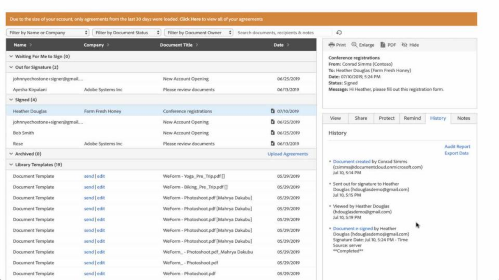
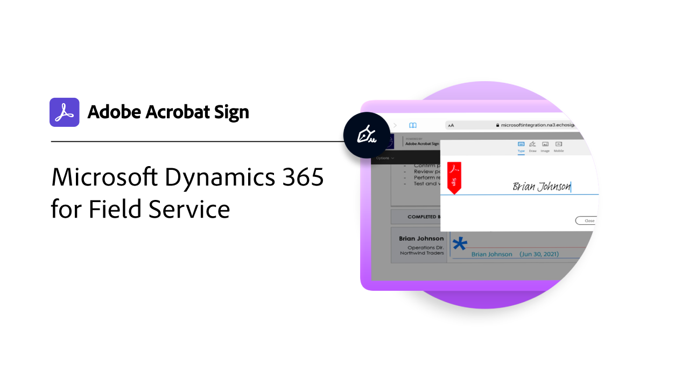

# Integrationen - Übersicht

Sie können Acrobat Sign in anderen Anwendungen verwenden, die Ihre Organisation bereits verwendet, z. B. Microsoft, Salesforce, Workday und Marketo, um nur einige zu nennen. In diesen Anleitungen und Tutorials zur Integration erfahrt ihr, wie ihr eure Workflows für elektronische Unterschriften vereinfachen könnt.

>[!NOTE]
> Wenn Sie auf keine dieser Funktionen zugreifen können, wenden Sie sich an den Administrator Ihrer Organisation, um sicherzustellen, dass die Integration aktiviert ist.

## Neue Funktionen

>[!BEGINTABS]

>[!TAB Große Dateien einrichten und Zuordnungen übertragen]

Erfahren Sie, wie Sie [große Dokumente einrichten und Vereinbarungsdienste](salesforce-large-files.md) in Salesforce übertragen.

>[!TAB Automatische Updates einrichten]

Erfahren Sie, wie Sie Ihr Konto ganz einfach mit Salesforce verknüpfen können, um [automatische Updates](salesforce-automatic-updates.md) zu erhalten.

>[!TAB Integration der Registerkarte &quot; Dokumente&quot; für Microsoft Teams]

Erfahren Sie, wie Sie Dokumente direkt von der Registerkarte [Dokumente](acrobat-sign-teams-documents-tab.md) in [!DNL Microsoft Teams] zur Signatur senden.

>[!ENDTABS]

## Tutorials zur Integration mit Microsoft

<table style="table-layout:fixed">
<tr>
  <td>
    
    

    <a href="fill-and-sign-doc-microsoft-outlook.md"><strong>Ausfüllen und Signieren in Microsoft Outlook</strong></a>
    

    <em>Ein Formular direkt in Microsoft Outlook ausfüllen und unterschreiben</em>
    2 
  </td>
  <td>
    
    

    <a href="send-for-signature-with-outlook.md"><strong>Zum Unterschreiben senden in Outlook</strong></a>
    

    <em>Ein Dokument direkt in Microsoft Outlook zum Unterschreiben senden</em>
    2 
  </td>
  <td>
    
    

    <a href="send-for-signature-with-sharepoint-online.md"><strong>Zum Unterschreiben senden in SharePoint Online</strong></a>
    

    <em>Ein Dokument direkt in SharePoint Online zur Signatur senden</em>
    2 
  </td>
   <td>
    
    

    <a href="track-an-agreement-with-sharepoint-online.md"><strong>Nachverfolgen in SharePoint Online</strong></a>
    

    <em>Den Fortschritt einer Vereinbarung direkt in Microsoft SharePoint verfolgen</em>
    2 
  </td>
</tr>
<tr>
  <td>
    
    

    <a href="integrate-web-form-sharepoint-online.md"><strong>Webformular mit [!DNL SharePoint Online]</strong></a> integrieren
    

    <em>Erfahren Sie, wie Sie aus einem Webformular gesammelte Daten einer [!DNL SharePoint]-Liste zuordnen</em>
    3 
  </td>
  <td>
    
    

    <a href="auto-archive-sharepoint-power-automate.md"><strong>Dateien in [!DNL SharePoint] automatisch mit [!DNL Power Automate]</strong></a> archivieren
    

    <em>Erfahren Sie, wie signierte Dokumente mit [!DNL Power Automate]</em> automatisch in einer [!DNL SharePoint]-Bibliothek archiviert werden.
    3 
  </td>
  <td>
    
    

    <a href="documentautomation.md"><strong>Dokumentautomatisierung mit [!DNL Acrobat Sign for Microsoft Power Platform]</strong></a>
    

    <em>Erfahren Sie, wie Sie die Connectors [!DNL Acrobat Sign] und [!DNL Adobe PDF Tools] für [!DNL Microsoft Power] Anwendungen aktivieren und verwenden</em>
    5 
  </td>
   <td>
    
    

    <a href="adobe-sign-teams-mortgage.md"><strong>Zum Unterschreiben senden in [!DNL Microsoft Teams]</strong></a>
    

    <em>Dokumente direkt in [!DNL Microsoft Teams]</em> zum Unterschreiben senden
    2 
  </td>
</tr>
<tr>
  <td>
    
    

    <a href="live-sign-microsoft-teams.md"><strong>Live Sign in Adobe Acrobat Sign für [!DNL Microsoft Teams]</strong></a>
    

    <em>Erfahren Sie, wie Sie ein Online-Signaturerlebnis erstellen, das dem persönlichen Signieren während eines [!DNL Microsoft Teams]-Meetings ähnelt</em>
    3 
  </td>
   <td>
    
    

    <a href="acrobat-sign-teams-documents-tab.md"><strong>Integration der Registerkarte "Dokumente" für [!DNL Microsoft Teams]</strong></a>
    

    <em>Erfahren Sie, wie Sie Dokumente direkt über die Registerkarte "Dokumente" in [!DNL Microsoft Teams]</em> zur Signatur senden.
    2 
  </td>
 <td>
    
    

    <a href="simple-workflow-power-automate.md"><strong>Erstellen eines einfachen Workflows mit [!DNL Power Automate]</strong></a>
    

    <em>Erfahren Sie, wie Sie mithilfe von [!DNL Power Automate] Connectors einen einfachen Workflow erstellen</em>
    3 
  </td>
  <td>
    
    

    <a href="advanced-workflow-power-automate.md"><strong>Erstellen eines erweiterten Workflows mit Power Automate</strong></a>
    

    <em>Erfahren Sie, wie Sie mithilfe von [!DNL Power Automate] Connectors einen erweiterten Workflow erstellen</em>
    3 
  </td>
<tr>
  <td>
    
    

    <a href="dynamics-customer-service.md"><strong>Microsoft Dynamics 365 for Customer Service</strong></a>
    

    <em>Erfahren Sie, wie Acrobat Sign und [!DNL Microsoft Dynamics 365] für den Kundendienst verwendet werden, um die Kundenzufriedenheit in einem Self-Service-Kundenwebportal zu verbessern</em>
    3 
  </td>
  <td>
    
    

    <a href="dynamics-field-service.md"><strong>Microsoft Dynamics 365 for Field Service</strong></a>
    

    <em>Erfahren Sie, wie Acrobat Sign, [!DNL Power Automate] und [!DNL Microsoft Dynamics 365] für den Außendienst verwendet werden, um Kundeninteraktionen vor Ort zu optimieren</em>
    4 
  </td>
  <td>
    
    

    <a href="dynamics-sales.md"><strong>Microsoft Dynamics 365 for Sales</strong></a>
    

    <em>Erfahren Sie, wie Acrobat Sign und [!DNL Microsoft Dynamics 365] für den Vertrieb verwendet werden, um den Signiervorgang für Verkaufsangebote zu automatisieren</em>
    3 
  </td>
  <td>
    
    

     
  </td>
</tr>
</table>

## [!DNL Notarize] Integrations-Tutorials

<table style="table-layout:fixed">
<tr>
  <td>
    
    

    <a href="send-document-notarize.md"><strong>Dokumente zur Beglaubigung senden</strong></a>
    

    <em>Erfahren Sie, wie Sie ein Dokument zur Beglaubigung senden</em>
    2 
  </td>
  <td>
    
    

     
  </td>
  <td>
    
    

     
  </td>
  <td>
    
    

     
  </td>
</tr>
</table>

## Tutorials zu Salesforce-Integrationen

<table style="table-layout:fixed">
<tr>
  <td>
    
    

    <a href="create-an-agreement-template.md"><strong>Document Builder für [!DNL Salesforce]</strong></a>
    

    <em>Erfahren Sie, wie Sie mit Document Builder für [!DNL Salesforce]</em> eine wiederverwendbare Dokumentvorlage erstellen.
    2 
  </td>
  <td>
    
    

    <a href="set-up-data-mapping.md"><strong>Einrichten der Datenzuordnung</strong></a>
    

    <em>Daten zurück in Salesforce abrufen, nachdem eine Vereinbarung signiert wurde</em>
    2 
  </td>
  <td>
    
    

    <a href="set-up-merging-map.md"><strong>Einrichten der Zusammenführungszuordnung in Salesforce</strong></a>
    

    <em>Erfahren Sie, wie Sie Daten aus Salesforce direkt in einem Acrobat Sign-Dokument zusammenführen</em>
    2 
  </td>
  <td>
    
    

    <a href="create-a-custom-button.md"><strong>Erstellen einer benutzerdefinierten Schaltfläche</strong></a>
    

    <em>Erstellen Sie eine benutzerdefinierte Schaltfläche, die den Sendevorgang startet und eine Vereinbarung automatisch in Salesforce ausfüllt</em>
    2 
  </td>
</tr>
<tr>
  <td>
    
    

    <a href="salesforce-automatic-updates.md"><strong>Automatische Updates einrichten</strong></a>
    

    <em>Erfahren Sie, wie Sie Ihr Konto ganz einfach mit Salesforce verknüpfen können, um automatische Updates zu erhalten</em>
    2 
  </td>
 <td>
    
    

    <a href="salesforce-large-files.md"><strong>Große Dateien einrichten und Zuordnungen übertragen</strong></a>
    

    <em>Erfahren Sie, wie Sie große Dokumente einrichten und Vereinbarungsdienste in Salesforce übertragen</em>
    2 
  </td>
  <td>
      
      

       
  </td>
  <td>
      
      

       
  </td>
</tr>
</table>

## Tutorials zur Integration mit Workday

<table style="table-layout:fixed">
<tr>
 <td>
    
    

    <a href="acrobat-sign-workday-onboarding.md"><strong>Acrobat Sign + Workday - Onboarding neuer Mitarbeiter</strong></a>
    

    <em>Erfahren Sie, wie Sie Onboarding-Workflows mit Acrobat Sign + Workday optimieren</em>
    2 
  </td>
 <td>
    
    

     
  </td>
  <td>
    
    

     
  </td>
  <td>
    
    

     
  </td>
</tr>
</table>

## Tutorials zur Marketo-Integration und Konfigurationsleitfäden

<table style="table-layout:fixed">
<tr>
  <td>
    
    

    <a href="marketo-salesforce-sms.md"><strong>Benachrichtigungen mit Acrobat Sign für Salesforce und Marketo senden</strong></a>
    

    <em>Erfahren Sie, wie Sie eine Textnachricht, eine E-Mail oder eine Push-Benachrichtigung senden, damit der Unterzeichner weiß, dass eine Vereinbarung in Bearbeitung ist</em>
    2 
  </td>
  <td>
    
    

    <a href="marketo-salesforce-reminder.md"><strong>Senden von Erinnerungen mithilfe des Videotutorials Adobe Sign für Salesforce und Marketo</strong></a>
    

    <em>Erfahren Sie, wie Sie eine E-Mail-Erinnerung von Marketo senden, wenn eine Vereinbarung nach einem bestimmten Zeitraum nicht signiert wird</em>
    2 
  </td>
  <td>
    
    

    <a href="marketo-salesforce-reminder.md"><strong>Erinnerungen mithilfe des Konfigurationsleitfadens für Acrobat Sign für Salesforce und Marketo senden</strong></a>
    

    <em>Lesen Sie, wie Sie eine E-Mail-Erinnerung von Marketo senden, wenn eine Vereinbarung nach einem bestimmten Zeitraum nicht signiert wird</em>
    2 
  </td>
   <td>
    
    

    <a href="marketo-dynamics-reminder.md"><strong>Erinnerungen mit Acrobat Sign für Microsoft Dynamics und Marketo senden</strong></a>
    

    <em>Erfahren Sie, wie Sie eine E-Mail-Erinnerung senden, wenn eine Vereinbarung nach einem bestimmten Zeitraum nicht signiert wird</em>
    2 
  </td>
</tr>
<tr>
  <td>
    
    

    <a href="marketo-dynamics-sms.md"><strong>Benachrichtigungen mit Acrobat Sign für Microsoft Dynamics und Marketo senden</strong></a>
    

    <em>Erfahren Sie, wie Sie eine Textnachricht, eine E-Mail oder eine Push-Benachrichtigung senden, damit der Unterzeichner weiß, dass eine Vereinbarung in Bearbeitung ist</em>
    2 
  </td>
  <td>
    
    

     
  </td>
  <td>
    
    

     
  </td>
  <td>
    
    

     
  </td>
</tr>
</table>
