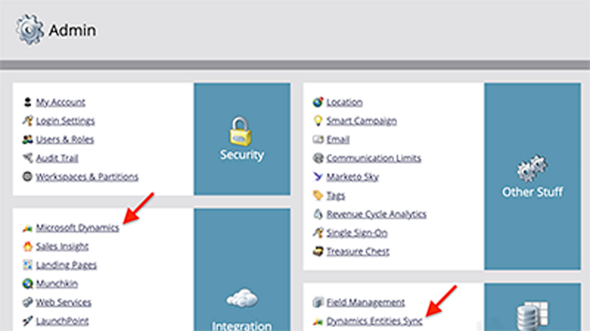

# Integrationen - Übersicht

Sie können Adobe Sign in anderen Anwendungen verwenden, die Ihre Organisation bereits verwendet, z. B. Microsoft, Salesforce, Workday und Marketo, um nur einige zu nennen. In diesen Anleitungen und Tutorials zur Integration erfahrt ihr, wie ihr eure Workflows für elektronische Unterschriften vereinfachen könnt.

>[!NOTE]
> Wenn Sie auf keine dieser Funktionen zugreifen können, wenden Sie sich an den Administrator Ihrer Organisation, um sicherzustellen, dass die Integration aktiviert ist.

## Tutorials zur Integration mit Microsoft

<table style="table-layout:fixed">
<tr>
  <td>
    
    

    <a href="fill-and-sign-doc-microsoft-outlook.md"><strong>Ausfüllen und Signieren in Microsoft Outlook</strong></a>
    

    <em>Ein Formular direkt in Microsoft Outlook ausfüllen und unterschreiben</em>
     
  </td>
  <td>
    
    

    <a href="send-for-signature-with-outlook.md"><strong>In Outlook zum Unterschreiben senden</strong></a>
    

    <em>Dokumente direkt aus Microsoft Outlook heraus zum Unterschreiben versenden</em>
     
  </td>
  <td>
    
    

    <a href="send-for-signature-with-sharepoint-online.md"><strong>In SharePoint Online zum Unterschreiben senden</strong></a>
    

    <em>Ein Dokument direkt in SharePoint Online zum Unterschreiben senden</em>
     
  </td>
</tr>
<tr>
  <td>
    
    

    <a href="track-an-agreement-with-sharepoint-online.md"><strong>Tracking in SharePoint Online</strong></a>
    

    <em>Vereinbarungsfortschritt direkt in Microsoft SharePoint verfolgen</em>
     
  </td>
  <td>
    
    

    <a href="adobe-sign-teams-mortgage.md"><strong>Senden von Dokumenten zum Unterschreiben in [!DNL Microsoft Teams]</strong></a>
    

    <em>Dokumente direkt aus [!DNL Microsoft Teams]</em>
     
  </td>
  <td>
    
    

    <a href="documentautomation.md"><strong>Automatisierung von Dokumenten mit Adobe Sign für Microsoft Power Platform.</strong></a>
    

    <em>Erfahren Sie, wie Sie die Connectors für Adobe Sign und Adobe PDF Tools für Microsoft Power Apps aktivieren und verwenden.</em>
     
  </td>
</tr>
</table>

## Tutorials zu Salesforce-Integrationen

<table style="table-layout:fixed">
<tr>
  <td>
    
    

    <a href="create-an-agreement-template.md"><strong>Erstellen einer Dokumentvorlage in Adobe Sign für Salesforce</strong></a>
    

    <em>Wiederverwendbare Dokumentvorlage erstellen, um Geschwindigkeit und Konsistenz sicherzustellen</em>
     
  </td>
  <td>
    
    

    <a href="set-up-data-mapping.md"><strong>Einrichten von Datenzuordnungen</strong></a>
    

    <em>Abrufen von Daten in Salesforce nach Unterzeichnung einer Vereinbarung</em>
     
  </td>
  <td>
    
    

    <a href="set-up-merging-map.md"><strong>Einrichten von Zusammenführungszuordnungen</strong></a>
    

    <em>Führen Sie Salesforce-Daten direkt in einer Vereinbarung zusammen</em>
     
  </td>
</tr>
<tr>
  <td>
    
    

    <a href="create-a-custom-button.md"><strong>Erstellen einer benutzerdefinierten Schaltfläche</strong></a>
    

    <em>Erstellen Sie eine benutzerdefinierte Schaltfläche, die den Sendevorgang startet und eine Vereinbarung in Salesforce automatisch ausfüllt.</em>
     
  </td>
  <td>
    
    

     
  </td>
  <td>
    
    

     
  </td>
</tr>
</table>

## Tutorials zur Integration mit Workday

<table style="table-layout:fixed">
<tr>
  <td>
    
    

    <a href="workday.md"><strong>Konfigurieren von Adobe Sign mit Workday</strong></a>
    

    <em>Hier erfahren Sie, wie Sie Adobe Sign so konfigurieren, dass es direkt in Workday funktioniert, um all Ihre Personalunterlagen nahtlos zu verwalten.</em>
     
  </td>
  <td>
    
    

     
  </td>
  <td>
    
    

     
  </td>
</tr>
</table>

## Tutorials zur Marketo-Integration und Konfigurationsleitfäden

<table style="table-layout:fixed">
<tr>
  <td>
    
    

    <a href="marketo-salesforce-sms.md"><strong>Senden von Benachrichtigungen mit Adobe Sign für Salesforce und Marketo</strong></a>
    

    <em>Erfahren Sie, wie Sie eine Textnachricht, eine E-Mail oder eine Push-Benachrichtigung senden, damit der Unterzeichner weiß, dass eine Vereinbarung in Bearbeitung ist.</em>
     
  </td>
  <td>
    
    

    <a href="marketo-salesforce-reminder.md"><strong>Erinnerungen mithilfe des Videotutorials Adobe Sign für Salesforce und Marketo senden</strong></a>
    

    <em>Hier erfahren Sie, wie Sie eine E-Mail-Erinnerung von Marketo senden, wenn ein Vertrag nach einer bestimmten Zeit nicht signiert wurde.</em>
     
  </td>
  <td>
    
    

    <a href="marketo-salesforce-reminder.md"><strong>Erinnerungen mithilfe des Konfigurationsleitfadens für Adobe Sign für Salesforce und Marketo senden</strong></a>
    

    <em>Erfahren Sie, wie Sie eine E-Mail-Erinnerung von Marketo senden, wenn ein Vertrag nach einem bestimmten Zeitraum nicht signiert wird.</em>
     
  </td>
</tr>
<tr>
  <td>
    
    

    <a href="marketo-dynamics-reminder.md"><strong>Mit Adobe Sign für Microsoft Dynamics und Marketo Erinnerungen versenden</strong></a>
    

    <em>Hier erfahren Sie, wie Sie eine E-Mail-Erinnerung senden, wenn eine Vereinbarung nach einer bestimmten Zeit nicht signiert wird.</em>
     
  </td>
  <td>
    
    

    <a href="marketo-dynamics-sms.md"><strong>Senden von Benachrichtigungen mit Adobe Sign für Microsoft Dynamics und Marketo</strong></a>
    

    <em>Erfahren Sie, wie Sie eine Textnachricht, eine E-Mail oder eine Push-Benachrichtigung senden, damit der Unterzeichner weiß, dass eine Vereinbarung in Bearbeitung ist.</em>
     
  </td>
  <td>
    
    

     
  </td>
</tr>
</table>
