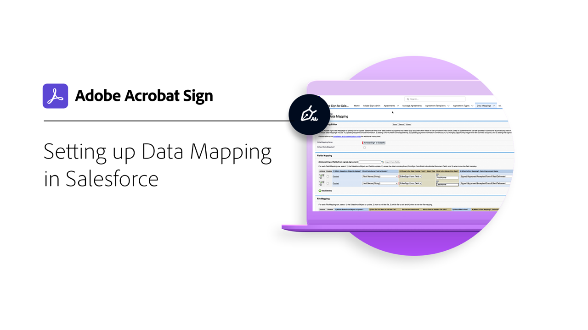
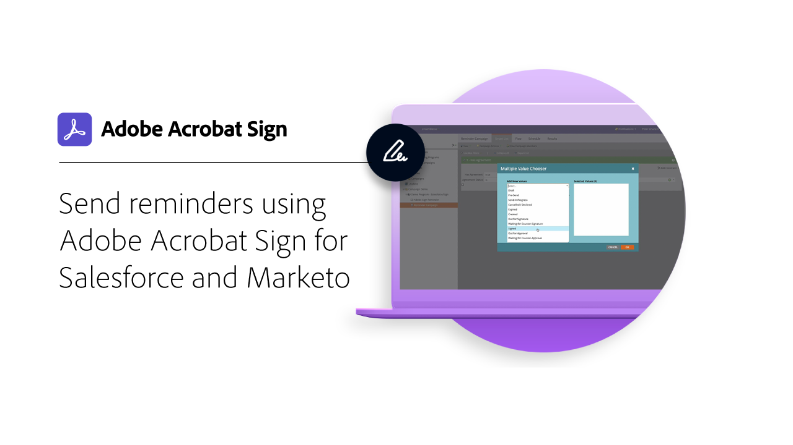

# Integrationen - Übersicht

Sie können Acrobat Sign in anderen Anwendungen verwenden, die Ihre Organisation bereits verwendet, z. B. Microsoft, Salesforce, Workday und Marketo, um nur einige zu nennen. In diesen Anleitungen und Tutorials zur Integration erfahrt ihr, wie ihr eure Workflows für elektronische Unterschriften vereinfachen könnt.

>[!NOTE]
> Wenn Sie auf keine dieser Funktionen zugreifen können, wenden Sie sich an den Administrator Ihrer Organisation, um sicherzustellen, dass die Integration aktiviert ist.

## Neue Funktionen

* [Erstelle einen einfachen Workflow mit [!DNL Power Automate]](simple-workflow-power-automate.md)
Erfahren Sie, wie Sie einen einfachen Workflow mit [!DNL Power Automate] Verbinder
* [Microsoft Dynamics 365 for Sales.](dynamics-sales.md)
Erfahren Sie, wie Acrobat Sign und [!DNL Microsoft Dynamics 365] für den Vertrieb werden verwendet, um den Signiervorgang für Verkaufsangebote zu automatisieren.
* [Microsoft Dynamics 365 for Field Service.](dynamics-field-service.md)
Weitere Informationen zu Acrobat Sign, [!DNL Power Automate]und [!DNL Microsoft Dynamics 365] für Field Service werden zur Optimierung der Vor-Ort-Interaktionen von Kunden verwendet.

## Tutorials zur Integration mit Microsoft

<table style="table-layout:fixed">
<tr>
  <td>
    
    

    <a href="fill-and-sign-doc-microsoft-outlook.md"><strong>Ausfüllen und Signieren in Microsoft Outlook</strong></a>
    

    <em>Ein Formular direkt in Microsoft Outlook ausfüllen und unterschreiben</em>
     
  </td>
  <td>
    
    

    <a href="send-for-signature-with-outlook.md"><strong>In Outlook zum Unterschreiben senden</strong></a>
    

    <em>Dokumente direkt aus Microsoft Outlook heraus zum Unterschreiben versenden</em>
     
  </td>
  <td>
    
    

    <a href="send-for-signature-with-sharepoint-online.md"><strong>In SharePoint Online zum Unterschreiben senden</strong></a>
    

    <em>Ein Dokument direkt in SharePoint Online zum Unterschreiben senden</em>
     
  </td>
   <td>
    
    

    <a href="track-an-agreement-with-sharepoint-online.md"><strong>Tracking in SharePoint Online</strong></a>
    

    <em>Vereinbarungsfortschritt direkt in Microsoft SharePoint verfolgen</em>
     
  </td>
</tr>
<tr>
  <td>
    
    

    <a href="integrate-web-form-sharepoint-online.md"><strong>Webformular integrieren mit [!DNL SharePoint Online]</strong></a>
    

    <em>Erfahren Sie, wie Sie die von einem Webformular erfassten Daten einem [!DNL SharePoint] auflisten</em>
     
  </td>
  <td>
    
    

    <a href="auto-archive-sharepoint-power-automate.md"><strong>Dateien automatisch archivieren in [!DNL SharePoint] mit [!DNL Power Automate]</strong></a>
    

    <em>Hier erfahren Sie, wie Sie unterzeichnete Dokumente automatisch in einer [!DNL SharePoint] Bibliothek mit [!DNL Power Automate]</em>
     
  </td>
  <td>
    
    

    <a href="documentautomation.md"><strong>Dokumentautomatisierung mit [!DNL Acrobat Sign for Microsoft Power Platform]</strong></a>
    

    <em>Erfahren Sie, wie Sie die [!DNL Acrobat Sign] und [!DNL Adobe PDF Tools] Anschlüsse für [!DNL Microsoft Power] Apps</em>
     
  </td>
   <td>
    
    

    <a href="adobe-sign-teams-mortgage.md"><strong>Zum Unterschreiben senden in [!DNL Microsoft Teams]</strong></a>
    

    <em>Dokumente direkt aus [!DNL Microsoft Teams]</em>
     
  </td>
</tr>
<tr>
  <td>
    
    

    <a href="simple-workflow-power-automate.md"><strong>Mit Power Automate einen einfachen Workflow erstellen.</strong></a>
    

    <em>Erfahren Sie, wie Sie einen einfachen Workflow mit [!DNL Power Automate] Verbinder</em>
     
  </td>
  <td>
    
    

    <a href="dynamics-customer-service.md"><strong>Microsoft Dynamics 365 for Customer Service</strong></a>
    

    <em>Erfahren Sie, wie Acrobat Sign und [!DNL Microsoft Dynamics 365] für den Kundendienst werden verwendet, um die Kundenzufriedenheit auf einem Self-Service-Kundenwebportal zu verbessern</em>
     
  </td>
  <td>
    
    

    <a href="dynamics-field-service.md"><strong>Microsoft Dynamics 365 for Field Service.</strong></a>
    

    <em>Weitere Informationen zu Acrobat Sign, [!DNL Power Automate]und [!DNL Microsoft Dynamics 365] für Field Service werden zur Optimierung der Vor-Ort-Interaktionen von Kunden verwendet.</em>
     
  </td>
  <td>
    
    

    <a href="dynamics-sales.md"><strong>Microsoft Dynamics 365 for Sales.</strong></a>
    

    <em>Erfahren Sie, wie Acrobat Sign und [!DNL Microsoft Dynamics 365] für den Vertrieb werden verwendet, um den Signiervorgang für Verkaufsangebote zu automatisieren.</em>
     
  </td>
</tr>
</table>

## [!DNL Notarize] Integrations-Tutorials

<table style="table-layout:fixed">
<tr>
  <td>
    
    

    <a href="send-document-notarize.md"><strong>Dokumente zur Beglaubigung senden</strong></a>
    

    <em>Erfahren Sie, wie Sie ein Dokument zur Beglaubigung senden</em>
     
  </td>
  <td>
    
    

     
  </td>
  <td>
    
    

     
  </td>
  <td>
    
    

     
  </td>
</tr>
</table>

## Tutorials zu Salesforce-Integrationen

<table style="table-layout:fixed">
<tr>
  <td>
    
    

    <a href="create-an-agreement-template.md"><strong>Document Builder für [!DNL Salesforce]</strong></a>
    

    <em>Erfahren Sie, wie Sie eine wiederverwendbare Dokumentvorlage mit Document Builder für [!DNL Salesforce]</em>
     
  </td>
  <td>
    
    

    <a href="set-up-data-mapping.md"><strong>Einrichten von Datenzuordnungen</strong></a>
    

    <em>Abrufen von Daten in Salesforce nach Unterzeichnung einer Vereinbarung</em>
     
  </td>
  <td>
    
    

    <a href="set-up-merging-map.md"><strong>Einrichten der Zusammenführungszuordnung in Salesforce</strong></a>
    

    <em>Erfahren Sie, wie Sie Salesforce-Daten direkt in einem Acrobat Sign-Dokument zusammenführen.</em>
     
  </td>
  <td>
    
    

    <a href="create-a-custom-button.md"><strong>Erstellen einer benutzerdefinierten Schaltfläche</strong></a>
    

    <em>Erstellen Sie eine benutzerdefinierte Schaltfläche, die den Sendevorgang startet und eine Vereinbarung in Salesforce automatisch ausfüllt.</em>
     
  </td>
</tr>
</table>

## Tutorials zur Integration mit Workday

<table style="table-layout:fixed">
<tr>
 <td>
    
    

    <a href="acrobat-sign-workday-onboarding.md"><strong>Acrobat Sign + Workday Eingliederung neuer Mitarbeiter</strong></a>
    

    <em>Onboarding-Workflows mit Acrobat Sign und Workday optimieren</em>
     
  </td>
 <td>
    
    

     
  </td>
  <td>
    
    

     
  </td>
  <td>
    
    

     
  </td>
</tr>
</table>

## Tutorials zur Marketo-Integration und Konfigurationsleitfäden

<table style="table-layout:fixed">
<tr>
  <td>
    
    

    <a href="marketo-salesforce-sms.md"><strong>Senden von Benachrichtigungen mit Acrobat Sign für Salesforce und Marketo</strong></a>
    

    <em>Erfahren Sie, wie Sie eine Textnachricht, eine E-Mail oder eine Push-Benachrichtigung senden, damit der Unterzeichner weiß, dass eine Vereinbarung in Bearbeitung ist.</em>
     
  </td>
  <td>
    
    

    <a href="marketo-salesforce-reminder.md"><strong>Erinnerungen mithilfe des Videotutorials Adobe Sign für Salesforce und Marketo senden</strong></a>
    

    <em>Hier erfahren Sie, wie Sie eine E-Mail-Erinnerung von Marketo senden, wenn ein Vertrag nach einer bestimmten Zeit nicht signiert wurde.</em>
     
  </td>
  <td>
    
    

    <a href="marketo-salesforce-reminder.md"><strong>Erinnerungen mithilfe des Konfigurationsleitfadens für Acrobat Sign für Salesforce und Marketo senden</strong></a>
    

    <em>Erfahren Sie, wie Sie eine E-Mail-Erinnerung von Marketo senden, wenn ein Vertrag nach einem bestimmten Zeitraum nicht signiert wird.</em>
     
  </td>
   <td>
    
    

    <a href="marketo-dynamics-reminder.md"><strong>Mit Acrobat Sign für Microsoft Dynamics und Marketo Erinnerungen versenden</strong></a>
    

    <em>Hier erfahren Sie, wie Sie eine E-Mail-Erinnerung senden, wenn eine Vereinbarung nach einer bestimmten Zeit nicht signiert wird.</em>
     
  </td>
</tr>
<tr>
  <td>
    
    

    <a href="marketo-dynamics-sms.md"><strong>Senden von Benachrichtigungen mit Acrobat Sign für Microsoft Dynamics und Marketo</strong></a>
    

    <em>Erfahren Sie, wie Sie eine Textnachricht, eine E-Mail oder eine Push-Benachrichtigung senden, damit der Unterzeichner weiß, dass eine Vereinbarung in Bearbeitung ist.</em>
     
  </td>
  <td>
    
    

     
  </td>
  <td>
    
    

     
  </td>
  <td>
    
    

     
  </td>
</tr>
</table>
