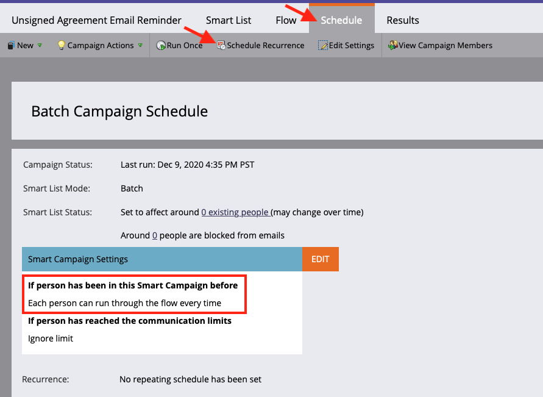

# Mit Acrobat Sign für Microsoft Dynamics 365 und Marketo Erinnerungen versenden

Hier erfahren Sie, wie Sie eine E-Mail-Erinnerung senden, wenn eine Vereinbarung nach einer bestimmten Zeit nicht signiert wird. Diese Integration verwendet Acrobat Sign, Acrobat Sign für Microsoft Dynamics, Marketo und Marketo Microsoft Dynamics Sync.

## Voraussetzungen

1. Installieren Sie Marketo Microsoft Dynamics Sync.

   Informationen und das neueste Plug-in für Microsoft Dynamics Sync sind hier [verfügbar.](https://experienceleague.adobe.com/docs/marketo/using/product-docs/crm-sync/microsoft-dynamics/marketo-plugin-releases-for-microsoft-dynamics.html)

1. Installieren Sie [Acrobat Sign für Microsoft Dynamics](https://appsource.microsoft.com/de-de/product/dynamics-365/adobesign.f3b856fc-a427-4d47-ad4b-d5d1baba6f86).

   Informationen zu diesem Plug-in sind hier [ verfügbar.](https://helpx.adobe.com/ca/sign/using/microsoft-dynamics-integration-installation-guide.html)

## Benutzerdefiniertes Objekt suchen

Sobald die Marketo-Konfigurationen für Microsoft Dynamics Sync und Acrobat Sign for Dynamics abgeschlossen sind, werden zwei neue Optionen im Marketo Admin-Terminal angezeigt.


1. Klicken Sie auf **[!UICONTROL Synchronisierung der Dynamics-Entitäten]**.

   Die Synchronisation muss deaktiviert sein, bevor benutzerdefinierte Entitäten synchronisiert werden. Klicken Sie auf **Schema synchronisieren**, wenn dies Ihr erstes Mal ist. Klicken Sie andernfalls auf **Schema aktualisieren**.

   

## Benutzerdefiniertes Objekt synchronisieren

1. Suchen Sie auf der rechten Seite nach [!UICONTROL Lead], [!UICONTROL Kontakt] und [!UICONTROL Account]-basierten benutzerdefinierten Objekten.

   * **Aktivieren Sie Sync** für die Objekte unter **[!UICONTROL Lead]**, wenn Sie eine Erinnerung senden möchten, wenn ein [!UICONTROL Lead] keine Vereinbarung in Dynamics signiert hat.

   * **Aktivieren Sie Sync** für die Objekte unter **[!UICONTROL Kontakt]**, wenn Sie eine Erinnerung senden möchten, wenn ein [!UICONTROL Kontakt] keine Vereinbarung in Dynamics signiert hat.

   * **Aktivieren Sie Synchronisation** für die Objekte unter **[!UICONTROL Konto]**, wenn Sie eine Erinnerung senden möchten, wenn ein [!UICONTROL Konto] keine Vereinbarung in Dynamics signiert hat.

   * **Synchronisierung aktivieren** für das Vereinbarungsobjekt unter dem gewünschten **[!UICONTROL übergeordneten]** ([!UICONTROL Lead], [!UICONTROL Kontakt] oder [!UICONTROL Konto]).

   

1. Wählen Sie im neuen Fenster die Eigenschaften aus, die Sie unter Vereinbarung wünschen, und aktivieren Sie dann die Felder unter **Einschränkung** und **Auslöser**, um sie Ihren Marketingaktivitäten zur Verfügung zu stellen.

   

   

1. Aktivieren Sie die Synchronisation erneut, nachdem Sie die Synchronisation für die benutzerdefinierten Objekte aktiviert haben.

   Kehren Sie zum Admin-Terminal zurück, klicken Sie auf **Microsoft Dynamics**, und klicken Sie dann auf **Synchronisation aktivieren**.

   

   

## Programm und Token erstellen

1. Klicken Sie im Abschnitt Marketingaktivitäten von Marketo mit der rechten Maustaste auf **Marketingaktivitäten** in der linken Leiste.

   Wählen Sie **Neuer Kampagnenordner** aus, und geben Sie ihm einen Namen.

   

1. Klicken Sie mit der rechten Maustaste auf den erstellten Ordner, wählen Sie **Neues Programm** aus, und geben Sie ihm einen Namen.

   Behalten Sie alles andere als Standard bei, und klicken Sie dann auf **Erstellen**.

   

   

1. Klicken Sie auf **Meine Token**, und ziehen Sie dann **E-Mail-Skript** auf die Arbeitsfläche.

   

1. Geben Sie einen Namen ein, und klicken Sie dann auf **Klicken Sie auf Bearbeiten**.

   

1. Erweitern Sie auf der rechten Seite **[!UICONTROL Benutzerdefinierte Objekte]**, und erweitern Sie dann das Objekt **[!UICONTROL Vereinbarung]**.

   Suchen Sie [!UICONTROL Name], Vereinbarungsstatus, Gesendet am und Aktuelle Unterzeichner-URL und ziehen Sie sie auf die Arbeitsfläche.

1. Schreiben Sie ein Velocity -Skript mit diesen Token, um die Vereinbarungs-URL einer Vereinbarung anzuzeigen, die eine Woche lang nicht signiert wurde. Im Folgenden finden Sie ein Beispiel, in dem das aktuelle Datum mit &quot;Gesendet am&quot; verglichen wird:

   ```
   #foreach($agreement in $adobe_agreementList)
       #if($agreement.adobe_esagreementstatus == "Out for Signature")
           #set($todayCalObj = $date.toCalendar($date.toDate("yyyy-MM-dd",$date.get('yyyy-MM-dd'))) )
           #set($dateSentCalObj = $date.toCalendar($date.toDate("yyyy-MM-dd",$agreement.adobe_datesent)) )
           #set($dateDiff = ($todayCalObj.getTimeInMillis() - $dateSentCalObj.getTimeInMillis()) / 86400000 )
   
           #if($dateDiff >= 7)
               #set($agreementName = $agreement.adobe_name)
               #set($agreementURL = $agreement.adobe_currentsignerurl.substring(8))
               #break
           #else
           #end
       #else
       #end
   #end
   
   #if(${agreementName})
       <a href="https://${agreementURL}">${agreementName}</a>
   #else
       Please contact us. 
   #end
   ```

1. Klicke auf **[!UICONTROL Speichern]**.

## Erinnerung erstellen und Personalisierung hinzufügen

Beispiele für die Personalisierung: der Name des Unterzeichners, der Name der Vereinbarung, ein Link zur Vereinbarung usw.

1. Klicken Sie mit der rechten Maustaste auf das Programm, das Sie erstellt haben, und klicken Sie auf **[!UICONTROL Neues lokales Element]**. Wählen Sie dann **[!UICONTROL E-Mail]** aus.

   

1. Geben Sie auf der neuen Registerkarte einen **[!UICONTROL Namen]** und **[!UICONTROL Beschreibung]** für die E-Mail ein und wählen Sie eine Vorlage in der Vorlagenauswahl aus.

   

1. Klicken Sie auf **[!UICONTROL Erstellen]**.

1. Legen Sie **[!UICONTROL Von Name]** und **[!UICONTROL Von Adresse]** fest.

   

1. Klicken Sie auf den Nachrichtentext, um den Editor zu aktivieren.

   Klicken Sie auf die Schaltfläche **[!UICONTROL Token einfügen]**, suchen Sie das von Ihnen erstellte benutzerdefinierte Vereinbarungs-URL-Token und klicken Sie dann auf **[!UICONTROL Einfügen]**. Beenden Sie die Anpassung Ihrer E-Mail und klicken Sie auf **[!UICONTROL Speichern]**.

   

1. Vorschau mit einem Profil, dem eine Vereinbarung zugewiesen ist.

   Sie sollten einen Link zur URL mit dem Vereinbarungsnamen als Beschriftung sehen.

   

## Einrichten des Smart Campaign-Filters

1. Klicken Sie mit der rechten Maustaste auf das Programm, das Sie erstellt haben, und klicken Sie dann auf **[!UICONTROL Neue Smart Campaign]**.

   

1. Geben Sie einen Namen Ihrer Wahl ein, und klicken Sie dann auf **[!UICONTROL Erstellen]**.

   

1. Suchen Sie nach, klicken Sie auf &quot;**[!UICONTROL Enthält Vereinbarung]**&quot; und ziehen Sie es in die Smart-Liste.

   

   Die Felder, die Sie dem Trigger verfügbar gemacht haben, sollten in **[!UICONTROL Einschränkung hinzufügen]** verfügbar sein.

1. Wählen Sie **[!UICONTROL Vereinbarungsstatus]** und alle anderen Felder aus, nach denen Sie filtern möchten.

   Definieren Sie für jedes hinzugefügte Feld die Werte, nach denen gefiltert werden soll. In diesem Fall wird er nur ausgelöst, wenn der **[!UICONTROL Vereinbarungsstatus]** *Zur Signatur versandt* und **[!UICONTROL Gesendet am]** *in der letzten Zeit vor einer Woche* ist.

   

   >[!NOTE]
   >
   > Fügen Sie den Einschränkungen einen eindeutigen Bezeichner hinzu, z. B. **Name**, wenn diese Kampagne nur für bestimmte Vereinbarungen ausgeführt werden soll.

1. Bestätigen Sie die Zielgruppe der Kampagne, und sehen Sie auf der Registerkarte &quot;Zeitplan&quot;, wer sich qualifiziert.

   

## Einrichten des Smart Campaign Flow

Da der Kampagnenfilter **Tage bis zum Ablauf** verwendet wurde, können Sie eine geplante Wiederholung für die Kampagne verwenden.

1. Klicken Sie in der [!UICONTROL Smart Campaign] auf die Registerkarte **[!UICONTROL Flow]**.

   Suchen Sie den Textfluss **E-Mail senden**, ziehen Sie ihn auf die Arbeitsfläche und wählen Sie die Erinnerungs-E-Mail aus, die Sie im vorherigen Abschnitt erstellt haben.

   

1. Klicken Sie in der Smart Campaign auf die Registerkarte **[!UICONTROL Zeitplan]**. Stellen Sie sicher, dass der Kampagnenfluss auf die Ausführung nur einmal pro Person in den **Einstellungen für intelligente Kampagnen** beschränkt ist. Klicken Sie dann auf die Registerkarte **Wiederholung planen**.

   

1. Setzen Sie **Schedule** auf _Daily_. Wählen Sie bei Bedarf einen Start- und einen Endtag für die Kampagne aus.

   
