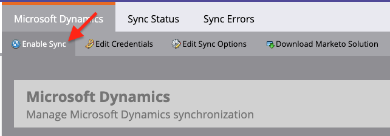
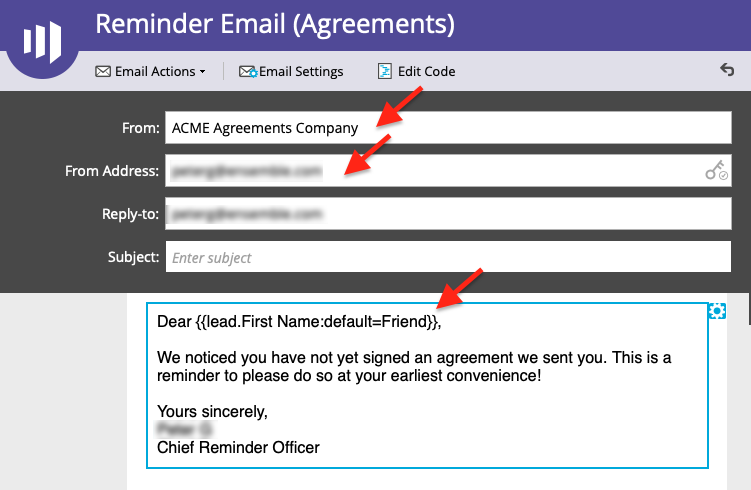

# Erinnerungen mit Acrobat Sign für Microsoft Dynamics 365 und Marketo senden

Hier erfahren Sie, wie Sie eine E-Mail-Erinnerung senden, wenn eine Vereinbarung nach einer bestimmten Zeit nicht signiert wird. Diese Integration verwendet Acrobat Sign, Acrobat Sign für Microsoft Dynamics, Marketo und Marketo Microsoft Dynamics Sync.

## Voraussetzungen

1. Installieren Sie Marketo Microsoft Dynamics Sync.

   Informationen und das neueste Plug-in für Microsoft Dynamics Sync sind verfügbar [hier.](https://experienceleague.adobe.com/docs/marketo/using/product-docs/crm-sync/microsoft-dynamics/marketo-plugin-releases-for-microsoft-dynamics.html)

1. Installieren [Acrobat Sign für Microsoft Dynamics](https://appsource.microsoft.com/de-de/product/dynamics-365/adobesign.f3b856fc-a427-4d47-ad4b-d5d1baba6f86).

   Informationen zu diesem Plug-in sind verfügbar [hier.](https://helpx.adobe.com/ca/sign/using/microsoft-dynamics-integration-installation-guide.html)

## Benutzerdefiniertes Objekt suchen

Sobald die Marketo Microsoft Dynamics Sync- und Acrobat Sign for Dynamics-Konfigurationen abgeschlossen sind, werden zwei neue Optionen im Marketo Admin-Terminal angezeigt.


1. Klicken **[!UICONTROL Dynamics-Entitäten synchronisieren]**.

   Die Synchronisation muss deaktiviert sein, bevor benutzerdefinierte Entitäten synchronisiert werden. Klicken **Schema synchronisieren** wenn dies Ihr erstes Mal ist. Klicken Sie andernfalls auf **Schema aktualisieren**.

   

## Benutzerdefiniertes Objekt synchronisieren

1. Suchen Sie auf der rechten Seite nach [!UICONTROL Blei], [!UICONTROL Kontakt]und [!UICONTROL Konto]-basierte benutzerdefinierte Objekte.

   * **Synchronisation aktivieren** für die Objekte unter **[!UICONTROL Blei]** , wenn Sie eine Erinnerung senden möchten, wenn ein [!UICONTROL Blei] hat keine Vereinbarung in Dynamics signiert.

   * **Synchronisation aktivieren** für die Objekte unter **[!UICONTROL Kontakt]** , wenn Sie eine Erinnerung senden möchten, wenn ein [!UICONTROL Kontakt] hat keine Vereinbarung in Dynamics signiert.

   * **Synchronisation aktivieren** für die Objekte unter **[!UICONTROL Konto]** , wenn Sie eine Erinnerung senden möchten, wenn ein [!UICONTROL Konto] hat keine Vereinbarung in Dynamics signiert.

   * **Synchronisation aktivieren** für das Vereinbarungsobjekt unter dem gewünschten **[!UICONTROL Übergeordnet]** ([!UICONTROL Blei], [!UICONTROL Kontakt]oder [!UICONTROL Konto]).

   

1. Wählen Sie im neuen Fenster die gewünschten Eigenschaften unter Vereinbarung aus, und aktivieren Sie dann die Felder unter **Einschränkung** und **Trigger** , um sie Ihren Marketingaktivitäten vorzustellen.

   

   

1. Aktivieren Sie die Synchronisation erneut, nachdem Sie die Synchronisation für die benutzerdefinierten Objekte aktiviert haben.

   Gehen Sie zurück zum Admin-Terminal und klicken Sie auf **Microsoft Dynamics** klicken Sie dann auf **Synchronisation aktivieren**.

   

   

## Programm und Token erstellen

1. Klicken Sie im Abschnitt &quot;Marketingaktivitäten&quot; von Marketo mit der rechten Maustaste auf **Marketing-Aktivitäten** in der linken Leiste.

   Auswählen **Neuer Kampagnenordner** und geben Sie ihm einen Namen.

   

1. Klicken Sie mit der rechten Maustaste auf den erstellten Ordner, wählen Sie **Neues Programm** und geben Sie ihm einen Namen.

   Behalten Sie alles andere als Standard bei, und klicken Sie dann auf **Erstellen**.

   

   

1. Klicken Sie auf **Meine Tokens** und ziehen Sie **E-Mail-Skript** auf die Arbeitsfläche.

   

1. Geben Sie einen Namen ein, und klicken Sie auf **Klicken, um zu bearbeiten**.

   

1. Erweitern **[!UICONTROL Benutzerdefinierte Objekte]** auf der rechten Seite, und erweitern Sie dann die **[!UICONTROL Vereinbarung]** Objekt.

   Suchen und Ziehen [!UICONTROL Name], Vereinbarungsstatus, Gesendet am und Aktuelle Unterzeichner-URL auf der Arbeitsfläche.

1. Schreiben Sie ein Velocity -Skript mit diesen Token, um die Vereinbarungs-URL einer Vereinbarung anzuzeigen, die eine Woche lang nicht signiert wurde. Im Folgenden finden Sie ein Beispiel, in dem das aktuelle Datum mit &quot;Gesendet am&quot; verglichen wird:

   ```
   #foreach($agreement in $adobe_agreementList)
       #if($agreement.adobe_esagreementstatus == "Out for Signature")
           #set($todayCalObj = $date.toCalendar($date.toDate("yyyy-MM-dd",$date.get('yyyy-MM-dd'))) )
           #set($dateSentCalObj = $date.toCalendar($date.toDate("yyyy-MM-dd",$agreement.adobe_datesent)) )
           #set($dateDiff = ($todayCalObj.getTimeInMillis() - $dateSentCalObj.getTimeInMillis()) / 86400000 )
   
           #if($dateDiff >= 7)
               #set($agreementName = $agreement.adobe_name)
               #set($agreementURL = $agreement.adobe_currentsignerurl.substring(8))
               #break
           #else
           #end
       #else
       #end
   #end
   
   #if(${agreementName})
       <a href="https://${agreementURL}">${agreementName}</a>
   #else
       Please contact us. 
   #end
   ```

1. Klicken Sie auf **[!UICONTROL Speichern]**.

## Erinnerung erstellen und Personalisierung hinzufügen

Beispiele für die Personalisierung: den Namen des Unterzeichners, den Namen der Vereinbarung, einen Link zur Vereinbarung usw.

1. Klicken Sie mit der rechten Maustaste auf das von Ihnen erstellte Programm, und klicken Sie auf **[!UICONTROL Neues lokales Element]** und wählen Sie dann **[!UICONTROL Email]**.

   

1. Geben Sie auf der neuen Registerkarte eine **[!UICONTROL Name]** und **[!UICONTROL Beschreibung]** für die E-Mail und wählen Sie in der Vorlagenauswahl eine Vorlage aus.

   

1. Klicken Sie auf **[!UICONTROL Erstellen]**.

1. Legen Sie die **[!UICONTROL Von Name]** und **[!UICONTROL Von Adresse]**.

   

1. Klicken Sie auf den Nachrichtentext, um den Editor zu aktivieren.

   Klicken Sie auf die Schaltfläche **[!UICONTROL Token einfügen]** das von Ihnen erstellte benutzerdefinierte Vereinbarungs-URL-Token und klicken Sie auf **[!UICONTROL Einfügen]**. Passen Sie Ihre E-Mail-Adresse an und klicken Sie auf **[!UICONTROL Speichern]**.

   

1. Vorschau mit einem Profil, dem eine Vereinbarung zugewiesen ist.

   Sie sollten einen Link zur URL mit dem Vereinbarungsnamen als Beschriftung sehen.

   

## Einrichten des Smart Campaign-Filters

1. Klicken Sie mit der rechten Maustaste auf das von Ihnen erstellte Programm, und klicken Sie dann auf **[!UICONTROL Neue Smart Campaign]**.

   

1. Geben Sie einen Namen Ihrer Wahl ein, und klicken Sie auf **[!UICONTROL Erstellen]**.

   

1. Suchen nach, dann klicken und ziehen **[!UICONTROL Hat Vereinbarung]** in die Smart-Liste aufnehmen.

   

   Die Felder, die Sie dem Auslöser ausgesetzt haben, sollten in **[!UICONTROL Einschränkung hinzufügen]**.

1. Auswählen **[!UICONTROL Vereinbarungsstatus]** und alle anderen Felder, nach denen Sie filtern möchten.

   Definieren Sie für jedes hinzugefügte Feld die Werte, nach denen gefiltert werden soll. In diesem Fall wird es nur ausgelöst, wenn die **[!UICONTROL Vereinbarungsstatus]** ist *Zur Signatur versandt* und **[!UICONTROL Gesendet am]** ist *in der Vergangenheit vor 1 Woche*.

   

   >[!NOTE]
   >
   > Fügen Sie den Einschränkungen einen eindeutigen Bezeichner hinzu, z. B. **Name**, wenn diese Kampagne nur für bestimmte Vereinbarungen ausgeführt werden soll.

1. Bestätigen Sie die Zielgruppe der Kampagne, und sehen Sie auf der Registerkarte &quot;Zeitplan&quot;, wer sich qualifiziert.

   

## Einrichten des Smart Campaign Flow

Weil der Kampagnenfilter **Tage bis zum Ablauf** verwendet wurde, können Sie eine geplante Wiederholung für die Kampagne verwenden.

1. Klicken Sie auf **[!UICONTROL Fluss]** &quot; im Dialogfeld &quot; [!UICONTROL Smart Campaign].

   Suchen Sie nach dem Element und ziehen Sie es **E-Mail senden** auf die Arbeitsfläche und wählen Sie die Erinnerungs-E-Mail aus, die Sie im vorherigen Abschnitt erstellt haben.

   

1. Klicken Sie auf **[!UICONTROL Planen]** in der Smart Campaign. Stellen Sie sicher, dass der Kampagnen-Flow auf nur einmal pro Person im **Smart Campaign-Einstellungen**. Klicken Sie dann auf die Schaltfläche **Wiederholung planen** &quot; ändern.

   

1. Legen Sie die **Planen** bis _Täglich_. Wählen Sie bei Bedarf einen Start- und einen Endtag für die Kampagne aus.

   

>[!TIP]
>
>Dieses Tutorial ist Teil des Kurses [Schnellere Vertriebszyklen - mit Acrobat Sign für Microsoft Dynamics und Marketo.](https://experienceleague.adobe.com/?recommended=Sign-U-1-2021.1) das auf Experience League kostenlos erhältlich ist!