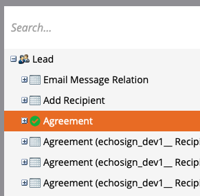

# Erinnerungen mithilfe des Acrobat Sign für Salesforce- und Marketo-Konfigurationshandbuchs senden

Hier erfahren Sie, wie Sie eine E-Mail-Erinnerung von Marketo senden, wenn ein Vertrag nach einer bestimmten Zeit nicht signiert wurde. Diese Integration verwendet Acrobat Sign, Acrobat Sign für Salesforce, Marketo sowie die Marketo und Salesforce Sync.

## Voraussetzungen

1. Installieren Sie Marketo Salesforce Sync.

   Informationen und das neueste Plug-in für Salesforce Sync sind hier [verfügbar.](https://experienceleague.adobe.com/docs/marketo/using/product-docs/crm-sync/salesforce-sync/understanding-the-salesforce-sync.html?lang=de)

1. Installieren Sie Acrobat Sign für Salesforce.

   Informationen zu diesem Plug-in sind hier [&#x200B; verfügbar.](https://helpx.adobe.com/ca/sign/using/salesforce-integration-installation-guide.html)

## Benutzerdefiniertes Objekt suchen

Wenn die Marketo Salesforce-Synchronisationskonfiguration und die Konfiguration von Acrobat Sign für Salesforce abgeschlossen sind, werden im Marketo Admin-Terminal mehrere neue Optionen angezeigt.


1. Klicken Sie auf **Schema synchronisieren**, wenn dies Ihr erstes Mal ist. Klicken Sie andernfalls auf **Schema aktualisieren**.

   

1. Wenn die globale Synchronisierung ausgeführt wird, deaktivieren Sie sie, indem Sie auf **Globale Synchronisierung deaktivieren** klicken.

   

1. Klicken Sie auf **Schema aktualisieren**.

   

## Benutzerdefiniertes Objekt synchronisieren

Auf der rechten Seite finden Sie weitere Informationen unter Lead-, Kontakt- und Account-basierte benutzerdefinierte Objekte.

**Aktivieren Sie Synchronisation** für die Objekte unter Lead, wenn Sie eine Erinnerung senden möchten, wenn ein Lead keine Vereinbarung in Salesforce signiert hat.

**Aktivieren Sie Synchronisation** für die Objekte unter Kontakt, wenn Sie eine Erinnerung senden möchten, wenn ein Kontakt keine Vereinbarung in Salesforce signiert hat.

**Aktivieren Sie Synchronisation** für die Objekte unter Konto, wenn Sie eine Erinnerung senden möchten, wenn ein Konto keine Vereinbarung in Salesforce signiert hat.

1. **Synchronisierung aktivieren** für das Objekt **Vereinbarung**, das unter dem gewünschten übergeordneten Objekt (Lead, Kontakt oder Konto) angezeigt wird. Führen Sie diesen Schritt für alle anderen benutzerdefinierten Objekte durch, die synchronisiert werden sollen.

   

1. Die folgenden Assets zeigen, wie **Synchronisierung aktivieren**.

   

   

## Auslöser für benutzerdefinierte Objektfelder verfügbar machen

1. Während die globale Synchronisation deaktiviert ist, wählen Sie das benutzerdefinierte Vereinbarungsobjekt aus, für das Sie die Synchronisation aktiviert haben, und **Sichtbare Felder bearbeiten**.

1. Aktivieren Sie das Feld &quot;Vereinbarungsname&quot; in der Trigger-Spalte, um es den Triggern für Kampagnenaktionen anzuzeigen. Überprüfen Sie alle anderen Felder, nach denen Sie filtern möchten, und **Speichern**.

   

   

1. Wenn Sie die Synchronisation für die benutzerdefinierten Objekte aktiviert und die Auslöserwerte verfügbar gemacht haben, müssen Sie die Synchronisation erneut aktivieren:

   

## Programm und Token erstellen

1. Klicken Sie im Abschnitt &quot;Marketingaktivitäten&quot; von Marketo mit der rechten Maustaste auf **Marketingaktivitäten** in der linken Leiste, wählen Sie **Neuer Kampagnenordner** aus, und geben Sie ihm einen Namen.

   

1. Klicken Sie mit der rechten Maustaste auf den erstellten Ordner, wählen Sie **Neues Programm** aus, und geben Sie ihm einen Namen. Behalten Sie alles andere als Standard bei, und klicken Sie dann auf **Erstellen**.

   

   

1. Klicken Sie auf **Meine Token**, und ziehen Sie dann **E-Mail-Skript** auf die Arbeitsfläche.

   

1. Geben Sie einen Namen ein, und klicken Sie dann auf **Klicken Sie auf Bearbeiten**.

   

1. Erweitern Sie auf der rechten Seite **Benutzerdefinierte Objekte**, und erweitern Sie dann das Objekt **Vereinbarung**. Suchen Sie den Vereinbarungsnamen, den Vereinbarungsstatus, das Datum der Signatur und die Signatur-URL und ziehen Sie sie auf die Arbeitsfläche.

1. Schreiben Sie ein Velocity -Skript mit diesen Token, um die Vereinbarungs-URL einer Vereinbarung anzuzeigen, die eine Woche lang nicht signiert wurde. Hier ist ein Beispiel, das das aktuelle Datum mit dem Sendedatum vergleicht:

   ```
   #foreach($agreement in $echosign_dev1__SIGN_Agreement__cList)
       #if($agreement.echosign_dev1__Status__c == "Out for Signature")
           #set($todayCalObj = $date.toCalendar($date.toDate("yyyy-MM-dd",$date.get('yyyy-MM-dd'))) )
           #set($dateSentCalObj = $date.toCalendar($date.toDate("yyyy-MM-dd",$agreement.echosign_dev1__DateSent__c)) )
           #set($dateDiff = ($todayCalObj.getTimeInMillis() - $dateSentCalObj.getTimeInMillis()) / 86400000 )
   
           #if($dateDiff >= 7)
               #set($agreementName = $agreement.Name)
               #set($agreementURL = $agreement.echosign_dev1__Signing_URL__c.substring(8))
               #break
           #else
           #end
       #else
       #end
   #end
   
   #if(${agreementName})
       <a href="https://${agreementURL}">${agreementName}</a>
   #else
       Please contact us. 
   #end
   ```

1. Klicke auf **Speichern**.

## Erinnerung erstellen und Personalisierung hinzufügen

Beispiele für die Personalisierung: der Name des Unterzeichners, der Name der Vereinbarung, ein Link zur Vereinbarung usw.

1. Klicken Sie mit der rechten Maustaste auf das Programm, das Sie erstellt haben, und klicken Sie auf **Neues lokales Element**. Wählen Sie dann **E-Mail** aus.

   

1. Geben Sie auf der neuen Registerkarte einen **Namen** und **Beschreibung** für die E-Mail ein und wählen Sie eine Vorlage in der Vorlagenauswahl aus. Klicken Sie auf **Erstellen**.

   

1. Legen Sie **Von Name** und **Von Adresse** fest.

   

1. Klicken Sie auf den Nachrichtentext, um den Editor zu aktivieren. Klicken Sie auf die Schaltfläche **Token einfügen**, suchen Sie das von Ihnen erstellte benutzerdefinierte Vereinbarungs-URL-Token und klicken Sie dann auf **Einfügen**. Beenden Sie die Anpassung Ihrer E-Mail und klicken Sie auf **Speichern**.

   

1. Vorschau mit einem Profil, dem eine Vereinbarung zugewiesen ist. Sie sollten einen Link zur URL mit dem Vereinbarungsnamen als Beschriftung sehen.

   

## Einrichten des Smart Campaign-Filters

1. Klicken Sie mit der rechten Maustaste auf das Programm, das Sie erstellt haben, und klicken Sie dann auf **Neue Smart Campaign**.

   

1. Geben Sie einen Namen Ihrer Wahl ein, und klicken Sie dann auf **Erstellen**.

   

1. Suchen Sie nach, klicken Sie auf &quot;**Enthält Vereinbarung**&quot; und ziehen Sie es in die Smart-Liste.

   

1. Die Felder, die Sie dem Trigger verfügbar gemacht haben, sollten jetzt in **Einschränkung hinzufügen** verfügbar sein. Wählen Sie **Vereinbarungsstatus** und alle anderen Felder aus, nach denen Sie filtern möchten. Definieren Sie für jedes hinzugefügte Feld die Werte, nach denen gefiltert werden soll. In diesem Fall wird er nur ausgelöst, wenn der **Vereinbarungsstatus** &quot;Zur Signatur versandt&quot; ist und das **Sendedatum** vor 7 Tagen vergangen ist.

   

   >[!NOTE]
   >
   > Fügen Sie den Einschränkungen einen eindeutigen Bezeichner hinzu, z. B. **Vereinbarungsname**, wenn diese Kampagne nur für bestimmte Vereinbarungen ausgeführt werden soll.

1. Bestätigen Sie die Zielgruppe der Kampagne, und sehen Sie auf der Registerkarte &quot;Zeitplan&quot;, wer sich qualifiziert.

   

## Einrichten des Smart Campaign Flow

Da der Kampagnenfilter **Tage nicht signiert** verwendet wurde, können Sie eine geplante Wiederholung für die Kampagne verwenden.

1. Klicken Sie in der Smart Campaign auf die Registerkarte **Flow**. Suchen Sie den Textfluss **E-Mail senden**, ziehen Sie ihn auf die Arbeitsfläche und wählen Sie die Erinnerungs-E-Mail aus, die Sie im vorherigen Abschnitt erstellt haben.

   

1. Klicken Sie in der Smart Campaign auf die Registerkarte **Zeitplan**. Stellen Sie sicher, dass der Kampagnenfluss auf die Ausführung nur einmal pro Person in den **Einstellungen für intelligente Kampagnen** beschränkt ist. Klicken Sie dann auf die Registerkarte **Wiederholung planen**.

   

1. Setzen Sie den **Zeitplan** auf &quot;Täglich&quot;, wählen Sie einen Starttag und eine Startzeit sowie ggf. ein Enddatum für die Kampagne aus.

   

