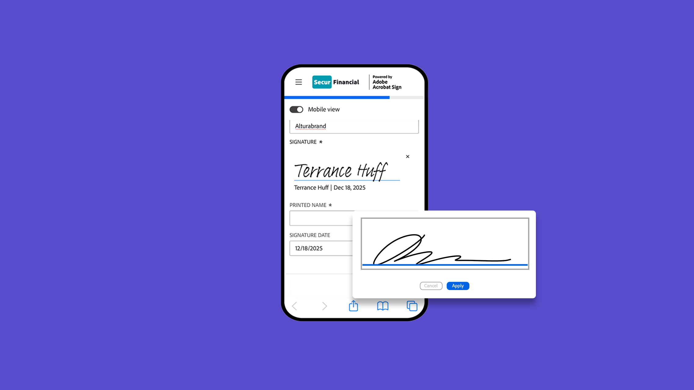
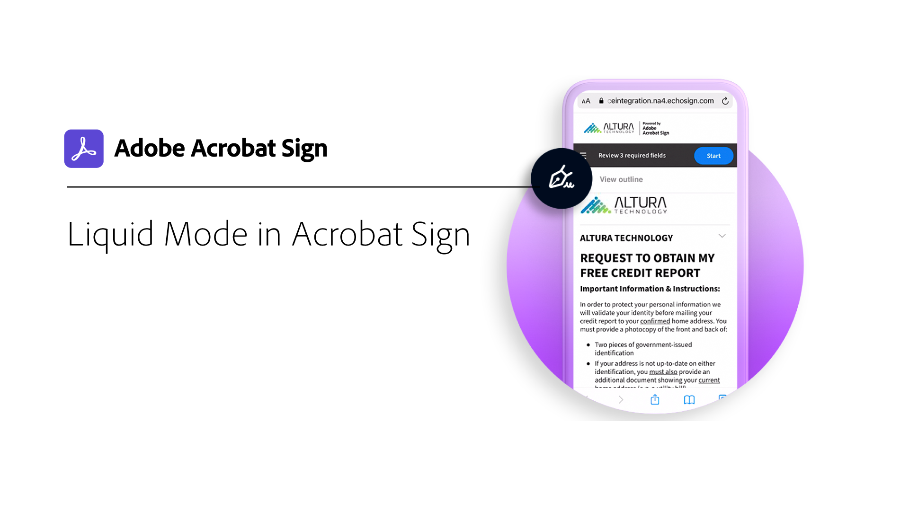

# Überblick über Mobilgeräte

Dokumente zur Unterzeichnung versenden, den Status verfolgen und in Echtzeit Benachrichtigungen erhalten - auf dem Smartphone oder Tablet.

## Neue Funktionen

>[!BEGINTABS]

>[!TAB Mobilfreundliche Ansicht]

Erfahren Sie, wie Sie mit der [mobilgerätefreundlichen Ansicht](mobile-friendly.md) Formulare auf Ihrem Mobilgerät ausfüllen.

>[!TAB Mobile Ansicht erstellen]

Erfahren Sie, wie Sie ein [mobilgerätefreundliches](create-mobile-friendly.md) Dokument nahtlos und ohne Entwicklerunterstützung generieren können.

>[!ENDTABS]

<table style="table-layout:fixed">
<tr>
  <td>
    
    

    <a href="sign-mobile.md"><strong>Dokumente unterwegs signieren</strong></a>
    

    <em>Erfahren Sie, wie Sie Dokumente mit der mobilen Acrobat Sign-App signieren</em>
     
  </td>
  <td>
    
    

    <a href="mobile-friendly.md"><strong>Mobilfreundliche Ansicht</strong></a>
    

    <em>Erfahren Sie, wie Sie Formulare in der für Mobilgeräte geeigneten Ansicht auf Ihrem Mobilgerät ausfüllen</em>
     
  </td>  
  <td>
    
    

    <a href="create-mobile-friendly.md"><strong>Mobile Ansicht erstellen</strong></a>
    

    <em>Erfahren Sie, wie Sie ein mobilgerätefreundliches Dokument nahtlos und ohne Entwicklerunterstützung generieren können</em>
     
  </td>
   <td>
    
    

    <a href="liquidmode.md"><strong>Liquid Mode in Acrobat Sign</strong></a>
    

    <em>Erfahren Sie, wie der Liquid Mode das mobile Signiererlebnis verbessert</em>
     
  </td>
</tr>
<tr>
  <td>
    
    

    <a href="https://apps.apple.com/us/app/adobe-acrobat-sign/id481082197_blank"><strong>Acrobat Sign-App für iOS herunterladen</strong></a>
    

    <em>Acrobat Sign-App aus App Store herunterladen</em>
     
  </td>
  <td>
    
    

    <a href="https://play.google.com/store/apps/details?id=com.adobe.echosign&amp;hl=en&amp;pli=1_blank"><strong>Acrobat Sign-App für Android herunterladen</strong></a>
    

    <em>Acrobat Sign-App von Google Play herunterladen</em>
     
  </td>
  <td>
    
    

     
  </td>
  <td>
    
    

     
  </td>
</tr>
</table>
