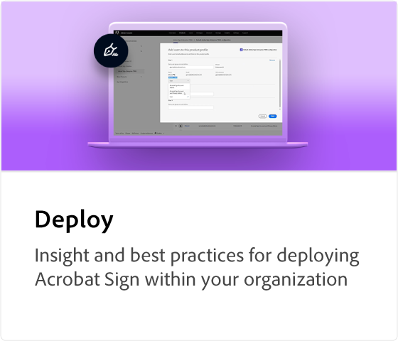

# Tutorials zu Acrobat Sign

Acrobat Sign, eine Lösung für Adobe Document Cloud, lässt sich mit Integrationen, APIs, erweiterter Authentifizierung, zusätzlichen Verwaltungsfunktionen und mehr an die Anforderungen Ihres Unternehmens anpassen. Hier finden Sie eine Vielzahl von Lernerlebnissen, die sowohl Anfänger als auch Administratoren schnell auf den neuesten Stand bringen, wenn es um Acrobat Sign geht.

## Lernpfade

<table style="table-layout:fixed">
<tr>
  <td>
    
    

    <a href="sign-beginner-tutorials/beginner-users-overview.md"><strong>Erste Schritte</strong></a>
    

    <em>Dokumente versenden, unterzeichnen und verfolgen</em>
     
  </td>
  <td>
    
    

    <a href="sign-advanced-users/advanced-users-overview.md"><strong>Erweiterte Aufgaben</strong></a>
    

    <em>Gehen Sie mit bestimmten Aufgaben und Automatisierung über die Grundlagen hinaus</em>
     
  </td>  
  <td>
    
    

    <a href="admin/intro-admin-overview.md"><strong>verwalten</strong></a>
    

    <em>Grundlegende bis erweiterte Einrichtungstipps für Ihr Unternehmen</em>
     
  </td>
</tr>
<tr>
  <td>
    
    

    <a href="digitalid/digitalid-overview.md"><strong>Digitale ID</strong></a>
    

    <em>Digitale IDs aus der ganzen Welt mit Acrobat Sign verwenden</em>
     
  </td>
  <td>
    
    

    <a href="integrations/integrations-overview.md"><strong>Integrationen</strong></a>
    

    <em>Acrobat Sign direkt in andere Programme einbinden, die eure Organisation bereits verwendet</em>
     
  </td>
  <td>
    
    

    <a href="sign-usecase/expand-inspire-overview.md"><strong>Branchen und Abteilungen</strong></a>
    

    <em>Anwendungsbeispiele und Rezepte für elektronische Unterschriften aus der Praxis.</em>
     
  </td>
</tr>
<tr>
  <td>
    
    

    <a href="develop/develop-overview.md"><strong>entwickeln</strong></a>
    

    <em>Entwicklungsressourcen für Acrobat Sign I/O abrufen</em>
     
  </td>
   <td>
    
    

    <a href="deploy-overview.md"><strong>Bereitstellen</strong></a>
    

    <em>Einblicke und Best Practices für die Bereitstellung von Acrobat Sign in Ihrem Unternehmen</em>
     
  </td>
  <td>
    
    

    <a href="mobile/mobile-overview.md"><strong>Mobile Endgeräte</strong></a>
    

    <em>Dokumente auf dem Smartphone oder Tablet versenden, verfolgen und in Echtzeit aktualisieren</em>
     
  </td>  
</tr>
</table>
