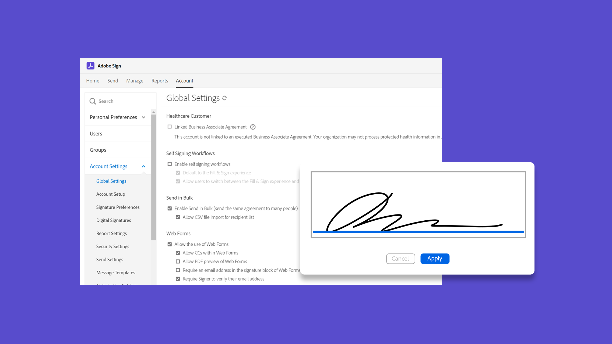

# Tutorials zu Acrobat Sign

Acrobat Sign, eine Lösung für Adobe Document Cloud, lässt sich mit Integrationen, APIs, erweiterter Authentifizierung, zusätzlichen Verwaltungsfunktionen und mehr an die Anforderungen Ihres Unternehmens anpassen. Hier finden Sie eine Vielzahl von Lernerfahrungen, die sowohl Anfänger als auch Administratoren schnell auf den neuesten Stand bringen sollen.

## Lernpfade

<table style="table-layout:fixed">
<tr>
  <td>
    
    

      <a href="sign-beginner-tutorials/beginner-users-overview.md"><strong>Erste Schritte</strong></a>
      

      <em>Dokumente senden, unterzeichnen und verfolgen</em>
      2 
  </td>
  <td>
    
    

      <a href="sign-advanced-users/advanced-users-overview.md"><strong>Erweiterte Aufgaben</strong></a>
      

      <em>Gehen Sie mit bestimmten Aufgaben und Automatisierung über die Grundlagen hinaus</em>
      2 
  </td>  
  <td>
    
    

      <a href="admin/intro-admin-overview.md"><strong>Verwalten</strong></a>
      

      <em>Grundlegende bis erweiterte Einrichtungstipps für Ihre Organisation</em>
      2 
  </td>
  <td>
    
     

      <a href="digitalid/digitalid-overview.md"><strong>Digitale ID</strong></a>
      

      <em>Erfahren Sie, wie Sie digitale IDs aus der ganzen Welt in Acrobat Sign verwenden</em>
      2 
  </td>
</tr>
<tr>
  <td>
    
    

      <a href="integrations/integrations-overview.md"><strong>Integrationen</strong></a>
      

      <em>Fügen Sie Acrobat Sign direkt in anderen Anwendungen hinzu, die Ihr Unternehmen bereits verwendet</em>
      2 
  </td>
  <td>
    
    

      <a href="sign-usecase/expand-inspire-overview.md"><strong>Branchen und Abteilungen</strong></a>
      

      <em>Nutzungsszenarien in der Branche und in Abteilungen entdecken</em>
      2 
  </td>
  <td>
    
    

      <a href="develop/develop-overview.md"><strong>Entwickeln</strong></a>
      

      <em>Entwicklungsressourcen für Acrobat Sign I/O abrufen</em>
      2 
  </td>
   <td>
    
    

      <a href="deploy-overview.md"><strong>Bereitstellen</strong></a>
      

      <em>Einblicke und Best Practices für die Bereitstellung von Acrobat Sign in Ihrem Unternehmen</em>
      2 
  </td>
</tr>
<tr>
  <td>
    
    

      <a href="mobile/mobile-overview.md"><strong>Mobile Endgeräte</strong></a>
      

      <em>Dokumente auf dem Smartphone oder Tablet versenden, signieren und in Echtzeit aktualisieren</em>
      2 
  </td>  
</tr>
</table>
