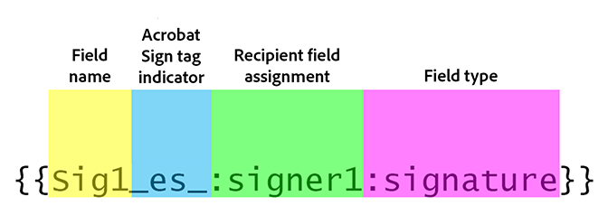

# Acrobat Sign Text-Tagging

Erfahren Sie, wie Sie Acrobat Sign-Formularfelder mit Text-Tags erstellen. Text-Tags können direkt zu Authoring-Tools wie Microsoft Word oder Adobe InDesign hinzugefügt werden oder wenn Sie eine PDF haben - in Acrobat. Sie können den Aufwand für die Erstellung von Dokumenten, die in Acrobat Sign verwendet werden, erheblich reduzieren. Nach dem Hochladen eines mit Tags versehenen Dokuments in Acrobat Sign kann es als Vorlage eingerichtet werden, sodass niemand mehr Felder zu seinen Dokumenten hinzufügen muss.

## Erste Schritte

Text-Tags sind eindeutig formatierte Textteile, die an einer beliebigen Stelle im Dokument platziert und beim Hochladen in Acrobat Sign automatisch als Felder erkannt werden.

Text-Tags können direkt zu Authoring-Tools wie Microsoft Word und Adobe InDesign hinzugefügt werden oder wenn Sie über eine PDF verfügen - Acrobat. Text-Tags reduzieren den Aufwand für die Vorbereitung von Dokumenten, die in Acrobat Sign verwendet werden, erheblich.

### Hinzufügen von Tags in Microsoft Word

Um Text-Tags zu einem Microsoft Word-Dokument hinzuzufügen, sehen Sie sich dieses [Video-Tutorial](text-tagging-word.md) an.

### Hinzufügen von Tags in Acrobat

Adobe Acrobat verfügt über eine robuste Drag-and-Drop-Formularautorenumgebung. Durch das Anwenden von Text-Tags in Acrobat können Sie auf zusätzliche Funktionen in Acrobat Sign zugreifen.

1. Öffnen Sie Ihr Formular in Acrobat.

1. Wählen Sie im Bereich **[!UICONTROL Alle Werkzeuge]** die Option **[!UICONTROL Formular]** vorbereiten.

1. Wählen Sie **[!UICONTROL Formular erstellen]** aus.

1. Wählen Sie im Dropdown-Menü des Bereichs **[!UICONTROL Optionen]** die Option **[!UICONTROL Formular für elektronische Signatur vorbereiten]** aus.

   

1. Wählen Sie zur Bestätigung **[!UICONTROL Weiter]** aus.

   

1. Doppelklicken Sie auf ein Feld, um das Dialogfeld **[!UICONTROL Eigenschaften]** aufzurufen.

   Verwenden Sie die in [Acrobat Sign Text Tag Guide](https://helpx.adobe.com/de/sign/using/text-tag.html) beschriebene Syntax, um den Formularfeldnamen zu ändern.

1. Sie können beispielsweise *OInt_es_:signer1:optinitials* in den Feldnamen eingeben, um ein erstes Feld optional zu machen.

   

   Text-Tags werden dem Formularfeldnamen hinzugefügt. Im Gegensatz zur Syntax, die Sie in Microsoft Word (oder anderen Authoring-Tools) verwenden würden, sind die geschweiften Klammern nicht enthalten.

   Text-Tags können auch im Fenster &quot;Felder&quot; hinzugefügt werden, indem Sie das Formularfeld einfach umbenennen.

   

1. Speichern und schließen Sie die Datei.

1. Laden Sie die Datei in Acrobat Sign hoch und erstellen Sie eine wiederverwendbare Vorlage, wie im nächsten Abschnitt beschrieben.

### Wiederverwendbare Vorlage erstellen

Richte ein mit Tags versehenes Dokument als wiederverwendbare Vorlage ein. So müssen Anwender ihren Dokumenten nicht mehr Felder hinzufügen.

Um eine wiederverwendbare Vorlage zu erstellen, sehen Sie sich dieses [Video-Tutorial](../sign-advanced-users/create-a-template.md) an.
