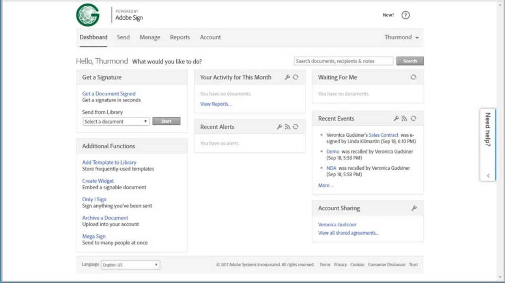

# Erweiterte Aufgabenübersicht

Erfahren Sie, wie Sie ein Dokument zur Signatur an Hunderte von Empfängern gleichzeitig senden, ein signaturfähiges Dokument für Ihre Website einrichten, Signaturtransaktionen verwalten und Dokumentvorlagen erstellen und verwalten. Diese Tutorials richten sich an alle, die sich bereits mit den Grundlagen des Versendens und Einholens von Unterschriften auskennen und mehr über die Möglichkeiten erfahren möchten, mit denen Acrobat Sign sie unterstützt.

## Senden

<table style="table-layout:fixed">
<tr>
  <td>
    
    

    <a href="setting-up-routing.md"><strong>Einrichten der Unterschriftsreihenfolge</strong></a>
    

    <em>Signierreihenfolge für mehrere Unterzeichner einrichten</em>
     
  </td>
  <td>
      
    

    <a href="delegate-signature.md"><strong>An eine andere Person delegieren</strong></a>
    

    <em>Verwenden Sie die Rolle "Delegierender", um ein Dokument an einen Vermittler zu senden, der das Dokument dann zur Signatur weiterleiten kann.</em>
     
  </td>
  <td>
    
    

    <a href="add-an-approver.md"><strong>Hinzufügen eines Genehmigers</strong></a>
    

    <em>Genehmigungsvorgang durch Hinzufügen einer Genehmigerrolle</em>
     
  </td>
</tr>
<tr>
  <td>
    
    

    <a href="megasign.md"><strong>Sammeln von Signaturen</strong></a>
    

    <em>Hole in wenigen Schritten Hunderte von Unterschriften auf einmal für jedes Dokument ein</em>
     
  </td>
  <td>
    
    

    <a href="webform.md"><strong>Einrichten eines Webformulars</strong></a>
    

    <em>Erstellen Sie ein Dokument, das direkt auf Ihrer Website elektronisch signiert werden kann</em>
     
  </td> 
  <td>
    
    

    <a href="adobe-sign-text-tagging.md"><strong>Acrobat Sign Text-Tagging</strong></a>
    

    <em>Acrobat Sign-Formularfelder durch Text-Tags mit Adobe Acrobat erstellen</em>
     
  </td> 
</table>

## Verwalten

<table style="table-layout:fixed">
<tr>
  <td>
    
    

    <a href="edit-a-template.md"><strong>Verwalten von Dokumentvorlagen</strong></a>
    

    <em>Vorlage in der Bibliothek bearbeiten oder löschen</em>
     
  </td>  
  <td>
    
    

     
  </td>
  <td>
    
    

     
  </td>
</tr>
</table>
