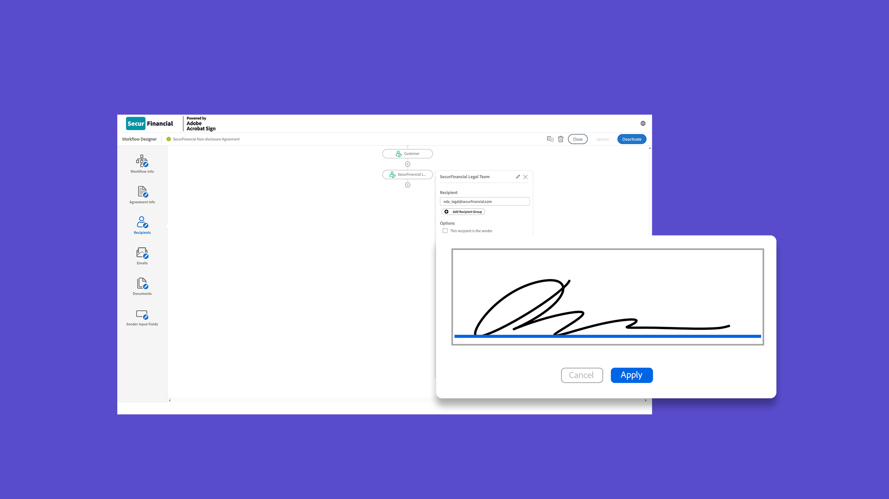
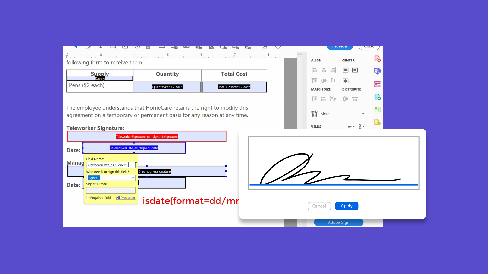
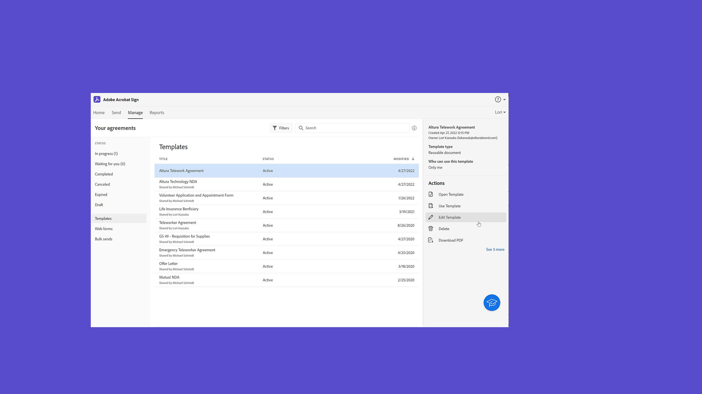
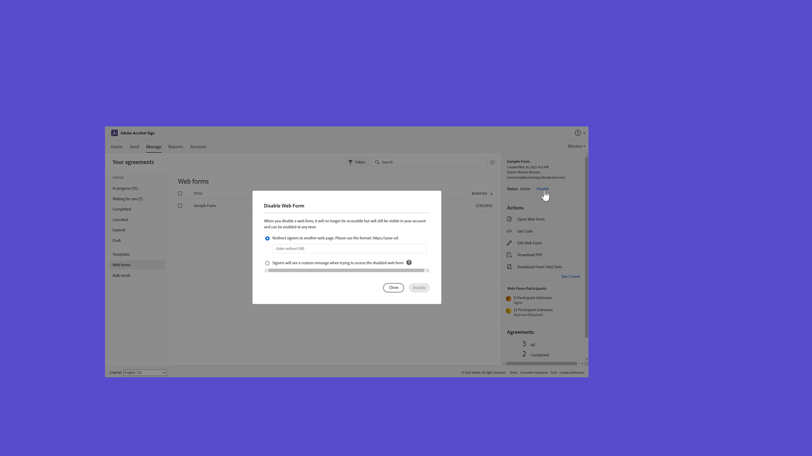

# Erweiterte Aufgabenübersicht

Erfahren Sie, wie Sie ein Dokument zur Signatur an Hunderte von Empfängern gleichzeitig senden, ein signaturfähiges Dokument für Ihre Website einrichten, Signaturtransaktionen verwalten und Dokumentvorlagen erstellen und verwalten. Diese Tutorials richten sich an alle, die sich bereits mit den Grundlagen des Versendens und Einholens von Unterschriften auskennen und mehr über die Möglichkeiten erfahren möchten, mit denen Acrobat Sign sie unterstützt.

## Neue Funktionen

>[!BEGINTABS]

>[!TAB Benutzerdefinierten Workflow erstellen]

Erfahren Sie, wie Sie [benutzerdefinierte Workflows](../admin/building-a-custom-workflow.md) erstellen und verwenden, um das Erstellen und Senden einer Vereinbarung zu beschleunigen.

>[!TAB Massenversand]

Erfahren Sie, wie Sie in nur wenigen Schritten [Tausende](megasign.md) von Unterschriften gleichzeitig für jedes Dokument erfassen können.

>[!TAB Authentifizierungsmethoden in Acrobat Sign]

Erfahren Sie mehr über den Bereich der in Acrobat Sign verfügbaren Methoden, mit denen die Identität einer Person, die ein Dokument signiert, [authentifiziert](authentication-methods.md) werden kann.

>[!ENDTABS]

## Send

<table style="table-layout:fixed">
<tr>
  <td>
    
    

    <a href="setting-up-routing.md"><strong>Signierreihenfolge einrichten</strong></a>
    

    <em>Signierreihenfolge für mehrere Unterzeichner einrichten</em>
     
  </td>
  <td>
      
    

    <a href="delegate-signature.md"><strong>Verwenden der Delegatorrolle </strong></a>
    

    <em>Verwenden Sie die Rolle "Delegierender", um ein Dokument an einen Mittler zu senden, der das Dokument dann zur Signatur weiterleiten kann</em>
     
  </td>
  <td>
    
    

    <a href="add-an-approver.md"><strong>Genehmigerrolle verwenden</strong></a>
    

    <em>Genehmigerrolle zu Ihrem Vertragsgenehmigungsprozess hinzufügen</em>
     
  </td>
  <td>
      
      

      <a href="megasign.md"><strong>Massenversand</strong></a>
      

      <em>Für jedes Dokument in nur wenigen Schritten Hunderte von Unterschriften gleichzeitig einholen</em>
       
  </td>
</tr>
<tr>
  <td>
      
      

      <a href="webform.md"><strong>Erstellen eines Webformulars</strong></a>
      

      <em>Erfahren Sie, wie Sie ein Dokument erstellen, das direkt auf Ihrer Website elektronisch signiert werden kann</em>
       
  </td>
  <td>
      
      

      <a href="../admin/building-a-custom-workflow.md"><strong>Benutzerdefinierten Workflow erstellen</strong></a>
      

      <em>Erfahren Sie, wie Sie benutzerdefinierte Workflows erstellen und verwenden, um das Erstellen und Senden einer Vereinbarung zu beschleunigen</em>
       
  </td>
  <td>
      
      

      <a href="set-up-online-payments.md"><strong>Onlinezahlungen einrichten</strong></a>
      

      <em>Weitere Informationen zum Einrichten und Annehmen von Online-Zahlungen in Ihren Dokumenten</em>
       
  </td>
  <td>
      
      

      <a href="authentication-methods.md"><strong>Authentifizierungsmethoden in Acrobat Sign</strong></a>
      

      <em>Erfahren Sie mehr über die in Acrobat Sign verfügbaren Methoden zur Identitätsauthentifizierung</em>
       
  </td>
</tr>
<tr>
  <td>
      
      

      <a href="adobe-sign-text-tagging.md"><strong>Acrobat Sign-Text-Tagging</strong></a>
      

      <em>Acrobat Sign-Formularfelder durch Text-Tagging mit Adobe Acrobat erstellen</em>
       
    </td>
  <td>
    
    

    <a href="text-tagging-word.md"><strong>Verwenden von Text-Tagging in [!DNL Microsoft Word]</strong></a>
    

    <em>Erfahren Sie, wie Sie eine wiederverwendbare Dokumentvorlage erstellen, indem Sie Acrobat Sign-Text-Tags in [!DNL Microsoft Word]</em> hinzufügen.
     
  </td>
  <td>
    
    

     
  </td>
  <td>
    
    

     
  </td>
</tr>
</table>

## Verwalten

<table style="table-layout:fixed">
<tr>
<td>
    
    

    <a href="creating-a-report.md"><strong>Berichterstellung und Transaktionsnutzung</strong></a>
    

    <em>Erfahren Sie, wie Sie Berichte generieren und die Transaktionsnutzung verfolgen</em>
     
  </td>
  <td>
    
    

    <a href="edit-a-template.md"><strong>Dokumentvorlagen verwalten</strong></a>
    

    <em>Vorlage in Ihrer Bibliothek bearbeiten oder löschen</em>
     
  </td>
  <td>
    
    

    <a href="modify-webform.md"><strong>Vorhandenes Webformular ändern</strong></a>
    

    <em>Erfahren Sie, wie Sie ein vorhandenes Webformular deaktivieren, bearbeiten und wieder aktivieren</em>
     
  </td>  
  <td>
    
    

    <a href="manage-webform-data.md"><strong>Verwalten von Webformulardaten</strong></a>
    

    <em>Erfahren Sie, wie Sie Daten aus einem Webformular verfolgen, verwalten und exportieren</em>
     
  </td>  
</tr>
<tr>
  <td>
      
      

      <a href="manage-form-data.md"><strong>Formulardaten verwalten</strong></a>
      

      <em>Erfahren Sie, wie Sie Formulardaten aus Ihren Dokumenten konsolidieren</em>
       
    </td>
    <td>
    
    

     
  </td>
  <td>
    
    

     
  </td>
  <td>
    
    

     
  </td>
</tr>
</table>